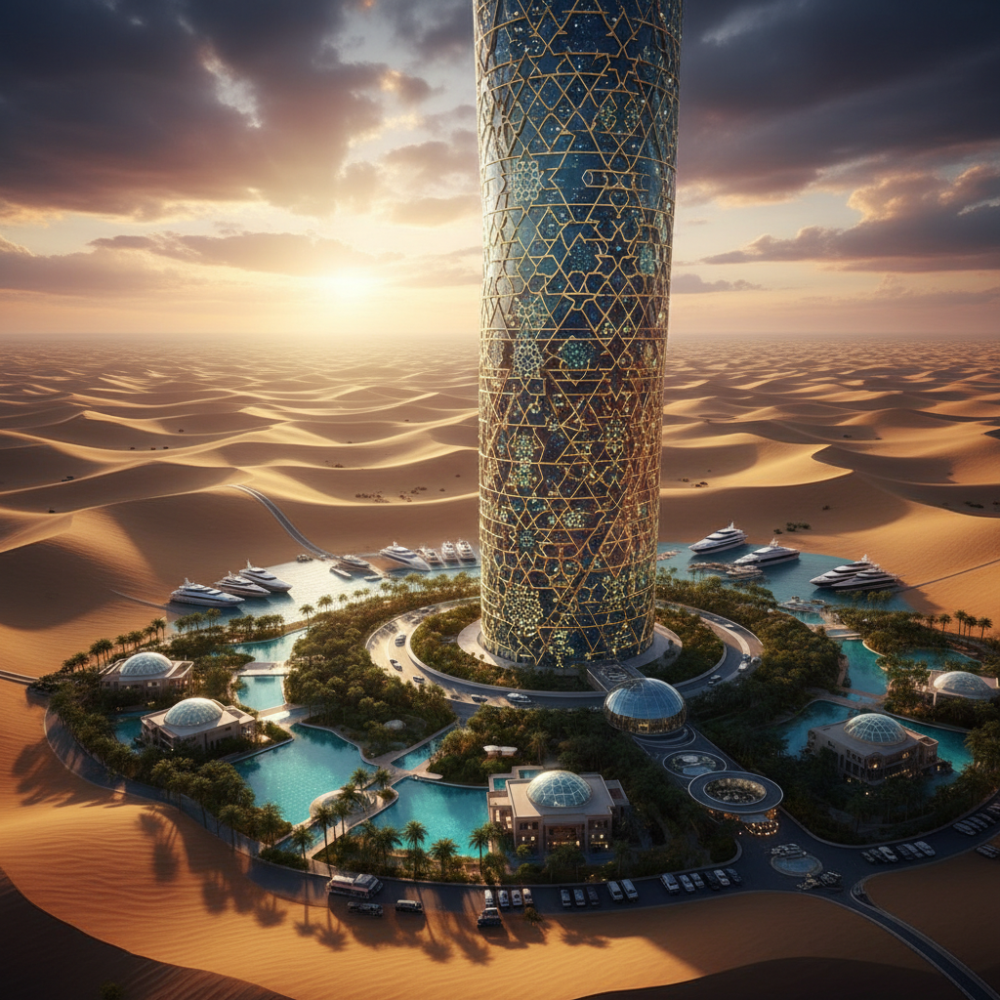

# Gulf Futurism 海湾未来主义

> **时期：** 2012–至今  
> **关键词：** 石油资本、沙漠乌托邦、超级建筑、加速现代化、后石油想象

## 概述

海湾未来主义（Gulf Futurism）由艺术家Sophia Al-Maria提出，描述波斯湾国家（特别是阿联酋、卡塔尔、沙特）在石油财富驱动下的超速现代化所产生的独特美学。从沙漠中拔地而起的超级摩天楼、人工岛屿、室内滑雪场——这些"不可能"的建筑体现了一种用金钱征服自然的极端未来主义，同时也暗含着石油枯竭后的焦虑。

## 风格特征

- **超级建筑**：不可能的摩天楼和人工地貌
- **沙漠+科技**：传统伊斯兰几何与未来建筑
- **奢华极简**：黄金、大理石、玻璃的极致运用
- **速度感**：从游牧到超现代的时间压缩
- **后石油焦虑**：繁荣背后的末日感

## 代表人物与作品

- Sophia Al-Maria《Gulf Futurism》视频论文
- Ahmed Mater 沙特城市化摄影
- Monira Al Qadiri 石油美学雕塑
- Farah Al Qasimi 海湾日常超现实摄影

## 概念图

