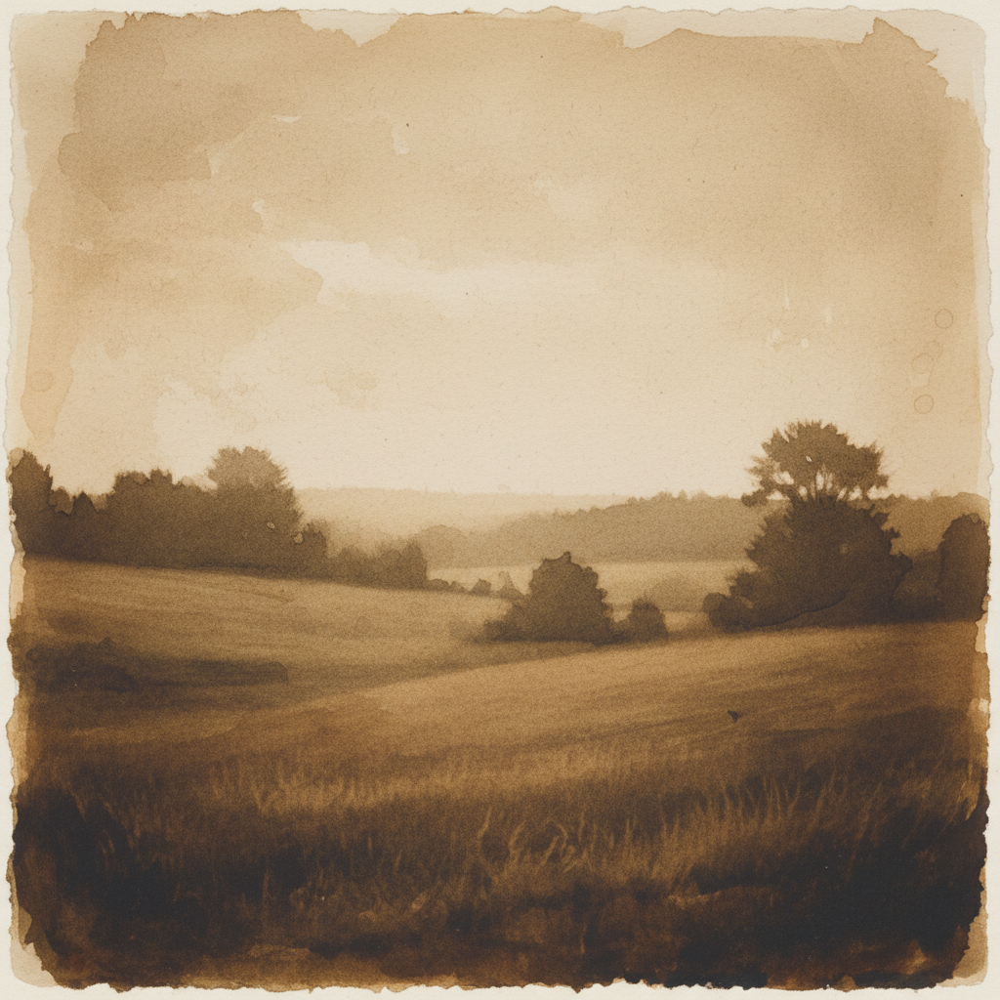

# Gum Bichromate Art 重铬酸胶印艺术

> "Gum bichromate is photography as painting — light-sensitive gum arabic mixed with watercolor pigment is brushed onto paper, exposed under a negative, then developed in water that dissolves the unexposed gum, leaving behind a pigment image with the texture of a watercolor and the tonal range of a photograph. Multiple coatings in different colors build images of extraordinary richness and painterly depth." — Unknown

## 概述

重铬酸胶印艺术（Gum Bichromate Art）是一种19世纪的摄影印刷工艺——将含有重铬酸盐的阿拉伯胶与水彩颜料混合涂在纸上，通过底片曝光后水洗显影，未曝光部分的胶被水溶解，留下颜料图像。通过多次涂层和曝光可以创造出具有绘画质感的多色摄影图像。

重铬酸胶印艺术的实践包括：1）涂层准备——将阿拉伯胶、重铬酸盐和颜料混合；2）涂布——将混合液刷涂在水彩纸上；3）曝光——在紫外光下通过底片曝光；4）水洗显影——用水溶解未硬化的胶层；5）多层印刷——多次涂层创造多色效果；6）套准——多层之间的精确对齐；7）当代重铬酸胶印——将传统工艺与现代创作结合。

## 核心特征

| 特征 | 描述 |
|------|------|
| 手工 | 完全手工的印刷工艺 |
| 绘画 | 具有绘画的质感 |
| 多层 | 多层涂布和曝光 |
| 颜料 | 使用水彩颜料 |
| 唯一 | 每张都是唯一的 |
| 控制 | 高度的艺术控制 |

## 视觉特征

- **绘画**：水彩般的绘画质感
- **柔和**：柔和的色调过渡
- **纹理**：纸张和颜料的纹理
- **深度**：多层创造的色彩深度
- **温暖**：温暖的色调倾向
- **独特**：每张的独特性

## 代表作品

| 作品 | 艺术家/文化 | 年代 | 意义 |
|------|-------------|------|------|
| *Robert Demachy works* | 法国 | 1890-1910年代 | 画意摄影先驱 |
| *Edward Steichen gum prints* | 美国 | 1900年代 | 斯泰肯的重铬酸胶印 |
| *Heinrich Kühn works* | 奥地利 | 1900年代 | 库恩的画意摄影 |
| *Contemporary gum prints* | 国际 | 当代 | 当代重铬酸胶印 |
| *Multi-layer gum prints* | 国际 | 当代 | 多层重铬酸胶印 |

## 历史时间线

| 时期 | 事件 |
|------|------|
| 1839年 | Mungo Ponton发现重铬酸盐感光性 |
| 1858年 | John Pouncy的早期重铬酸胶印 |
| 1890-1910年代 | 画意摄影运动中的广泛使用 |
| 20世纪中 | 工艺的衰落 |
| 当代 | 替代摄影工艺的复兴 |

## 中国语境

重铬酸胶印在中国的摄影艺术界有一定的认知和实践。中国的替代摄影工艺（Alternative Process）爱好者群体中，重铬酸胶印作为最具绘画性的工艺——受到关注。中国的摄影教育中，重铬酸胶印作为经典的手工摄影工艺——在高等院校的摄影专业中教授。中国当代的摄影艺术家将重铬酸胶印与中国传统的宣纸和水墨美学结合——创造出具有东方韵味的作品。中国的一些摄影工作坊开始教授重铬酸胶印——作为一种创意摄影体验。中国的艺术市场中，手工摄影工艺作品——因其唯一性和手工性而受到收藏家关注。

## AI生成概念图

## 与其他风格的关系

- **Platinum Print** → 铂金印相
- **Cyanotype** → 蓝晒法
- **Pictorialism** → 画意摄影
- **Watercolor** → 水彩画
- **Alternative Process** → 替代摄影工艺
- **Photogravure** → 照相凹版

---

*浮光艺志 | Chronicle of Artistry*
