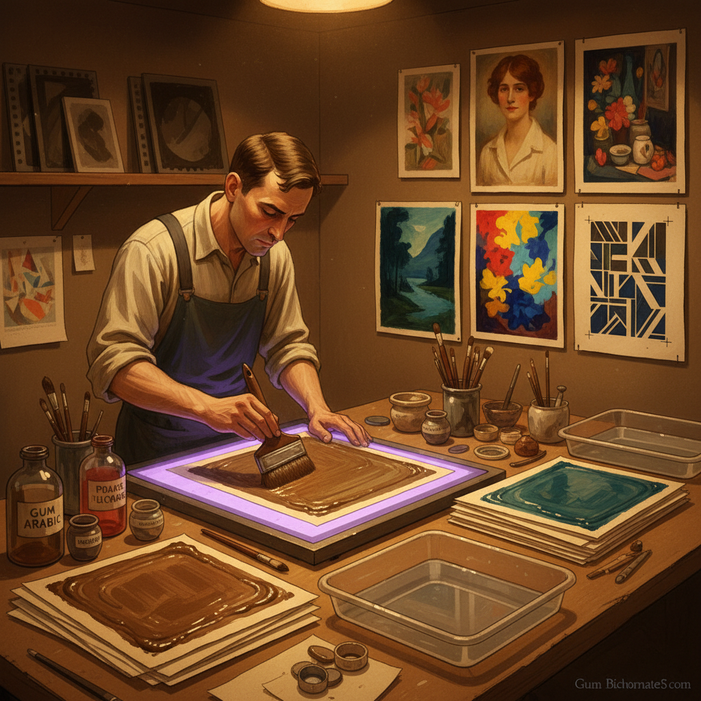

# Gum Bichromate 重铬酸胶印

> "Gum bichromate is photography painted by hand — each print a unique interpretation built layer by layer, where the photographer becomes painter, choosing colors and textures that no camera could ever capture alone." — Unknown

## 概述

重铬酸胶印（Gum Bichromate / Gum Dichromate）是一种19世纪发明的古典摄影印相工艺——将阿拉伯胶（gum arabic）与重铬酸盐（potassium dichromate）和水彩颜料混合，涂布在纸张上，通过底片接触曝光后水洗显影。曝光部分的胶层硬化不溶于水，未曝光部分被水洗去，留下由颜料形成的影像。

重铬酸胶印的独特之处在于：可以自由选择任何水彩颜料的颜色、可以多次涂布和曝光实现多色叠加、每一张印相都是独一无二的手工作品、印相具有绘画般的质感和色彩。这种工艺在19世纪末的画意摄影运动（Pictorialism）中极为流行——摄影师用它来创造具有绘画感的摄影作品，模糊摄影与绘画的界限。

## 核心特征

| 特征 | 描述 |
|------|------|
| 手工 | 完全手工制作 |
| 色彩 | 自由选择色彩 |
| 多层 | 多层叠加 |
| 独特 | 每张都独一无二 |
| 绘画 | 绘画般的质感 |
| 古典 | 古典摄影工艺 |

## 视觉特征

- **绘画**：绘画般的质感
- **色彩**：丰富的色彩选择
- **柔和**：柔和的影调
- **质感**：纸张和颜料的质感
- **层次**：多层叠加的深度
- **手工**：手工的独特性

## 代表作品

| 作品 | 艺术家 | 年代 | 意义 |
|------|--------|------|------|
| *Pictorialist prints* | Robert Demachy | 1890s | 画意摄影的代表 |
| *Gum prints* | Edward Steichen | 1900s | 早期大师作品 |
| *Multi-layer gum works* | Various | 当代 | 当代多层重铬酸胶印 |
| *Alternative process art* | Various | 当代 | 替代工艺摄影 |
| *Mixed media gum prints* | Various | 当代 | 混合媒介应用 |

## 历史时间线

| 时期 | 事件 |
|------|------|
| 1839 | Mungo Ponton发现重铬酸盐感光性 |
| 1858 | John Pouncy的早期重铬酸胶印 |
| 1890s | 画意摄影运动中的广泛使用 |
| 1900s | Steichen等大师的多层技法 |
| 1960s-70s | 替代工艺摄影的复兴 |
| 当代 | 重铬酸胶印在当代艺术中的应用 |

## 中国语境

重铬酸胶印在中国的摄影艺术教育中有一定的介绍。中国的一些摄影院校和工作室开设古典摄影工艺课程，其中包括重铬酸胶印。中国的替代工艺摄影爱好者社群中，重铬酸胶印因其"可以自由选择色彩"和"绘画般的效果"而受到关注。中国的一些当代摄影艺术家使用重铬酸胶印创作具有东方美学的作品。

## AI生成概念图

## 与其他风格的关系

- **Cyanotype** → 蓝晒法
- **Platinum Printing** → 铂金印相
- **Salt Printing** → 盐纸印相
- **Pictorialism** → 画意摄影
- **Watercolor** → 水彩画
- **Alternative Process** → 替代工艺

---

*浮光艺志 | Chronicle of Artistry*
