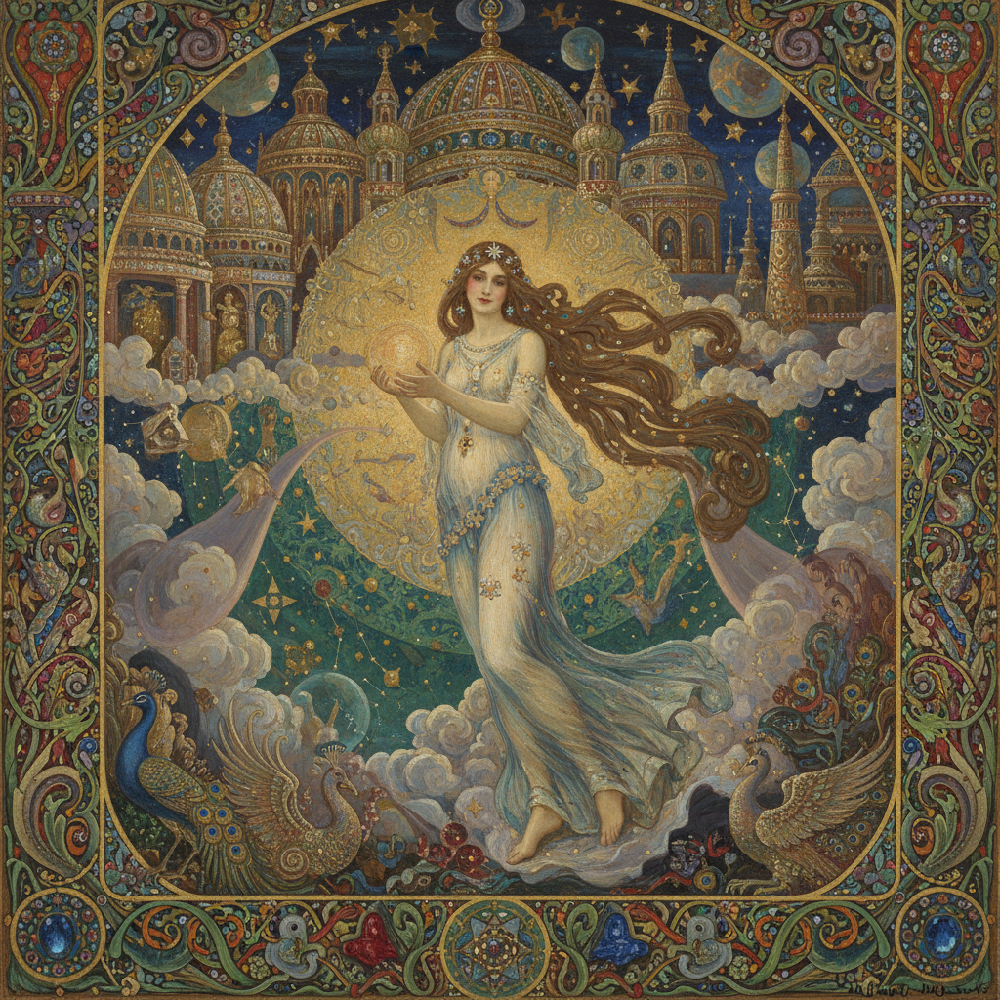

# Gustave Moreau 居斯塔夫·莫罗

> "I believe neither in what I touch nor what I see. I only believe in what I do not see, and solely in what I feel." — Gustave Moreau

## 概述

居斯塔夫·莫罗（Gustave Moreau，1826–1898）是法国象征主义画家，以华丽的神话和圣经题材闻名。他的画面如同镶满宝石的梦境——将古典叙事包裹在繁复的装饰、神秘的光辉和致命的女性形象中，用极度精细的笔触创造出一个超越现实的幻想世界。

## 核心特征

| 特征 | 描述 |
|------|------|
| 神话题材 | 希腊神话和圣经故事 |
| 宝石般色彩 | 镶嵌画般的华丽质感 |
| 致命女性 | 莎乐美、美杜莎的诱惑 |
| 繁复装饰 | 极度精细的细节堆积 |
| 神秘光辉 | 内在发光的超自然氛围 |
| 梦境逻辑 | 超越现实的幻想空间 |

## 代表作品

| 作品 | 年代 | 意义 |
|------|------|------|
| *The Apparition* | 1876 | 莎乐美与施洗约翰的头颅 |
| *Jupiter and Semele* | 1895 | 神话的华丽巅峰 |
| *Oedipus and the Sphinx* | 1864 | 人与命运的对峙 |
| *The Unicorns* | 1885 | 梦幻般的神话田园 |

## AI生成概念图

## 与其他风格的关系

- **Symbolism** → 法国象征主义的核心人物
- **Pre-Raphaelite** → 共享中世纪神话的迷恋
- **Art Nouveau** → 影响了新艺术运动的装饰性
- **Matisse/Rouault** → 莫罗工作室培养了野兽派
