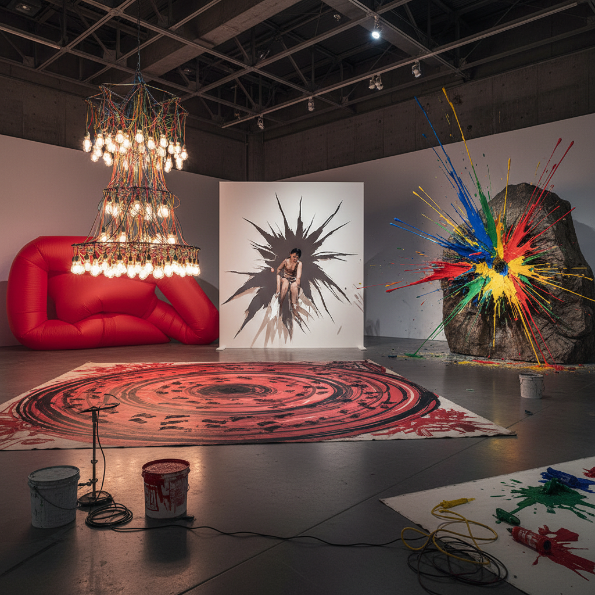

# Gutai Group 具体美术协会

> "Gutai means concrete — the concreteness of spirit meeting matter, of the body crashing through paper, of paint hurled from a distance, of feet dancing across canvas, of vibrating machines making marks no human hand could produce, a group that declared do what has never been done before and meant it with every fiber of their being, Japanese artists who in the aftermath of war found liberation not in Western abstraction's spiritual claims but in the sheer physical joy of material encounter, making art that was simultaneously performance, destruction, creation, and celebration of the body's capacity to transform the world through direct action." — Unknown

## 概述

具体美术协会（具体美術協会 / Gutai Bijutsu Kyōkai / Gutai Group）是1954年由吉原治良（Yoshihara Jirō）在日本�的尼崎创立的前卫艺术团体，是战后日本最重要的艺术运动之一。"具体"（Gutai）意为"具体的"或"实在的"，强调精神与物质的直接遭遇——艺术家的身体与材料的物理性碰撞。

具体派的核心宣言是"做从未做过的事"（Do what has never been done before）。成员们通过极端的身体行为和材料实验来创作：白发一雄（Shiraga Kazuo）用脚在画布上滑行作画、村上三郎（Murakami Saburō）冲破纸屏、嶋本昭三（Shimamoto Shōzō）从高处投掷颜料瓶、田中敦子（Tanaka Atsuko）穿着电灯泡制成的服装表演。具体派预示了行为艺术、偶发艺术和装置艺术的发展，但长期被西方艺术史忽视，直到2000年代才获得国际认可。

## 核心特征

| 特征 | 描述 |
|------|------|
| 身体 | 身体的直接参与 |
| 物质 | 物质的具体性 |
| 行动 | 行动和表演 |
| 创新 | 做从未做过的事 |
| 破坏 | 创造性的破坏 |
| 集体 | 集体的能量 |

## 视觉特征

- **身体**：身体痕迹和动作
- **破坏**：撕裂和穿透
- **泼洒**：颜料的投掷和泼洒
- **装置**：早期的装置和环境
- **光**：电灯和光的使用
- **纹理**：极端的物质纹理

## 代表作品

| 作品 | 艺术家 | 年代 | 意义 |
|------|--------|------|------|
| *Challenging Mud* | Shiraga Kazuo | 1955 | 白发一雄的泥中搏斗 |
| *Passing Through* | Murakami Saburō | 1956 | 村上三郎冲破纸屏 |
| *Electric Dress* | Tanaka Atsuko | 1956 | 田中敦子的电灯服 |
| *Bottle throwing* | Shimamoto Shōzō | 1956 | 嶋本昭三的投掷绘画 |
| *Work (Footprints)* | Shiraga Kazuo | 1954 | 白发一雄的脚画 |

## 历史时间线

| 时期 | 事件 |
|------|------|
| 1954 | 吉原治良创立具体派 |
| 1955 | 第一届具体美术展 |
| 1956 | 户外展和舞台表演 |
| 1957 | 与Michel Tapié的联系 |
| 1972 | 吉原去世，具体派解散 |

## 中国语境

具体派对中国当代艺术有重要的参照意义。作为亚洲最早的前卫艺术运动之一，具体派展示了如何在非西方语境中发展出原创性的当代艺术实践。中国的"85新潮"运动中的一些行为艺术和实验性创作与具体派有精神上的共鸣——对身体性、物质性和行动性的强调。中国当代的一些行为艺术家和实验艺术家也在探索类似的"身体与物质的直接遭遇"。具体派的历史也提醒我们：亚洲的前卫艺术有其独立的发展脉络，不应简单地被纳入西方艺术史的叙事框架。

## AI生成概念图

## 与其他风格的关系

- **Action Painting** → 行动绘画
- **Performance Art** → 行为艺术
- **Happenings** → 偶发艺术
- **Tachisme** → 塔希主义
- **Fluxus** → 激浪派
- **Mono-ha** → 物派

---

*浮光艺志 | Chronicle of Artistry*
