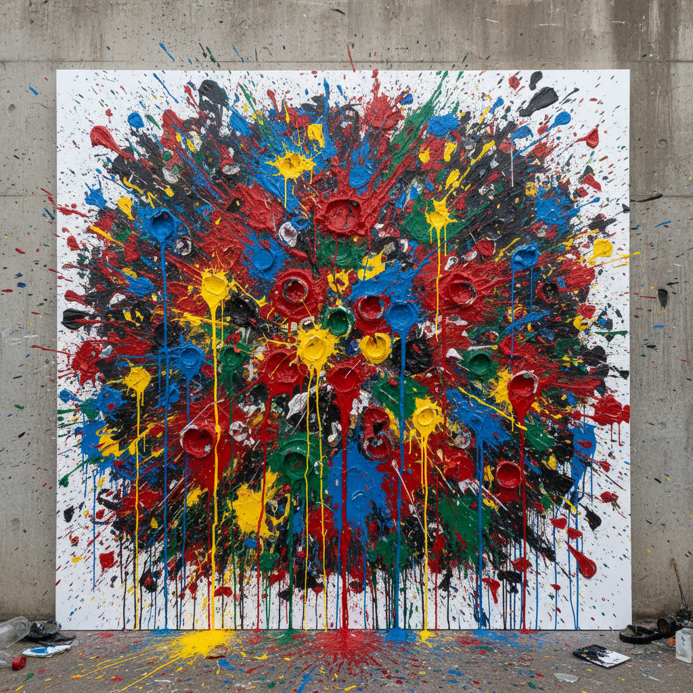

# Gutai Painting 具体派绘画

> **时期：** 1954年–1972年  
> **关键词：** 日本、身体行动、物质对话、破坏创造、先锋精神

## 概述

Gutai（具体派）是1954年由吉原治良在大阪创立的日本前卫艺术团体，名称意为"具体"——让精神具体化为物质。白发一雄用脚在画布上滑行作画，村上三郎用身体冲破纸屏，嶋本昭三将颜料瓶摔碎在画布上——他们比西方行动绘画更早、更激进地将身体变为画笔，将破坏变为创造。

## 风格特征

- **身体行动**：用脚、全身或投掷作画
- **物质实验**：颜料的物理性被极端化
- **破坏创造**：撕裂、冲破、摔碎作为方法
- **偶然性**：拥抱不可控的结果
- **表演性**：创作过程本身即作品

## 代表人物与作品

- 白发一雄 脚画
- 嶋本昭三 投掷画
- 村上三郎 冲破纸屏
- 田中敦子 电气服装

## 概念图

