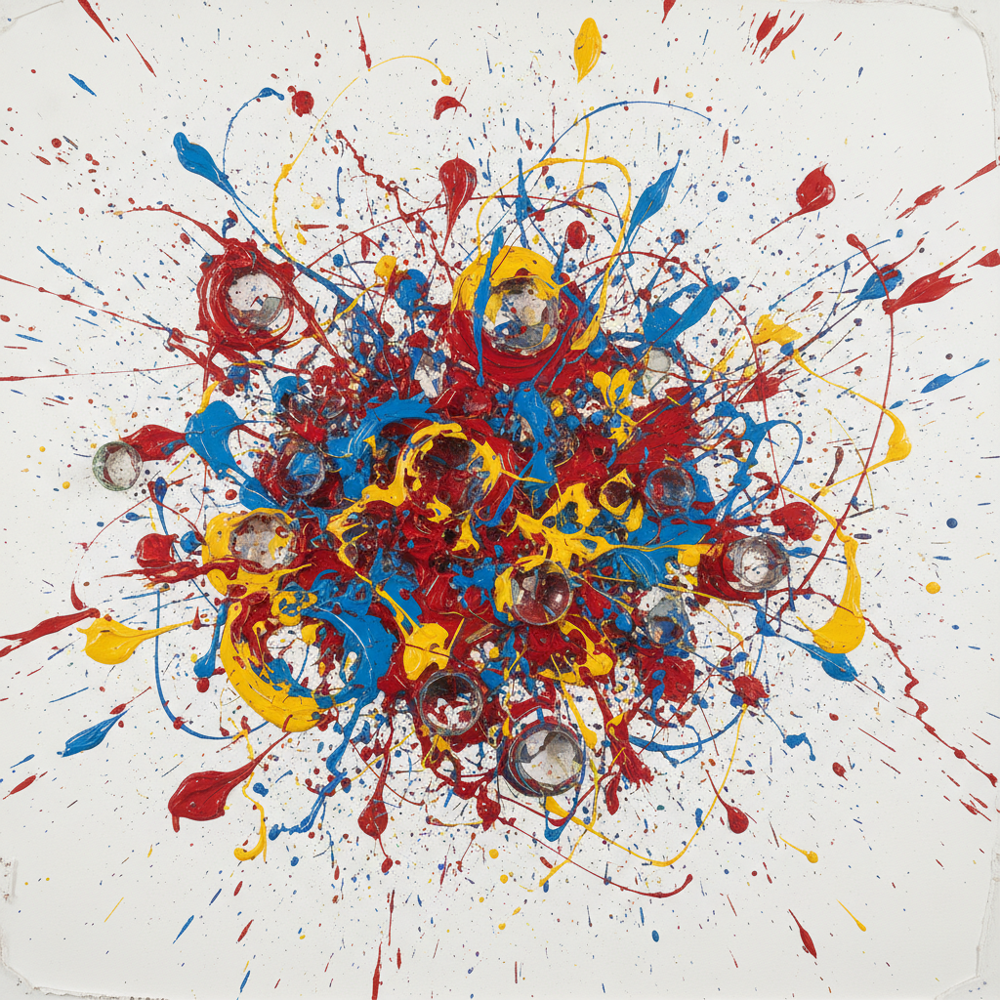

# Gutai 具体美術協会 | 具体派

> **"勿仿效他人！做前无来者之事。"** —— 吉原治良

## 概述

具体美術協会（Gutai Bijutsu Kyōkai，简称"具体派"）是二战后日本最激进的前卫艺术团体，1954年由画家吉原治良在�的�的兵库县芦屋市创立。"具体"一词意为"我们精神自由的具体证明"，与当时主导日本艺术界的抽象派形成对立。具体派被视为行为艺术、装置艺术和表演艺术的先驱之一。

## 时间线

| 年份 | 事件 |
|------|------|
| 1954 | 吉原治良率16名年轻学生在芦屋成立具体美術協会 |
| 1955 | 第一回具体艺术展（东京小原会馆），白发一雄《挑战泥土》震撼登场 |
| 1955–1965 | 出版日英双语《具体》杂志 |
| 1957 | 法国非定形艺术理论家 Michel Tapié 造访日本，将具体派介绍给欧美 |
| 1962 | 第二代成员加入：前川强、名坂有子、松谷武判等 |
| 1972 | 吉原治良去世，协会宣布解散 |
| 2013 | 古根海姆美术馆举办"GUTAI: Splendid Playground"回顾展 |

## 核心理念

- **物质即生命**：不改变物质，而是赋予物质生命——让石头说话、让泥巴呐喊
- **身体即画笔**：白发一雄用脚作画、在泥中翻滚；村上三郎以身体穿破纸屏风
- **反模仿**：吉原治良的核心信条——"人の真似をするな"（不要模仿他人）
- **跨媒介实验**：绘画、装置、行为、声音、电子——打破一切媒介边界

## 代表艺术家

| 艺术家 | 代表作/特征 |
|--------|------------|
| 吉原治良 Jirō Yoshihara | 圆系列——以最简单的形状追求无限可能 |
| 白发一雄 Kazuo Shiraga | 用脚在画布上滑行作画，《挑战泥土》 |
| 田中敦子 Atsuko Tanaka | 《电器服》——200个彩色灯泡组成的可穿戴装置 |
| 村上三郎 Saburō Murakami | 《六个洞》——以身体穿破多重纸屏风 |
| 元永定正 Sadamasa Motonaga | 用塑料袋装彩色水悬挂于树间 |
| 嶋本昭三 Shōzō Shimamoto | 将颜料瓶摔碎在画布上 |
| 前川强 Tsuyoshi Maekawa | 麻布缝合——"雕塑式绘画" |

## 视觉特征

- 原始的身体痕迹与物质肌理
- 非传统材料：泥土、水、电线、灯泡、塑料袋
- 行为过程的记录性——作品即事件的遗迹
- 强烈的色彩对比与物质张力
- 空间装置：公园、剧场等非常规展览空间

## 与其他运动的关系

| 运动 | 关系 |
|------|------|
| 抽象表现主义 | 同时代但独立发展，吉原治良关注波洛克但强调差异 |
| 达达主义 | 常被误认为达达，但具体派"源于对可能性的追求"而非否定 |
| 激浪派 Fluxus | 共享跨媒介精神，但具体派更强调物质性 |
| 物派 Mono-ha | 后继者，同样关注物质但更为静默内省 |
| 非定形艺术 Art Informel | Michel Tapié 建立了两者的桥梁 |

## 遗产与影响

具体派是日本战后最重要的艺术运动，其创新精神预示了：
- 行为艺术（Performance Art）
- 偶发艺术（Happenings）
- 装置艺术（Installation Art）
- 参与式艺术（Participatory Art）

2013年古根海姆回顾展使其获得迟来的国际认可，如今被视为与同时代欧美前卫运动平行发展的东方先锋力量。

## 概念图

---

*浮光艺志 | Chronicle of Artistry*
