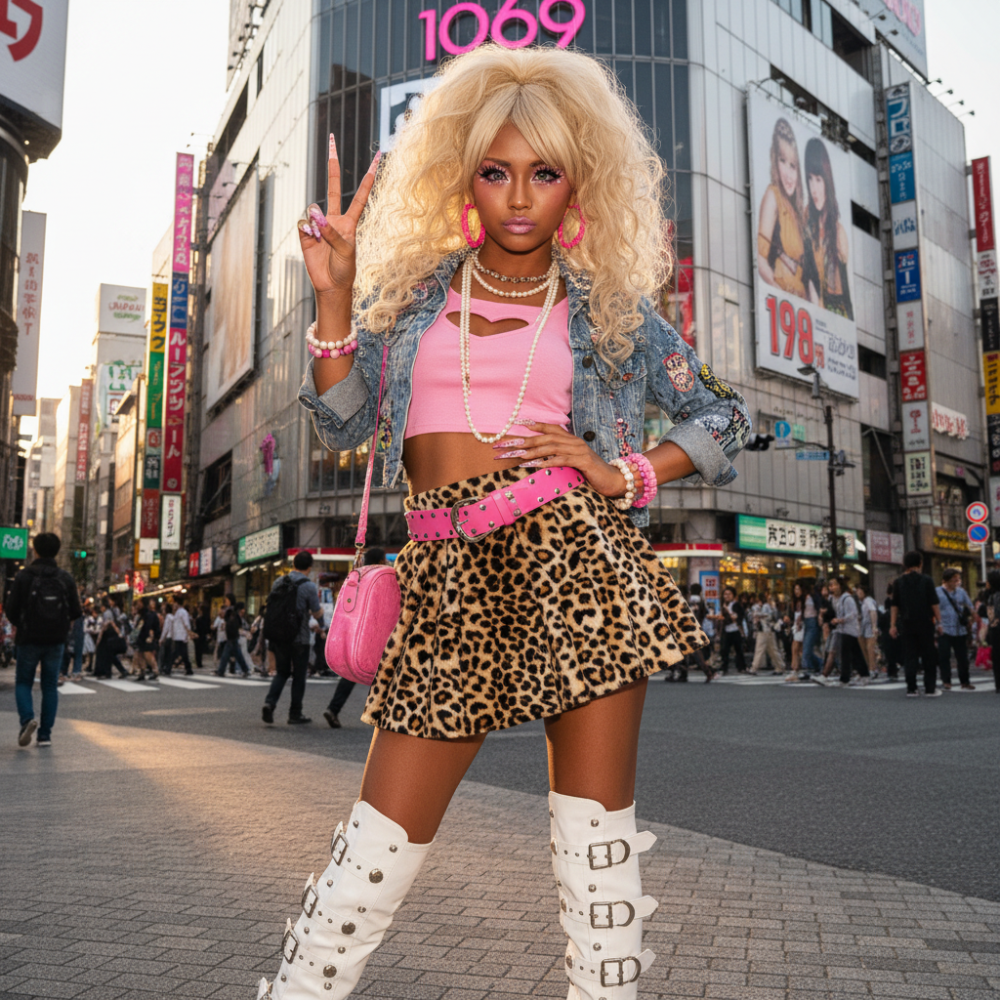

# Gyaru ギャル



> **"深色美黑、夸张假睫毛、金色长发——日本女孩对'可爱'的叛逆重定义。"**

## 概述

| 维度 | 描述 |
|------|------|
| 时期 | 1990s–至今 |
| 别名 | Gyaru, Gal, ギャル |
| 核心色彩 | 金色、棕色、粉色、黑色、白色 |
| 关键元素 | 美黑肌肤、夸张假睫毛、金色/彩色长发、厚底鞋 |
| 代表人物 | 安室奈美惠、egg杂志模特 |
| 关联风格 | Y2K, McBling, Hime Gyaru, Kogal |

---

## 历史脉络

| 年份 | 事件 |
|------|------|
| 1991 | 安室奈美惠出道——"Amura"风潮 |
| 1995 | 涩谷 109 百货——Gyaru 圣地 |
| 1999 | Ganguro（极端美黑）高峰 |
| 2000s | egg/Popteen 杂志全盛期 |
| 2008 | 开始衰落——但从未消失 |
| 2020s | TikTok 上的 Gyaru 复兴 |

### 核心哲学

Gyaru 的精神是**"我的美我定义——不需要符合任何人的标准"**：
- 反叛 = 核心（对日本"清纯"审美的反叛）
- 美黑 = 自由（"白不是唯一的美"）
- 夸张 = 力量（"我就是要被看见"）
- 友情 = 重要（"Para Para 一起跳"）
- "可爱可以是强大的"

---

## 视觉语法

### 色彩系统

```
主色：
  金色 (#DAA520) — 头发
  棕色 (#8B4513) — 美黑肌肤
  粉色 (#FF69B4) — 配饰、指甲
  黑色 (#000000) — 眼线、睫毛
  白色 (#FFFFFF) — 眼妆高光

辅色：
  豹纹 — 经典 Gyaru 图案
  花朵 — 夏季 Gyaru
  亮片 — 派对

质感：
  假睫毛 — 夸张、浓密
  美甲 — 长、装饰、3D
  厚底 — 鞋子
  亮片 — 配饰
```

### 标志性元素

| 类别 | 元素 |
|------|------|
| 妆容 | 美黑、假睫毛、大眼妆、唇彩 |
| 发型 | 金色/彩色长发、卷发、接发 |
| 服装 | 迷你裙、厚底靴、豹纹、花朵 |
| 配饰 | 大耳环、手机挂饰、贴钻 |
| 分支 | Hime Gyaru(公主)、Ganguro(极端)、Kogal(高中) |
| 态度 | 自信、反叛、友情、快乐 |

---

## 与千禧怀旧的关系

### 2000s 日本青年文化的代表
- Gyaru = 2000s 涩谷的视觉符号
- 与 Y2K 美学高度交叉（闪亮、粉色、手机）
- Para Para 舞蹈 = 2000s 日本流行文化
- "涩谷 109 = 2000s 日本时尚的圣殿"

### TikTok 复兴
- 2020s Gyaru 在 TikTok 上复兴
- 新一代重新诠释经典 Gyaru 妆容
- 与 Y2K 复兴交叉
- "Gyaru 从未真正消失——只是在等待"

---

## 中国语境

- "辣妹"在中国的流行（2020s）
- 与中国"甜辣风"的交叉
- 涩谷 109 在中国游客中的地位
- 小红书上的"日系辣妹妆"

---

## 设计应用

| 场景 | 应用方式 |
|------|----------|
| 时尚 | 金色+粉色+豹纹+闪亮+大胆 |
| 美妆 | 假睫毛+大眼妆+美黑+唇彩 |
| 品牌 | 活力+自信+年轻+反叛+快乐 |
| 数字 | 闪亮+贴纸+粉色+手机装饰感 |

---

## 相关风格

← [Y2K](y2k.md) | [McBling 千禧闪耀](mcbling.md) →

↑ [返回千禧怀旧目录](README.md) | [返回总目录](../README.md)
