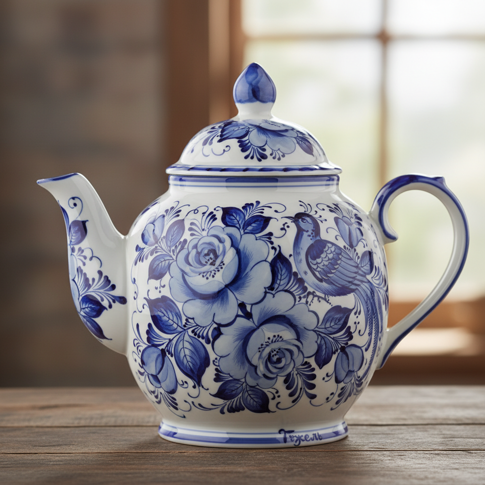

# Gzhel 格热利蓝白瓷 | Гжель

> **"俄罗斯的青花——莫斯科郊外的陶工用钴蓝色在白瓷上画出比荷兰人更奔放的花鸟。"**

## 概述

格热利（Gzhel / Гжель）是俄罗斯莫斯科州格热利地区的传统蓝白陶瓷艺术，用钴蓝色（кобальт）在白色陶瓷上手绘花卉、鸟类和民间场景。格热利陶瓷传统始于14世纪，但其标志性的蓝白风格在18世纪定型。与中国青花瓷和荷兰Delft蓝陶不同，格热利的笔触更加奔放自由——一笔之中从深蓝到浅蓝的渐变（мазок с тенями "带阴影的笔触"）是其最独特的技法。格热利至今仍是俄罗斯最具辨识度的工艺品之一。

## 核心特征

- **蓝白配色**：钴蓝色在白瓷上
- **渐变笔触**：一笔中的深浅变化
- **手绘**：每件都是手工绘制
- **花卉主题**：玫瑰、矢车菊、郁金香
- **鸟类**：公鸡、孔雀
- **民间场景**：三驾马车、农民生活

## 经典技法

| 技法 | 俄语 | 特征 |
|------|------|------|
| 带阴影笔触 | Мазок с тенями | 一笔渐变 |
| 网格填充 | Сеточка | 细网格 |
| 点缀 | Капелька | 小点装饰 |
| 线条 | Линия | 细线勾勒 |

## 视觉特征

- 钴蓝色的深浅层次
- 白瓷的洁净底色
- 奔放自由的笔触
- 花卉的立体渐变
- 民间艺术的活力
- 蓝白对比的清新感

## 与其他风格的关系

| 风格 | 关系 |
|------|------|
| 中国青花瓷 | 共享蓝白陶瓷传统 |
| Delftware荷兰蓝陶 | 共享欧洲蓝白传统 |
| Blue Willow | 共享蓝白装饰 |
| Zhostovo | 共享俄罗斯装饰传统 |
| 当代陶瓷 | 格热利的现代影响 |

## 概念图

---

*浮光艺志 | Chronicle of Artistry*
