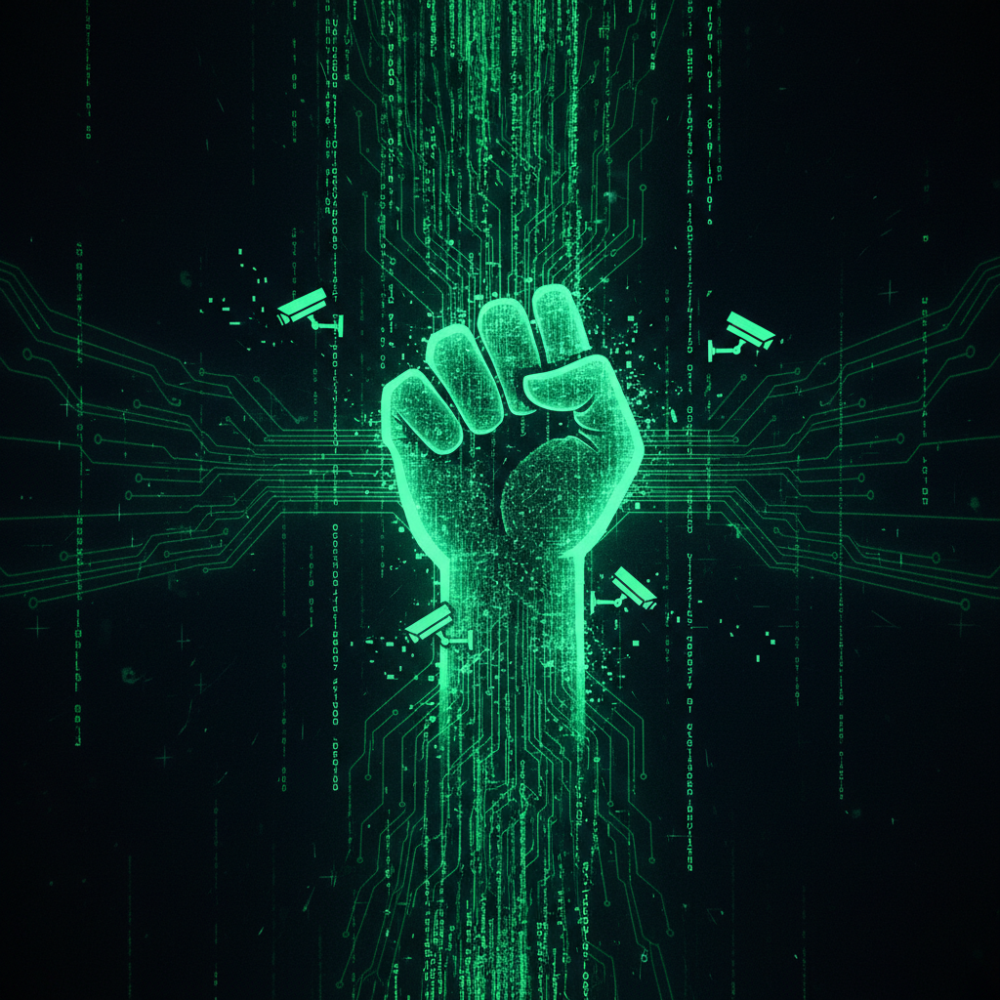

# Hacktivism Art 黑客行动主义艺术

> **时期：** 1990年代–至今  
> **关键词：** 代码即抗议、数字不服从、网络自由、开源文化、监控批判

## 概述

黑客行动主义艺术将编程技术与政治抗议结合，用代码作为表达工具和行动武器。从1990年代的电子市民不服从（虚拟静坐）到当代的监控批判装置，这些艺术家-黑客们揭示数字基础设施中的权力结构，用技术手段挑战审查、监控和数据垄断。

## 风格特征

- **代码美学**：源代码、终端界面作为视觉元素
- **系统揭露**：让不可见的数字基础设施变得可见
- **参与性**：观众成为行动的参与者
- **开源精神**：工具和方法公开共享
- **对抗性**：直接挑战权力机构

## 代表人物与作品

- Electronic Disturbance Theater FloodNet（1998）
- Jodi.org 网页艺术破坏
- Paolo Cirio 面部搜索项目
- !Mediengruppe Bitnik 监控艺术

## 概念图

