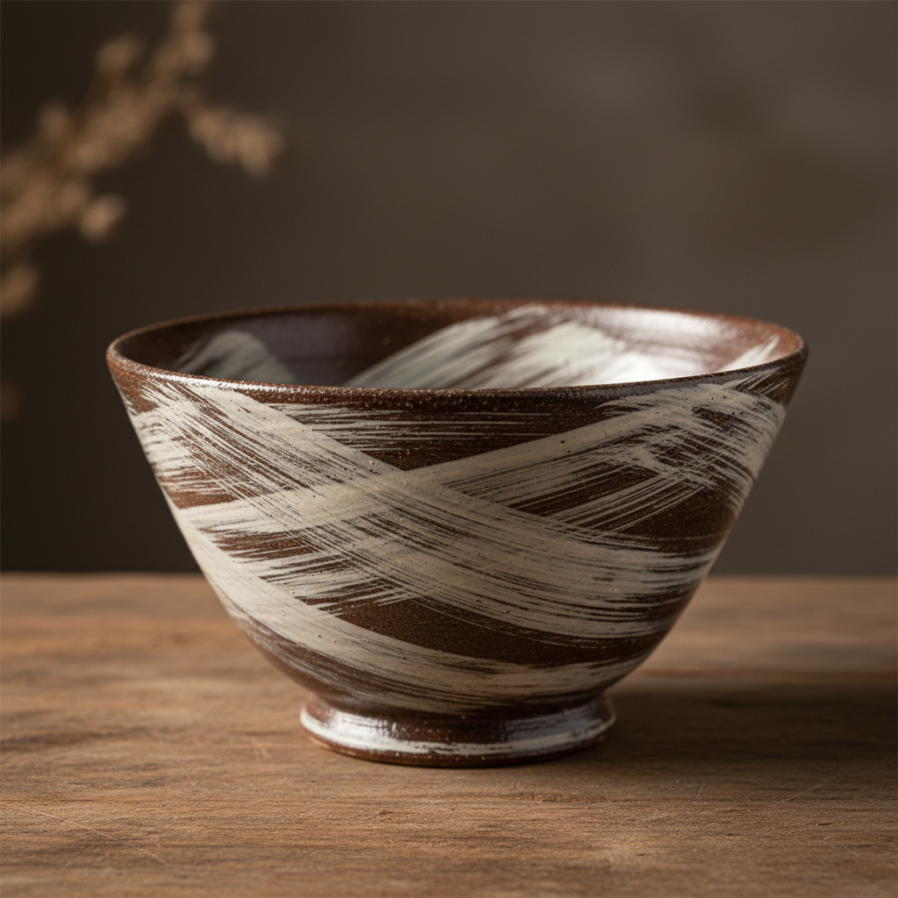

# Hakeme Art 刷毛目艺术

> "Hakeme is the gesture of the brush preserved forever in clay — white slip swept across a dark body in broad, rapid strokes that leave the bristle marks visible like calligraphy frozen mid-breath, each vessel wearing the energy of its making on its surface, the speed and confidence of the potter's hand recorded in parallel tracks of cream over earth." — Unknown

## 概述

刷毛目艺术（Hakeme Art）是一种用刷子将白色化妆土（白泥浆）快速刷涂在深色坯体上的陶瓷装饰技法。刷毛目以其保留刷痕的独特质感著称——刷子的毛痕清晰可见，形成有节奏感的平行线条，展现了制作过程中的速度和力量。这一技法在韩国李朝时期（粉青沙器）和日本茶陶中都有重要地位。

刷毛目艺术的核心要素包括：1）白色化妆土——白色泥浆作为装饰材料；2）刷涂——用宽刷快速涂抹；3）刷痕保留——刻意保留刷子的毛痕；4）深浅对比——白色化妆土与深色坯体的对比；5）速度感——快速刷涂带来的动态美；6）不完美——刷痕的不均匀作为美感来源；7）釉下装饰——化妆土上覆盖透明釉。

## 核心特征

| 特征 | 描述 |
|------|------|
| 刷痕纹理 | 清晰可见的刷子毛痕 |
| 白色化妆土 | 白泥浆的装饰层 |
| 速度感 | 快速刷涂的动态美 |
| 深浅对比 | 白色与深色坯体的对比 |
| 节奏感 | 平行线条的韵律 |
| 手工痕迹 | 制作过程的直接记录 |

## 视觉特征

- **白色刷痕**：乳白色的平行刷纹
- **深色底色**：透出的深色坯体
- **毛痕肌理**：刷毛留下的细密纹理
- **不均匀覆盖**：有意的疏密变化
- **动态线条**：充满速度感的笔触
- **温暖色调**：化妆土与坯体的暖色调和

## 代表作品

| 作品 | 艺术家/文化 | 年代 | 意义 |
|------|-------------|------|------|
| *粉青沙器刷毛目碗* | 韩国李朝 | 15-16世纪 | 韩国刷毛目代表 |
| *刷毛目茶碗* | 日本 | 桃山时代 | 日本茶陶中的刷毛目 |
| *滨田�的刷毛目作品* | 滨田庄司 | 20世纪 | 民艺运动中的刷毛目 |
| *伯纳德·利奇刷毛目* | Bernard Leach | 20世纪 | 西方对刷毛目的接受 |
| *当代刷毛目* | 各地陶艺家 | 当代 | 刷毛目的现代演绎 |

## 历史时间线

| 时期 | 事件 |
|------|------|
| 三国时代 | 韩国早期化妆土技法 |
| 李朝 | 粉青沙器刷毛目的成熟 |
| 桃山时代 | 日本茶陶采用刷毛目 |
| 20世纪 | 民艺运动推广刷毛目 |
| 当代 | 刷毛目在全球陶艺中的应用 |

## 中国语境

刷毛目技法与中国陶瓷的化妆土传统有密切关系。中国北方的磁州窑系统广泛使用白色化妆土装饰——虽然中国传统更倾向于均匀涂抹而非保留刷痕。韩国粉青沙器的刷毛目技法被认为受到中国磁州窑化妆土技术的影响。在中国当代陶艺中，刷毛目作为一种表现性强的装饰手法受到关注——它将制作过程的痕迹直接转化为装饰，体现了"过程即作品"的当代艺术理念。中国书法中的飞白笔法与刷毛目有异曲同工之妙。

## AI生成概念图

## 与其他风格的关系

- **Kohiki** → 粉引
- **Mishima** → 三岛手
- **Buncheong** → 粉青沙器
- **Slip Decoration** → 化妆土装饰
- **Mingei** → 民艺运动
- **Calligraphy** → 书法美学

---

*浮光艺志 | Chronicle of Artistry*
