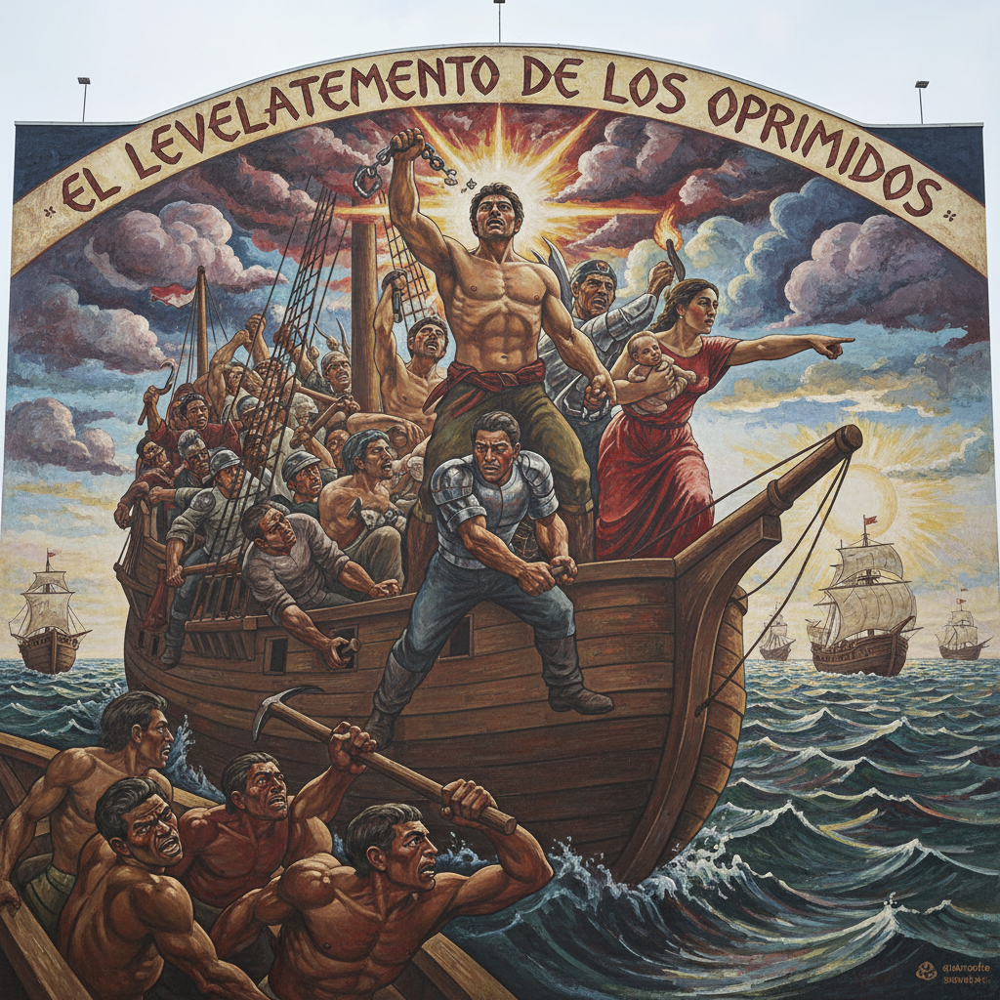

# Hale Woodruff 黑尔·伍德拉夫

> **时期：** 1900–1980  
> **关键词：** 壁画运动、非裔美国历史叙事、从具象到抽象、Amistad壁画

## 概述

Hale Woodruff 是美国画家和壁画家，职业生涯从墨西哥壁画运动影响下的社会现实主义叙事壁画，演变为抽象表现主义的色彩探索。他最著名的作品是Talladega College的Amistad壁画系列，描绘了1839年奴隶船叛乱的历史。他也是Spiral Group的联合创始人。

## 风格特征

- **壁画叙事**：大尺幅的历史叙事构图，具有电影般的戏剧性
- **墨西哥影响**：从里维拉处学到的纪念碑性人物和社会叙事
- **从具象到抽象**：1950年代后转向抽象，保持色彩的力量感
- **非洲图案**：晚期作品融入非洲纺织和雕刻的几何图案
- **教育使命**：作品服务于黑人历史教育和文化自豪感

## 代表作品

- *Amistad Mutiny*壁画系列（1939）
- *The Art of the Negro*壁画系列（1950–1951）
- *Celestial Gate*（1966）
- *Landscape with Constellations*（1973）

## 历史意义

Woodruff 是将墨西哥壁画运动的社会叙事传统引入非裔美国艺术的关键人物。他的Amistad壁画是美国最重要的历史壁画之一，将被压制的黑人反抗历史视觉化为永久的公共艺术。

## 概念图

