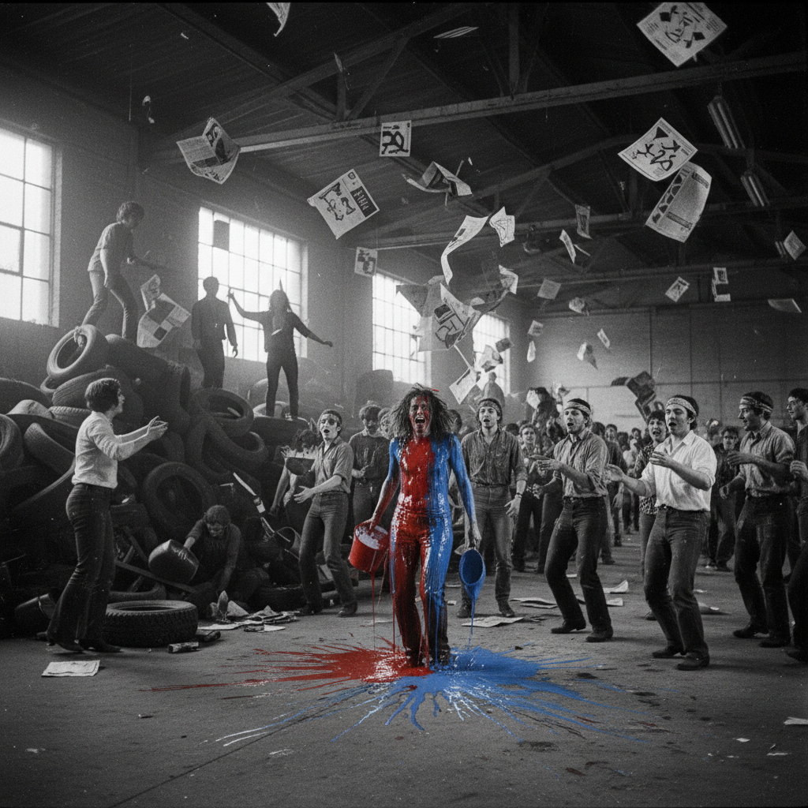

# Happening 偶发艺术

> "The line between art and life should be kept as fluid, and perhaps indistinct, as possible." — Allan Kaprow

## 概述

偶发艺术（Happening）是1950年代末至1960年代兴起的艺术形式，由艾伦·卡普罗（Allan Kaprow）命名和理论化。它是一种介于戏剧、视觉艺术和日常生活之间的事件——没有剧本、没有排练、没有观众与表演者的明确分界，参与者在预设的环境中即兴行动。

Happening是行为艺术和装置艺术的直接先驱，它将艺术从画布和雕塑台上解放出来，变成了一种活的、不可重复的、集体参与的体验。

## 核心特征

| 特征 | 描述 |
|------|------|
| 事件性 | 艺术是一个发生的事件而非一个物品 |
| 即兴性 | 没有固定剧本，允许偶然和意外 |
| 参与性 | 观众成为参与者，没有被动旁观 |
| 多感官 | 视觉、听觉、触觉、嗅觉的综合体验 |
| 不可重复 | 每次发生都是唯一的 |
| 日常材料 | 使用日常物品和日常动作 |

## 视觉特征

- **空间**：仓库、街道、停车场——非传统艺术空间
- **材料**：轮胎、报纸、食物、水、日常垃圾
- **人**：参与者的身体和动作是核心元素
- **时间**：从几分钟到数小时不等
- **氛围**：混乱的、欢乐的、有时令人困惑的
- **记录**：照片和文字描述是唯一的"遗物"

## 代表作品

| 作品 | 艺术家 | 年代 | 意义 |
|------|--------|------|------|
| *18 Happenings in 6 Parts* | Allan Kaprow | 1959 | 第一个被命名为"Happening"的作品 |
| *Yard* | Allan Kaprow | 1961 | 庭院里堆满轮胎——观众在其中攀爬 |
| *Meat Joy* | Carolee Schneemann | 1964 | 身体、生肉、颜料的狂欢 |
| *Fluids* | Allan Kaprow | 1967 | 用冰块建造建筑——等待融化 |
| *Anthropometries* | Yves Klein | 1960 | 用裸体模特作为"活画笔" |
| *Cut Piece* | Yoko Ono | 1964 | 观众用剪刀剪去艺术家的衣服 |

## 历史时间线

| 时期 | 事件 |
|------|------|
| 1952 | John Cage在Black Mountain College的"无题事件"——先驱 |
| 1958 | Kaprow发表"The Legacy of Jackson Pollock"文章 |
| 1959 | *18 Happenings in 6 Parts*——Happening正式诞生 |
| 1960-62 | 纽约Happening高峰——Kaprow、Oldenburg、Dine |
| 1962 | Fluxus运动兴起，与Happening平行发展 |
| 1964 | Happening传播到欧洲和日本 |
| 1966 | Kaprow转向更日常化的"Activities" |
| 1970s | Happening演变为行为艺术和参与式艺术 |

## 子类型

| 子类型 | 特征 |
|--------|------|
| 环境Happening | Kaprow——预设环境中的集体行动 |
| 剧场Happening | Oldenburg——更接近戏剧的结构 |
| 街头Happening | 在公共空间中的突发事件 |
| 身体Happening | Schneemann、Klein——身体作为核心 |
| 日常Activities | Kaprow后期——将日常动作框定为艺术 |

## 中国语境

Happening在中国当代艺术中有重要的回响。1980年代"85新潮"中的许多行为艺术事件（如包裹长城）可视为中国版的Happening。2000年代以来，中国的"快闪"活动、社区参与式艺术项目、以及各种艺术节中的互动事件都延续了Happening的精神。中国传统的庙会、社火等民间集体活动本身就具有Happening的特质。

## 争议与遗产

- **争议**：这是艺术还是只是"一群人在做奇怪的事"？
- **文档化悖论**：不可重复的事件如何被记录和传承？
- **与Fluxus的区别**：Happening更强调环境和规模，Fluxus更强调简单动作和幽默
- **遗产**：为行为艺术、装置艺术、参与式艺术、沉浸式戏剧奠定基础
- **当代回响**：沉浸式戏剧（Sleep No More）、快闪族、参与式艺术节

## AI生成概念图

## 与其他风格的关系

- **Fluxus** → 激浪派与Happening平行发展，共享事件性
- **Performance Art** → 行为艺术是Happening的直接后继
- **Installation Art** → 装置艺术继承了Happening的环境性
- **Relational Aesthetics** → 关系美学继承了参与和相遇的理念
- **Situationism** → 情境主义的"构建情境"与Happening相通
- **Immersive Theatre** → 沉浸式戏剧是Happening的当代商业化

---

*浮光艺志 | Chronicle of Artistry*
