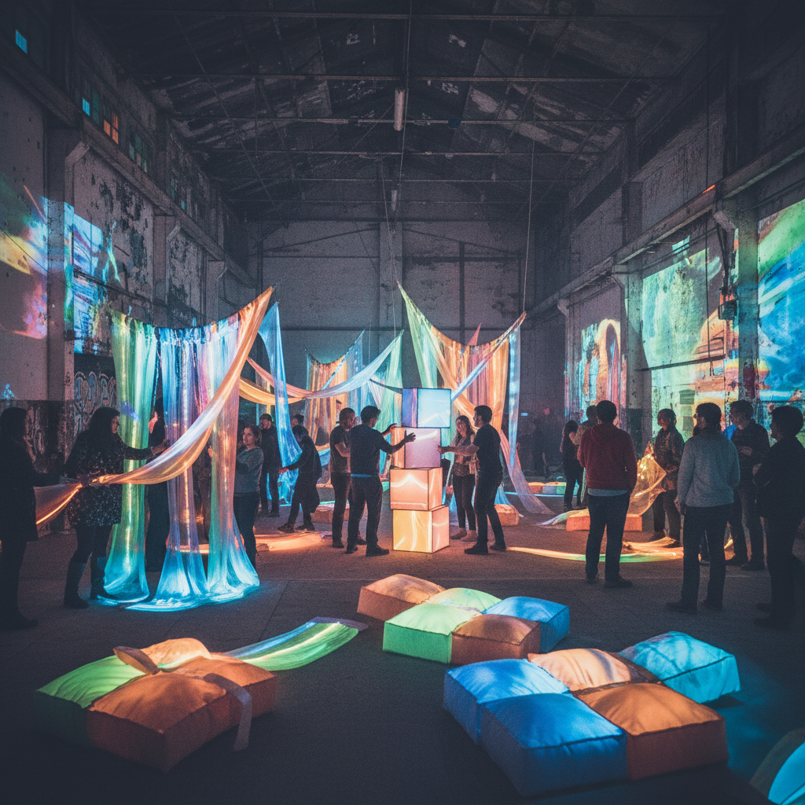

# Happenings Art 偶发艺术

> **时期：** 1958年–1970年代  
> **关键词：** 即兴表演、观众参与、跨媒介、一次性事件、生活即艺术

## 概述

Happenings（偶发艺术）是1950年代末由阿兰·卡普罗发起的表演艺术形式，将绘画、雕塑、音乐、舞蹈和戏剧融合为一次性的现场事件。观众不再是被动的观看者，而是事件的参与者——艺术从画框中走出，进入真实的时间和空间，每一次"发生"都是独一无二、不可重复的。

## 风格特征

- **即兴性**：没有固定剧本的开放结构
- **观众参与**：打破表演者与观众的界限
- **跨媒介**：视觉、声音、身体的综合
- **一次性**：不可重复的时间性事件
- **日常空间**：在非艺术场所发生

## 代表人物与作品

- 阿兰·卡普罗《18个偶发事件的6个部分》
- 克拉斯·奥登伯格（商店偶发）
- 吉姆·戴恩（早期偶发艺术）
- 红色格鲁姆斯（戏剧性偶发）

## 概念图

