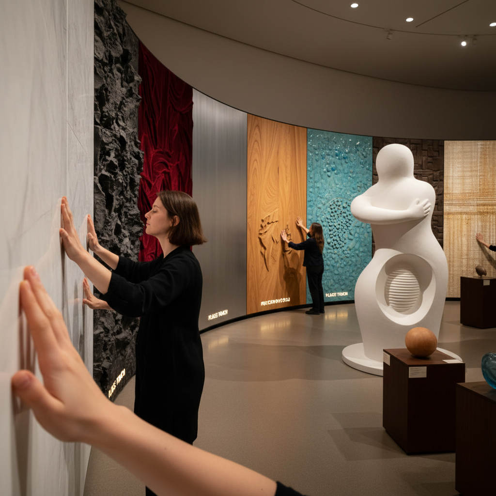

# Haptic Art 触觉艺术

> "Haptic art insists on the body's knowledge — that understanding comes through the fingertips as much as through the eyes, that texture and weight and temperature and resistance carry meaning that vision alone cannot decode, that the history of art's prohibition against touching is also a history of sensory impoverishment, and that when we finally allow ourselves to feel art rather than merely see it, we discover dimensions of aesthetic experience that have been waiting patiently for centuries to be acknowledged." — Unknown

## 概述

触觉艺术（Haptic Art）是一种以触觉体验为核心的艺术实践，强调通过触摸、质感、温度、重量和身体接触来传达艺术意义。触觉艺术挑战了西方艺术传统中"不要触摸"的禁令，主张触觉是一种与视觉同等重要的审美通道。

触觉艺术的实践包括：1）为触摸而设计的雕塑——邀请观众用手探索形态和质感；2）触觉绘画——使用厚重的颜料、混合媒材创造可触摸的表面；3）触觉装置——利用振动、温度变化、气流等创造触觉体验；4）无障碍艺术——为视障人士设计的可触摸艺术品；5）数字触觉——利用触觉反馈技术（haptic feedback）创造虚拟触觉体验。触觉艺术与无障碍运动、身体现象学和感官研究密切相关。

## 核心特征

| 特征 | 描述 |
|------|------|
| 触摸 | 触摸作为核心体验 |
| 质感 | 丰富的表面质感 |
| 身体 | 身体的直接参与 |
| 无障碍 | 感官的无障碍性 |
| 亲密 | 亲密的距离 |
| 材料 | 材料的物质性 |

## 视觉特征

- **质感**：丰富多样的表面质感
- **厚度**：材料的厚度和层次
- **有机**：有机的形态
- **温暖**：温暖的材料选择
- **手工**：手工制作的痕迹
- **邀请**：邀请触摸的形态

## 代表作品

| 作品 | 艺术家 | 年代 | 意义 |
|------|--------|------|------|
| *Touch sculptures* | Constantin Brancusi | 1920年代 | 光滑表面的触觉邀请 |
| *Tactile paintings* | Various | 当代 | 可触摸的绘画 |
| *Haptic installations* | Various | 2010年代 | 触觉装置 |
| *Accessible art programs* | Various museums | 2000年代 | 博物馆触摸项目 |
| *Digital haptics* | Various | 2020年代 | 数字触觉艺术 |

## 历史时间线

| 时期 | 事件 |
|------|------|
| 古代 | 雕塑的触觉传统 |
| 20世纪初 | 未来主义的触觉宣言 |
| 1960年代 | 参与式艺术的兴起 |
| 2000年代 | 无障碍艺术运动 |
| 当代 | 数字触觉技术的应用 |

## 中国语境

触觉艺术在中国有深厚的文化根基。中国传统文化中对材料触感的重视——玉的温润、丝绸的滑爽、紫砂的细腻、宣纸的柔韧——本身就是一种触觉美学。中国的文人传统中，"把玩"是一种重要的审美方式——通过反复触摸和握持来体验器物之美。中国当代的一些艺术家在探索触觉艺术的可能性：利用传统材料（陶瓷、丝绸、竹编）创作邀请触摸的作品，或者将数字触觉技术与传统工艺结合。中国的博物馆也在逐步引入触摸体验项目，特别是为视障观众提供可触摸的艺术品复制品。

## AI生成概念图

## 与其他风格的关系

- **Sensory Art** → 感官艺术
- **Sculpture** → 雕塑
- **Installation Art** → 装置艺术
- **Disability Art** → 残障艺术
- **Material Art** → 材料艺术
- **Interactive Art** → 互动艺术

---

*浮光艺志 | Chronicle of Artistry*
