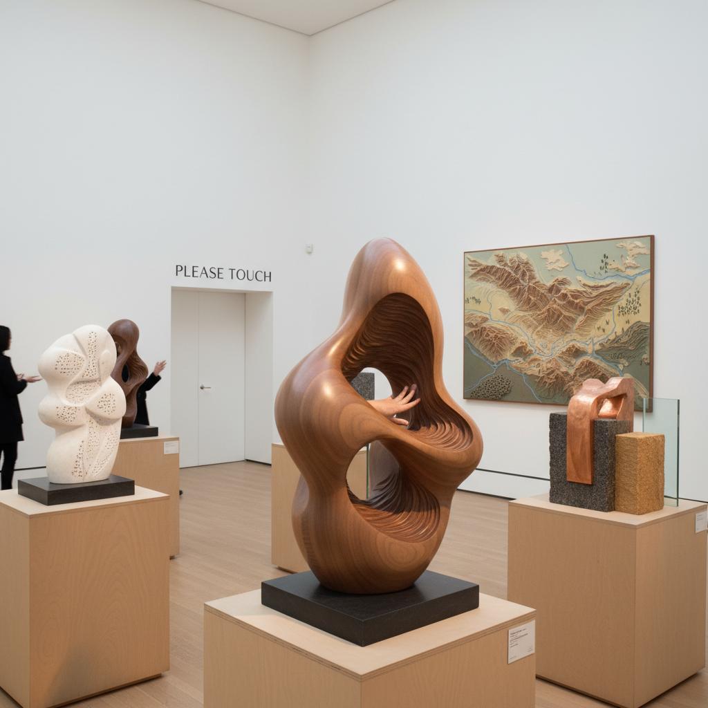

# Haptic Sculpture Art 触觉雕塑艺术

> "Haptic sculpture insists that art is not only for the eyes — it demands to be touched, held, stroked, gripped, and explored by the hands. In a world where museums put velvet ropes around everything and signs say 'Do Not Touch,' haptic sculpture rebels by making touch the primary sense through which the work is understood, by designing for fingertips rather than retinas, and by recognizing that the skin is our largest organ of perception." — Unknown

## 概述

触觉雕塑艺术（Haptic Sculpture Art）是专门为触觉体验而设计的三维艺术形式——作品的意义和美感主要通过触摸而非观看来传达。"Haptic"源自希腊语"haptikos"（触觉的），这类雕塑邀请观众用手去探索形态、质地、温度、重量和表面变化。

触觉雕塑艺术的实践包括：1）盲人可及的艺术——为视障人士设计的可触摸雕塑；2）质地探索——以丰富多变的表面质地为核心的雕塑；3）温度雕塑——利用不同材料的导热性创造温度体验；4）互动触觉——响应触摸的动态雕塑；5）数字触觉——结合力反馈技术的虚拟触觉雕塑；6）治愈性触觉——用于冥想、减压和治疗的触觉对象。

## 核心特征

| 特征 | 描述 |
|------|------|
| 触觉 | 触觉为主要感知通道 |
| 质地 | 丰富的表面质地 |
| 互动 | 需要身体接触 |
| 包容 | 视障人士可及 |
| 温度 | 材料温度体验 |
| 亲密 | 亲密的身体关系 |

## 视觉特征

- **曲面**：流畅的有机曲面
- **质地**：多样的表面纹理
- **手感**：适合手握的尺度
- **材料**：多种材料的对比
- **光滑**：抛光与粗糙的对比
- **温暖**：木材、石材的温度感

## 代表作品

| 作品 | 艺术家 | 年代 | 意义 |
|------|--------|------|------|
| *Touch sculptures* | Constantin Brancusi | 1920年代 | 极致光滑的触觉 |
| *Tactile sculptures* | Barbara Hepworth | 1960年代 | 可穿越的形态 |
| *Haptic installations* | Various | 2000年代 | 互动触觉装置 |
| *Blind art programs* | Various | 2010年代 | 无障碍触觉艺术 |
| *Digital haptics* | Various | 2020年代 | 数字触觉雕塑 |

## 历史时间线

| 时期 | 事件 |
|------|------|
| 古代 | 宗教雕塑的触摸传统 |
| 1920年代 | Brancusi的极致表面 |
| 1960年代 | Hepworth的触觉形态 |
| 2000年代 | 博物馆触觉项目 |
| 2020年代 | 数字触觉技术 |

## 中国语境

触觉雕塑艺术在中国有深厚的文化根基。中国传统文化中对"手感"的重视——玉器的温润、紫砂壶的细腻、文玩核桃的包浆——本质上就是一种触觉美学。中国人"盘"玉、"养"壶的传统，是通过长期触摸让物件获得生命力的过程。中国传统的"把件"文化——专门为手中把玩而设计的小型雕刻——是最纯粹的触觉雕塑。中国当代的一些艺术家在探索触觉雕塑：将中国传统的"把件"美学与当代雕塑结合、为中国博物馆开发无障碍触觉展品、以及将中国传统材料（玉、竹、紫砂）的触觉特性作为创作核心。

## AI生成概念图

## 与其他风格的关系

- **Sculpture** → 雕塑
- **Interactive Art** → 互动艺术
- **Accessible Art** → 无障碍艺术
- **Material Art** → 材料艺术
- **Kinetic Art** → 动态艺术
- **Sensory Art** → 感官艺术

---

*浮光艺志 | Chronicle of Artistry*
