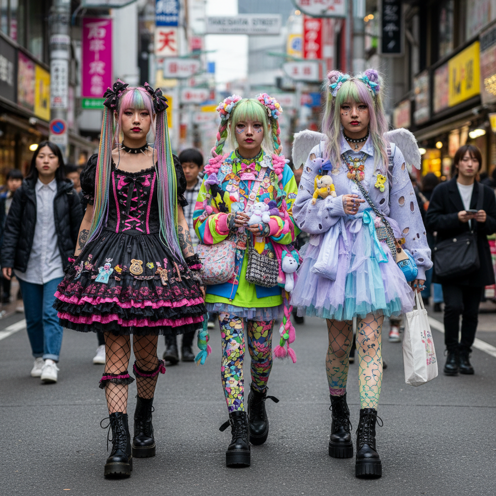

# Harajuku Street 原宿街头



> **"竹下通的彩色爆炸——没有规则，只有自我表达。"**

## 概述

| 维度 | 描述 |
|------|------|
| 时期 | 1980s–至今 |
| 别名 | Harajuku Fashion, 原宿系, ストリートファッション |
| 核心色彩 | 全色谱——无限制 |
| 关键元素 | 混搭、层叠、DIY、无规则、极端个性 |
| 代表人物 | FRUiTS 杂志、KERA 杂志、きゃりーぱみゅぱみゅ |
| 关联风格 | Decora, Lolita, Visual Kei, Fairy Kei, Mori Girl |

---

## 历史脉络

| 年份 | 事件 |
|------|------|
| 1980s | 原宿竹下通成为青年时尚聚集地 |
| 1997 | 青木正一创办 FRUiTS 杂志——记录街头时尚 |
| 2000s | 全盛期——全球关注原宿 |
| 2004 | Gwen Stefani "Harajuku Girls"——全球化 |
| 2012 | 原宿街头时尚开始衰落 |
| 2017 | FRUiTS 杂志停刊——"街上没有有趣的人了" |
| 2020s | 线上延续+部分复兴 |

### 核心哲学

原宿街头的精神是**"穿你想穿的——没有规则，只有创造力"**：
- 自由 = 核心（"没有对错"）
- 混搭 = 创造力（"把不搭的东西搭在一起"）
- DIY = 独特（"买不到就自己做"）
- 街头 = 舞台（"竹下通就是T台"）
- "如果别人能理解你的穿搭，说明你还不够大胆"

---

## 视觉语法

### 色彩系统

```
规则：没有规则
  - 任何颜色都可以
  - 越多越好（或极简也行）
  - 高饱和度偏好
  - 对比越强越好
  - 黑白极端也是一种选择

子风格色彩倾向：
  Decora → 全彩虹
  Lolita → 粉/黑/白
  Visual Kei → 黑/红/银
  Fairy Kei → 粉/紫/蓝（柔和）
  Mori Girl → 棕/绿/米

质感：
  所有质感都可以混搭
  塑料+丝绒+蕾丝+皮革+棉
  关键是"意想不到的组合"
```

### 标志性元素

| 类别 | 元素 |
|------|------|
| 服装 | 无限制——从洛丽塔到朋克到运动 |
| 配饰 | 大量、层叠、DIY、意想不到 |
| 发型 | 彩色、造型、假发、极端 |
| 妆容 | 从无妆到极端——取决于子风格 |
| 态度 | 自由、创造、无规则、个性 |
| 场所 | 竹下通、明治神宫桥、代代木公园 |

---

## 子风格谱系

| 子风格 | 特征 |
|--------|------|
| Decora | 配饰堆叠、彩色发夹 |
| Gothic Lolita | 黑色+蕾丝+洛可可 |
| Sweet Lolita | 粉色+蝴蝶结+公主 |
| Fairy Kei | 80s 彩虹+独角兽+柔和 |
| Visual Kei | 华丽+哥特+摇滚 |
| Mori Girl | 自然+层叠+森林 |
| Gyaru | 美黑+金发+大胆 |
| Punk | 安全别针+格子+反叛 |
| Cyber | 荧光+PVC+未来 |

---

## 与千禧怀旧的关系

### 2000s 全球青年文化的灵感源
- 原宿 = "世界上最有创意的街头"
- 影响了全球的 Scene/Emo/Alternative 文化
- FRUiTS 杂志 = 街拍文化的先驱
- "Instagram 之前，原宿就是视觉社交媒体"

### 为什么衰落？
- 社交媒体让"独特"变得"可复制"
- 快时尚让"DIY"变得"没必要"
- 但精神从未消失——只是转移到了线上

---

## 中国语境

- 原宿文化对中国青年时尚的深远影响
- 中国"日系"穿搭的根源
- 与中国 cosplay/二次元文化的交叉
- 北京三里屯、上海巨鹿路的"中国原宿"

---

## 设计应用

| 场景 | 应用方式 |
|------|----------|
| 时尚 | 混搭+无规则+极端个性+DIY |
| 品牌 | 创造力+自由+年轻+大胆+独特 |
| 空间 | 彩色+层叠+展示+互动+拍照 |
| 数字 | 贴纸+彩色+混搭+可爱+极端 |

---

## 相关风格

← [Decora デコラ](decora.md) | [Fairy Kei 仙女系](fairy-kei.md) →

↑ [返回千禧怀旧目录](README.md) | [返回总目录](../README.md)
