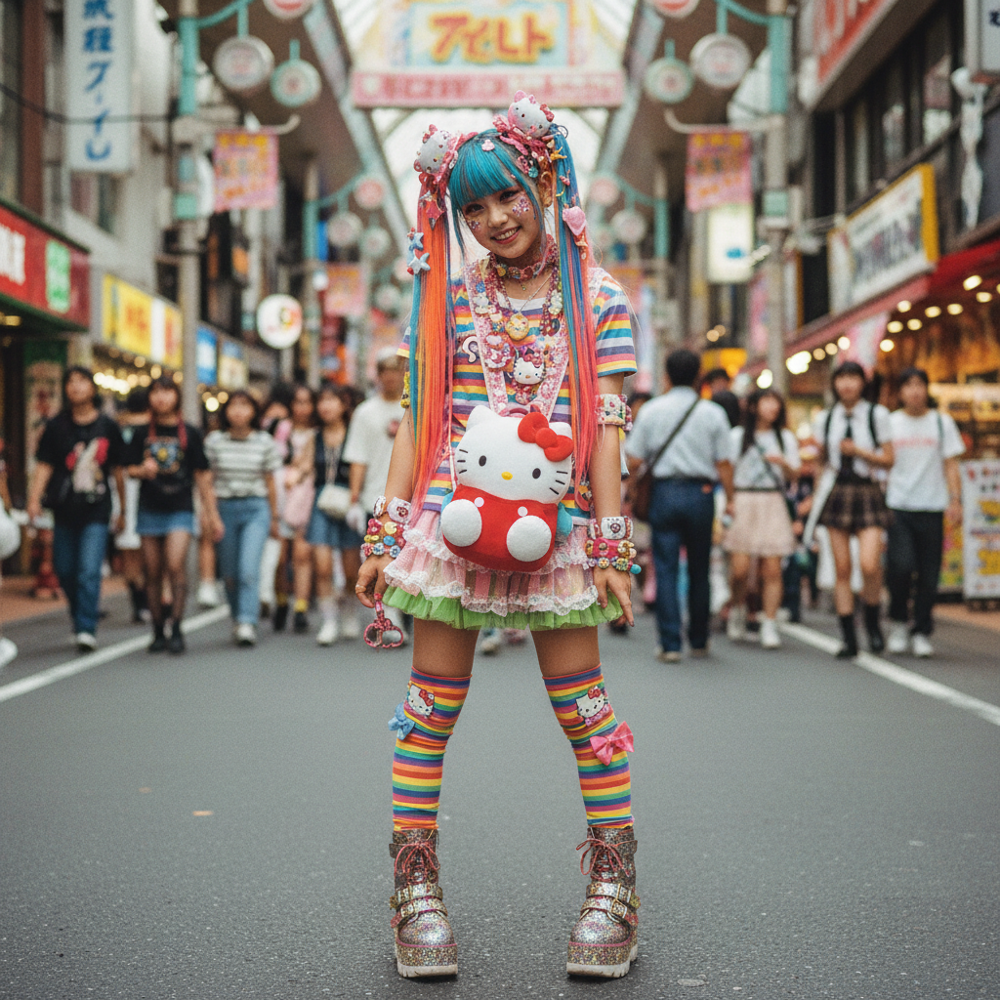
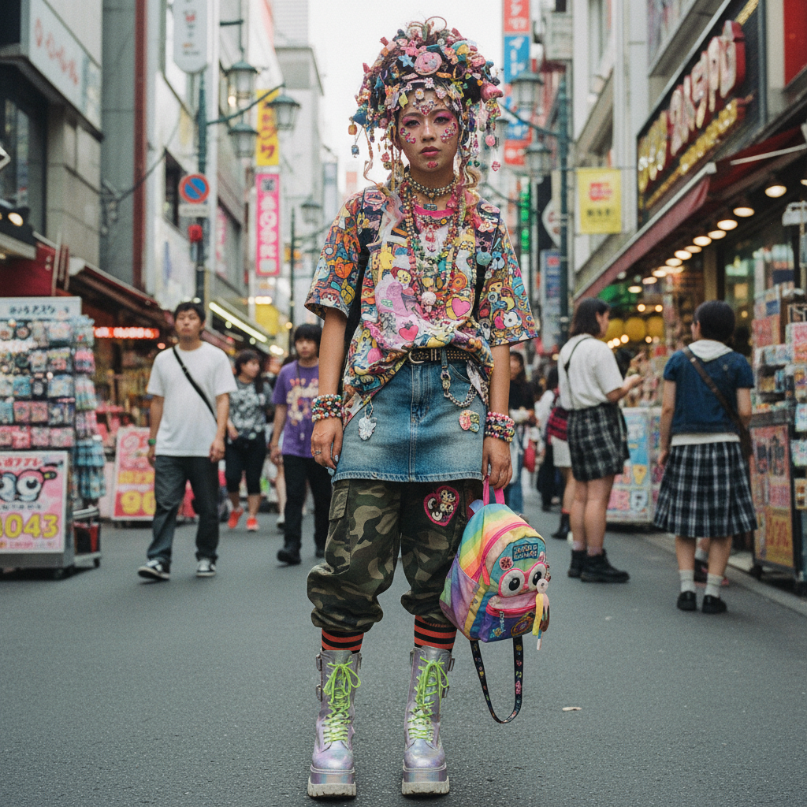

# Harajuku Y2K | 原宿千禧风

## 概述

- **时间跨度**：2000 – 2015
- **发源地**：日本东京原宿（Harajuku）
- **核心理念**：色彩爆炸、层次堆叠、童趣与反叛并存的日本街头千禧美学
- **别名**：Decora、Fairy Kei（部分重叠）

## 历史背景

原宿Y2K是日本街头时尚在千禧年前后的独特表达。与西方Y2K的科技未来感不同，日本版本更强调**可爱（Kawaii）、层叠、手工感和个人表达**。原宿竹下通（Takeshita Street）是这种文化的物理中心，FRUiTS杂志（1997-2017）则是其视觉档案。

### 竹下通：一条街的宇宙

竹下通全长约350米，却浓缩了整个日本青年亚文化的光谱。2000年代的竹下通是这样的：
- 入口处的麦当劳是"集合地点"——穿着各异的年轻人在这里汇合
- 两侧密布着 SPINNS、WEGO、6%DOKIDOKI 等潮流店铺
- 可丽饼店门口排着长队，每个人的穿搭都像一件行走的艺术品
- 周末下午，摄影师青木正一（Shoichi Aoki）举着相机寻找下一期 FRUiTS 的封面

### FRUiTS 杂志：街拍圣经

FRUiTS（1997-2017）由青木正一创办，是世界上第一本专注于街头时尚街拍的杂志。它的规则很简单：**只拍真实的人，不用模特，不做造型**。每一页都是原宿街头的真实切片。

2017年杂志停刊时，青木正一说："原宿的年轻人不再有自己的风格了。他们都穿得一样。"这句话本身就是原宿Y2K时代终结的墓志铭。

### 核心子风格

| 子风格 | 时期 | 特征 |
|--------|------|------|
| **Decora** | 1998-2012 | 数百个发夹、玩具、贴纸装饰全身 |
| **Fairy Kei** | 2007-2015 | 80年代彩虹色+独角兽+星星+蓬蓬裙 |
| **Cyber** | 2000-2008 | 护目镜+荧光色+PVC管+假发 |
| **Visual Kei** | 1990s-至今 | 摇滚乐队的华丽妆容与服装 |
| **Lolita** | 1990s-至今 | 维多利亚/洛可可风格的精致裙装 |
| **Gyaru** | 1990s-2010s | 深色肤色+金发+夸张睫毛 |

## 视觉特征

### 核心元素
- **极度层叠**：同时穿5-10层不同颜色的衣物
- **发夹与配饰过载**：头上可能有50+个发夹
- **卡通元素**：Hello Kitty、My Melody、宝可梦
- **DIY精神**：手工改造、贴纸拼贴、自制配饰
- **平台鞋**：厚底鞋是标配（有些高达20cm）
- **彩色假发/挑染**
- **面部贴纸**：星星、心形、创可贴作为装饰
- **玩具配饰**：扭蛋玩具、塑料恐龙、迷你食物模型

### 色彩
- 全色谱——没有禁忌色
- 粉色、薰衣草、薄荷绿、柠檬黄最常见
- 彩虹渐变
- 黑色用于Cyber/Gothic子风格
- 关键原则：**越多越好，越不搭配越好**

### 代表品牌

| 品牌 | 风格定位 | 创始人/设计师 |
|------|----------|---------------|
| 6%DOKIDOKI | Decora/Kawaii | Sebastian Masuda |
| Super Lovers | 彩色街头 | — |
| Hysteric Glamour | 摇滚千禧 | 北村信彦 |
| Angelic Pretty | 甜系洛丽塔 | — |
| MILK | 少女复古 | — |
| BABY, THE STARS SHINE BRIGHT | 古典洛丽塔 | — |
| Metamorphose | 洛丽塔 | — |
| Galaxxxy | 宇宙Kawaii | — |

## 代表案例

| 领域 | 代表 | 说明 |
|------|------|------|
| 杂志 | FRUiTS (1997-2017) | 原宿街拍圣经 |
| 音乐 | Kyary Pamyu Pamyu | 原宿Kawaii的全球化（2011-） |
| 音乐 | Capsule/中田ヤスタカ | 原宿电子流行的音乐制作人 |
| 品牌 | 6%DOKIDOKI | Sebastian Masuda的彩色世界 |
| 动画 | 《下妻物语》(2004) | 洛丽塔+原宿文化 |
| 游戏 | 《美妙世界》(TWEWY, 2007) | 涩谷街头时尚RPG |
| 展览 | KAWAII Monster Cafe (2015-2021) | Sebastian Masuda的沉浸式餐厅 |
| 艺术 | 村上隆 Superflat | Kawaii文化的当代艺术化 |

## 文化内核

原宿Y2K的核心是**个人表达的极致自由**。在日本社会强调统一和规范的背景下，原宿成为年轻人"可以做自己"的安全空间。每一个过度装饰的发夹、每一层不协调的衣物，都是对"正常"的温柔反抗。

### Kawaii 作为抵抗

日本社会学家认为，Kawaii（可爱）文化本身就是一种**温柔的反抗**：
- 拒绝"成熟"——不想变成穿西装的上班族
- 拒绝"性感"——用童趣对抗物化
- 拒绝"统一"——用过度装饰对抗制服文化
- 拒绝"效率"——花3小时穿衣服本身就是一种宣言

### 衰落与遗产

2010年代中期，原宿街头时尚逐渐衰落：
- 快时尚（UNIQLO、H&M）的普及让年轻人不再需要独立品牌
- 社交媒体让"穿搭"从街头转移到屏幕
- 竹下通的独立店铺被连锁品牌取代
- FRUiTS 2017年停刊

但原宿Y2K的遗产仍然活跃：
- Kyary Pamyu Pamyu 将Kawaii带向全球
- 西方时尚界定期"发现"原宿并致敬
- Decora 和 Fairy Kei 在海外有忠实的小众社群
- "Harajuku"本身已成为一个全球性的文化符号

## 图片画廊

| | |
|:---:|:---:|
|  | |
| *原宿千禧风 · Decora发夹与彩虹层叠* | |

## 延伸阅读

- [Decora | Aesthetics Wiki](https://aesthetics.fandom.com/wiki/Decora)
- [Fairy Kei | Aesthetics Wiki](https://aesthetics.fandom.com/wiki/Fairy_Kei)
- FRUiTS Magazine Archive
- 《下妻物语》(Kamikaze Girls, 2004)
- Sebastian Masuda: "Colorful Rebellion"

---

[← Nu-Rave](nu-rave.md) | [→ Cyber Y2K](cyber-y2k.md) | [↑ 返回目录](README.md)
