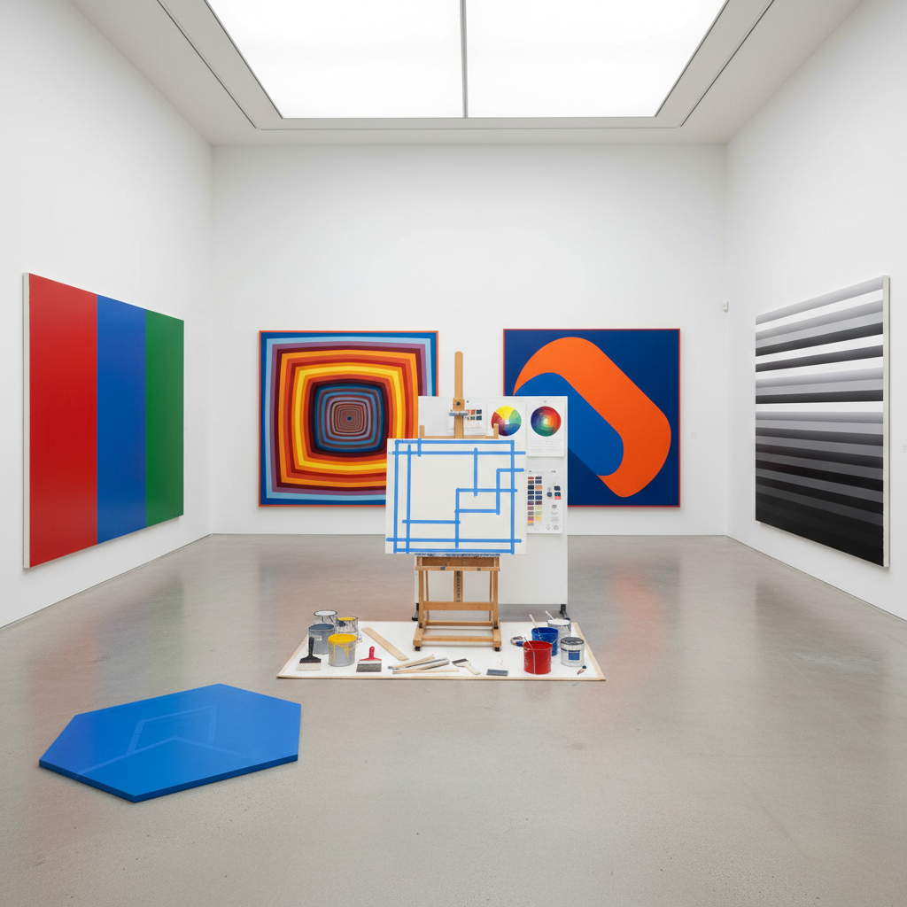

# Hard-Edge Abstraction 硬边抽象

> "Hard-edge painting is the discipline of the absolute boundary — where color meets color with the precision of a knife edge, where no brushstroke bleeds or blurs, where the canvas becomes a field of pure chromatic relationships defined by geometry so clean it seems mechanical, yet the effect is not cold but vibrating, optical, alive with the tension between adjacent hues pressing against their shared border, a painting practice that proves you do not need gesture or expression to create visual intensity, only the courage to commit to a line and the patience to make it perfect." — Jules Langsner

## 概述

硬边抽象（Hard-Edge Painting / Hard-Edge Abstraction）是1950-60年代在美国（特别是加利福尼亚）发展起来的一种抽象绘画风格，由评论家朱尔斯·朗斯纳（Jules Langsner）在1959年命名。硬边绘画的特征是：清晰锐利的边缘、平坦的色彩区域、几何形式、以及对笔触痕迹的消除。

硬边抽象是对抽象表现主义的"热"表现（gestural, emotional）的反应，追求一种"冷"的、理性的、精确的抽象。代表艺术家包括埃尔斯沃思·凯利（Ellsworth Kelly）、弗兰克·斯特拉（Frank Stella）、肯尼斯·诺兰（Kenneth Noland）、杰克·扬格曼（Jack Youngerman）和约翰·麦克劳林（John McLaughlin）。硬边绘画与色域绘画（Color Field）和极简主义有密切关联，但更强调形状之间的边界关系和色彩的光学效果。

## 核心特征

| 特征 | 描述 |
|------|------|
| 锐利 | 锐利清晰的边缘 |
| 平坦 | 平坦的色彩区域 |
| 几何 | 几何形式 |
| 精确 | 机械般的精确 |
| 光学 | 光学的色彩效果 |
| 非手势 | 消除手势痕迹 |

## 视觉特征

- **边缘**：刀刃般锐利的边缘
- **平面**：完全平坦的色面
- **几何**：圆形、条纹、V形
- **色彩**：纯色的并置
- **对称**：对称或规则的构图
- **表面**：光滑无笔触的表面

## 代表作品

| 作品 | 艺术家 | 年代 | 意义 |
|------|--------|------|------|
| *Red Blue Green* | Ellsworth Kelly | 1963 | 凯利的色彩形状 |
| *Die Fahne Hoch!* | Frank Stella | 1959 | 斯特拉的黑色条纹 |
| *Chevron paintings* | Kenneth Noland | 1960年代 | 诺兰的V形 |
| *Untitled (McLaughlin)* | John McLaughlin | 1960年代 | 麦克劳林的极简 |
| *Four Panels* | Jack Youngerman | 1960年代 | 扬格曼的有机形状 |

## 历史时间线

| 时期 | 事件 |
|------|------|
| 1959 | Langsner命名"硬边绘画" |
| 1959 | "Four Abstract Classicists"展 |
| 1960年代 | 硬边绘画的高峰 |
| 1964 | "Post-Painterly Abstraction"展 |
| 当代 | 硬边传统的延续 |

## 中国语境

硬边抽象在中国的直接影响相对有限，但其精神在中国当代抽象艺术中有所体现。中国的一些抽象画家追求类似的精确性和几何秩序——如丁乙的"十示"系列以其严格的网格和精确的重复体现了硬边精神。中国传统艺术中对"工笔"（精细绘画）的重视也与硬边绘画的精确追求有某种呼应。中国的设计和建筑领域对几何抽象的运用也受到硬边传统的影响。近年来，中国的一些年轻抽象画家在探索硬边与软边、几何与有机之间的张力，发展出融合东西方抽象传统的新语言。

## AI生成概念图

## 与其他风格的关系

- **Color Field** → 色域绘画
- **Minimalism** → 极简主义
- **Geometric Abstraction** → 几何抽象
- **Op Art** → 欧普艺术
- **Post-Painterly Abstraction** → 后绘画性抽象
- **De Stijl** → 风格派

---

*浮光艺志 | Chronicle of Artistry*
