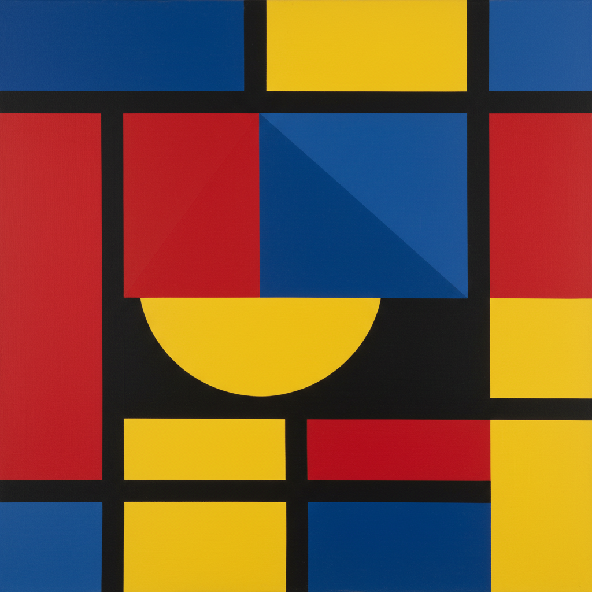

# Hard-Edge Painting 硬边绘画



> **"没有模糊——没有渐变——只有纯色与纯色之间锋利如刀的边界。"**

## 概述

| 维度 | 描述 |
|------|------|
| 时期 | 1950s–1960s |
| 别名 | Hard-Edge Painting, 硬边绘画, Post-Painterly Abstraction |
| 核心色彩 | 纯色平涂——鲜明、饱和、无混合 |
| 关键元素 | 锐利边缘、几何形状、纯色平涂、无笔触 |
| 代表人物 | Ellsworth Kelly, Frank Stella, Kenneth Noland, Al Held |
| 关联风格 | Color Field, Minimalism, Op Art, Geometric Abstraction |

---

## 历史脉络

| 年份 | 事件 |
|------|------|
| 1958 | Jules Langsner命名"Hard-Edge" |
| 1959 | Frank Stella "Black Paintings"——条纹即结构 |
| 1960s | Ellsworth Kelly的色块形状画布 |
| 1964 | "Post-Painterly Abstraction"展——Clement Greenberg策展 |
| 1960s | Kenneth Noland的靶心和V形 |

### 核心哲学

硬边绘画的精神是**"绘画不需要情感的模糊——清晰就是力量"**：
- "抽象表现主义太情绪化——我们要冷静、精确、客观"
- "边缘是决定——模糊是犹豫"
- "颜色不需要混合——每种颜色都是完整的"
- "画面就是画面——不指向画面之外的任何东西"
- "形状即内容——颜色即形式——没有隐喻"

---

## 视觉语法

### 色彩系统

```
规则：
  - 纯色平涂——无渐变、无笔触
  - 边缘锐利如刀——用遮蔽胶带
  - 色彩饱和度最大化
  - 通常2-5种颜色
  - 颜色之间无过渡

典型配色：
  红+蓝+黄 — 三原色对比
  黑+白 — 极端对比
  互补色 — 最大视觉张力
  类似色 — 微妙振动

技法：
  遮蔽胶带 — 完美直线
  喷枪 — 无笔触平涂
  shaped canvas — 画布即形状
  对称/不对称 — 几何构图
```

### 标志性元素

| 类别 | 元素 |
|------|------|
| 边缘 | 锐利、精确、无模糊 |
| 形状 | 几何、规则、简洁 |
| 色彩 | 纯色、饱和、平涂 |
| 表面 | 无笔触、无质感、工业感 |
| 构图 | 对称、重复、系列 |
| 态度 | 冷静、客观、精确、反情感 |

---

## 与千禧怀旧/当代设计的关系

### 对平面设计的影响
- 扁平化设计(Flat Design) = 硬边绘画的数字版本
- Material Design的色块 = 硬边美学
- "iOS 7之后的设计世界——就是硬边绘画的世界"
- Logo设计中的几何+纯色 = 硬边精神

---

## 设计应用

| 场景 | 应用方式 |
|------|----------|
| 品牌 | 几何Logo+纯色系统+扁平化 |
| 数字 | Flat Design+Material Design |
| 空间 | 色块墙面+几何装饰 |
| 时尚 | 色块拼接+几何图案 |

---

## 相关风格

← [Color Field 色域绘画](color-field.md) | [Op Art 欧普艺术](op-art.md) →

↑ [返回千禧怀旧目录](README.md) | [返回总目录](../README.md)
