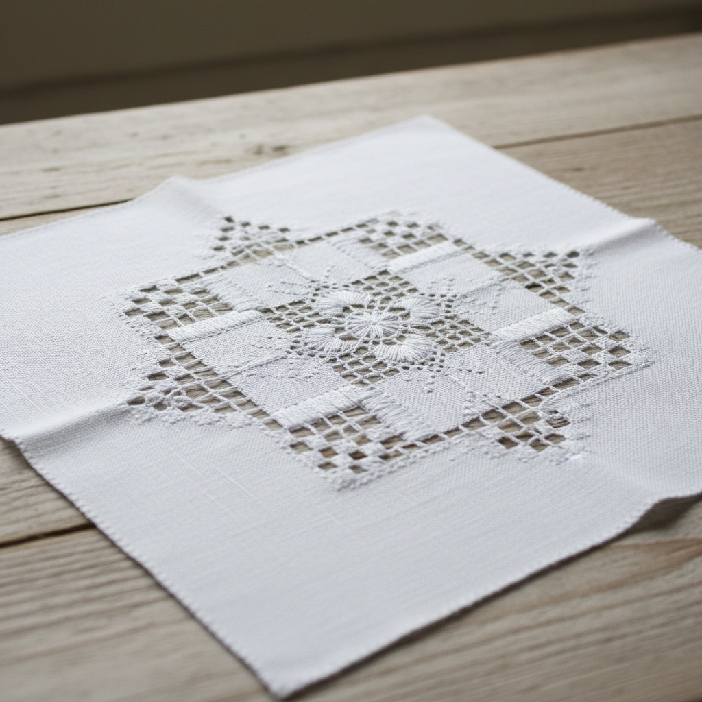

# Hardanger Art 哈当厄尔刺绣艺术

> "Hardanger embroidery is architecture in thread — geometric blocks of satin stitch (kloster blocks) define the boundaries of open areas where threads are cut away and the remaining threads are wrapped, woven, and decorated to create lace-like openwork within a fabric frame. Named for the Hardanger fjord region of Norway, this whitework technique transforms plain even-weave linen into a fabric of extraordinary geometric beauty." — Unknown

## 概述

哈当厄尔刺绣艺术（Hardanger Art）是一种源自挪威哈当厄尔峡湾地区的几何刺绣技法——在均匀织物上用缎面绣（kloster blocks）围出方形区域，然后抽去区域内的经纬线，对剩余的线进行包缠和编织，形成精美的镂空效果。哈当厄尔刺绣是北欧最具代表性的白色刺绣（whitework）之一。

哈当厄尔刺绣艺术的实践包括：1）Kloster blocks——基本的缎面绣方块；2）抽线——切除和抽去织物中的线；3）包缠——对剩余线的包缠装饰；4）编织棒——在抽线区域编织装饰棒；5）鸽眼——小型的圆形镂空装饰；6）填充图案——在镂空区域编织填充图案；7）当代哈当厄尔——将传统技法与现代设计结合的创作。

## 核心特征

| 特征 | 描述 |
|------|------|
| 几何 | 严格的几何图案 |
| 镂空 | 抽线形成的镂空 |
| 白色 | 传统的白色刺绣 |
| 对称 | 精确的对称设计 |
| 北欧 | 挪威传统工艺 |
| 精密 | 极其精密的计数 |

## 视觉特征

- **几何**：严格的几何方块
- **镂空**：精美的镂空效果
- **白色**：白线在白布上的效果
- **对称**：精确的四方对称
- **光影**：镂空处的光影变化
- **精密**：极其精密的结构

## 代表作品

| 作品 | 艺术家/文化 | 年代 | 意义 |
|------|-------------|------|------|
| *Norwegian bunad aprons* | 挪威 | 17世纪至今 | 民族服装围裙 |
| *Hardanger tablecloths* | 挪威 | 18世纪至今 | 哈当厄尔桌布 |
| *Church altar cloths* | 北欧 | 中世纪至今 | 教堂祭坛布 |
| *Bridal accessories* | 挪威 | 传统 | 新娘配饰 |
| *Contemporary Hardanger* | 当代 | 当代 | 当代哈当厄尔 |

## 历史时间线

| 时期 | 事件 |
|------|------|
| 17世纪 | 哈当厄尔刺绣的起源 |
| 18-19世纪 | 在挪威的普及和发展 |
| 19世纪末 | 传入北美和其他地区 |
| 20世纪 | 作为传统工艺的保护 |
| 当代 | 哈当厄尔的全球传播和创新 |

## 中国语境

哈当厄尔刺绣艺术在中国有一定的爱好者群体。中国传统的"抽纱"工艺与哈当厄尔有技术上的相似之处——都涉及从织物中抽去线并对剩余线进行装饰。中国山东烟台的抽纱传统中有类似的几何镂空技法——虽然风格不同，但基本原理相通。中国的刺绣爱好者中，哈当厄尔作为一种精确的计数刺绣正在获得关注——因为其图案的数学美感和冥想般的制作过程。中国的一些手工刺绣社区开始教授哈当厄尔技法——将其作为拓展刺绣技能的选择。中国的十字绣爱好者转向哈当厄尔的比例较高——因为两者都基于计数和网格。中国的一些设计师将哈当厄尔的几何美学与中国传统图案结合——创造具有东方韵味的镂空刺绣作品。

## AI生成概念图

## 与其他风格的关系

- **Drawn Thread Work** → 抽线绣
- **Whitework** → 白色刺绣
- **Cutwork** → 镂空绣
- **Cross Stitch** → 十字绣
- **Norwegian Art** → 挪威艺术
- **Geometric Art** → 几何艺术

---

*浮光艺志 | Chronicle of Artistry*
