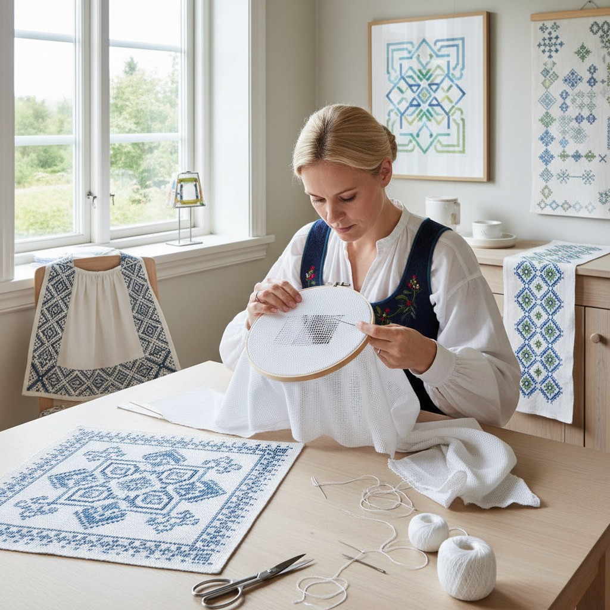

# Hardanger 哈当厄尔刺绣

> "Hardanger is geometry in thread — kloster blocks of satin stitch framing open squares where threads are cut and withdrawn, the remaining threads wrapped and woven into delicate bars and filling stitches, creating a fabric that is simultaneously solid and transparent, structured and lace-like, as precise as architecture." — Unknown

## 概述

哈当厄尔刺绣（Hardanger Embroidery）是一种源自挪威哈当厄尔峡湾地区的计数线刺绣和抽丝绣结合的技法。Hardanger的核心结构是：先用缎面针法（satin stitch）缝制成对的"Kloster块"（每块5针跨越5根织物线），这些块定义了将要剪切的区域边界；然后在块之间剪断并抽出织物线，留下的线被包裹（wrapped）或编织（woven）成装饰性的"bars"（横杆），空隙中可以填入各种装饰性填充针法。

Hardanger起源于17世纪的挪威——受到意大利Reticella蕾丝的影响，挪威妇女发展出了这种独特的技法。传统的Hardanger使用白色线在白色均匀织物（even-weave fabric，通常是22-count Hardanger布）上制作。Hardanger传统上用于围裙、桌布、窗帘和教堂装饰。当代Hardanger在全球的刺绣社区中有活跃的实践。

## 核心特征

| 特征 | 描述 |
|------|------|
| Kloster块 | 缎面针法的方块 |
| 剪切 | 剪断织物线 |
| 抽丝 | 抽出织物线 |
| 包裹 | 包裹剩余线 |
| 几何 | 严格的几何结构 |
| 计数 | 精确的计数线 |

## 视觉特征

- **几何**：严格的几何图案
- **透明**：剪切区域的透明
- **对比**：实体与透空的对比
- **精确**：数学般的精确
- **优雅**：北欧的简约优雅
- **白色**：传统的白色美学

## 代表作品

| 作品 | 艺术家 | 年代 | 意义 |
|------|--------|------|------|
| *Traditional Hardanger aprons* | 挪威妇女 | 17-19世纪 | 传统围裙 |
| *Hardanger table linens* | Various | 传统 | 桌布和餐巾 |
| *Church Hardanger* | Various | 传统 | 教堂装饰 |
| *Contemporary Hardanger* | Various | 当代 | 当代哈当厄尔 |
| *Colored Hardanger* | Various | 当代 | 彩色哈当厄尔 |

## 历史时间线

| 时期 | 事件 |
|------|------|
| 17世纪 | 意大利Reticella影响挪威 |
| 18世纪 | Hardanger在挪威的发展 |
| 19世纪 | Hardanger的标准化和传播 |
| 20世纪 | Hardanger的全球传播 |
| 当代 | Hardanger的持续创新 |

## 中国语境

哈当厄尔刺绣在中国的刺绣社区中有一定的知名度——中国的十字绣和抽纱爱好者中有人学习Hardanger。中国的手工材料市场上有Hardanger专用布料和线材的供应。中国传统的抽纱技法（如汕头抽纱）与Hardanger有技法上的相似性——都涉及剪断和抽出织物线。中国的一些刺绣教育机构在课程中包含Hardanger。Hardanger的几何美学与中国传统的几何纹样有审美上的共鸣。

## AI生成概念图

## 与其他风格的关系

- **Whitework** → 白色刺绣
- **Drawn Thread Work** → 抽丝绣
- **Cutwork** → 雕绣
- **Needle Lace** → 针绣蕾丝
- **Cross Stitch** → 十字绣
- **Geometric Art** → 几何艺术

---

*浮光艺志 | Chronicle of Artistry*
