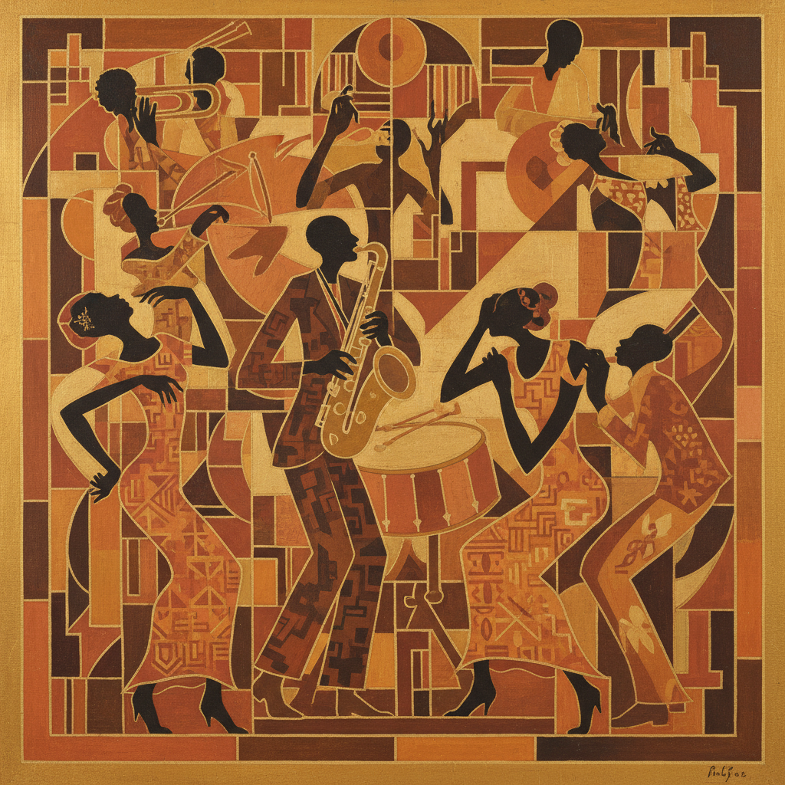

# Harlem Renaissance Art 哈莱姆文艺复兴艺术

> **时期：** 1920年代–1930年代  
> **关键词：** 非裔美国人、文化觉醒、爵士时代、种族自豪、现代主义融合

## 概述

Harlem Renaissance Art（哈莱姆文艺复兴艺术）是1920年代在纽约哈莱姆区爆发的非裔美国文化运动的视觉分支。画家们将非洲艺术传统、现代主义形式语言和黑人生活经验融为一体——亚伦·道格拉斯的几何剪影、雅各布·劳伦斯的叙事系列——创造出一种既现代又扎根于非洲散居者历史的独特视觉语言。

## 风格特征

- **非洲元素**：面具、图案、几何化人物
- **剪影风格**：平面化的人物轮廓
- **爵士节奏**：音乐般的构图韵律
- **叙事性**：讲述黑人历史和日常生活
- **现代融合**：立体主义和装饰艺术的影响

## 代表人物与作品

- 亚伦·道格拉斯《从奴役到重建》
- 雅各布·劳伦斯《大迁徙》系列
- 阿奇博尔德·莫特利 夜生活场景
- 洛伊斯·梅洛·琼斯 非洲主题

## 概念图

