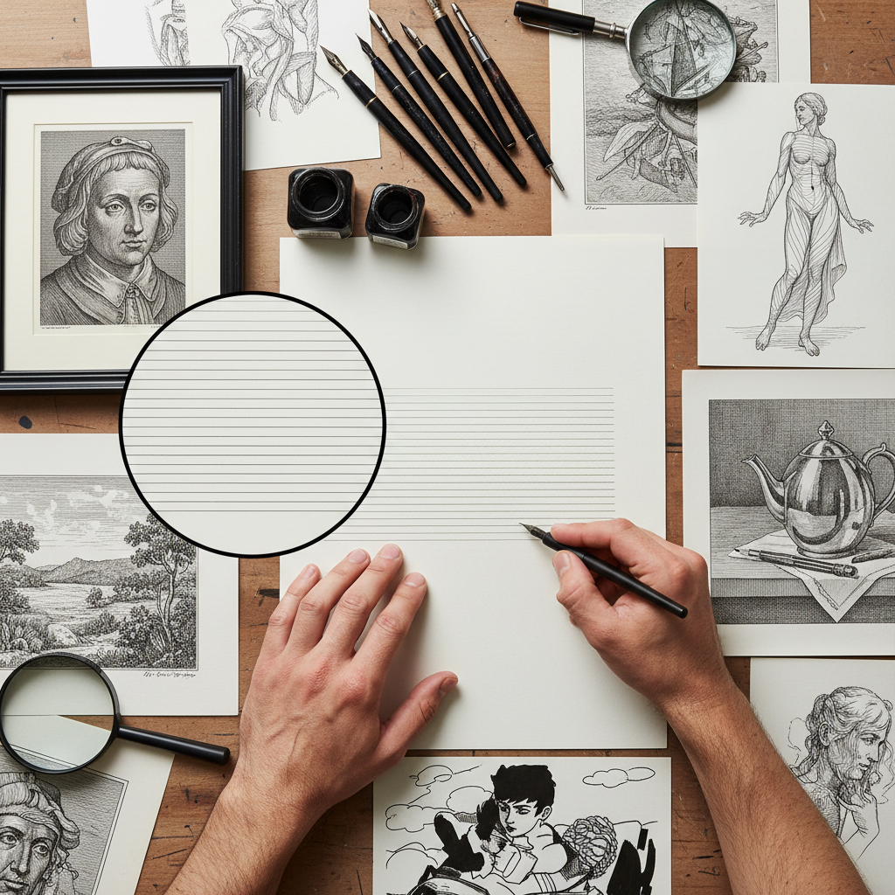

# Hatching Technique 排线技法

> "Hatching is the grammar of drawing — parallel lines laid side by side, their spacing and weight speaking volumes about light, shadow, form, and texture without a single tone being blended or smudged." — Unknown

## 概述

排线技法（Hatching Technique）是绘画和素描中最基本的明暗表现技法之一——通过绘制平行线条来表现物体的明暗、体积和质感。线条的密度、粗细、方向和间距决定了画面的明暗层次。排线法与交叉排线（crosshatching）不同——排线法只使用单方向的平行线，而交叉排线使用多方向交叉的线条。

排线法的历史可追溯到中世纪的手稿插图和早期版画。文艺复兴时期，排线法在铜版画和素描中得到系统化发展——丢勒、伦勃朗等大师将排线法发展到极高的艺术水平。排线法的优势在于：线条方向可以暗示物体的形态和表面走向、线条的规律性产生优雅的视觉效果、排线法比涂抹法更能保持画面的清晰度和精确性。

## 核心特征

| 特征 | 描述 |
|------|------|
| 平行 | 平行线条 |
| 密度 | 通过密度表现明暗 |
| 方向 | 线条方向暗示形态 |
| 精确 | 精确的线条控制 |
| 清晰 | 保持画面清晰 |
| 基础 | 素描基础技法 |

## 视觉特征

- **线条**：可见的平行线条
- **方向**：有方向感的线条
- **层次**：通过密度产生层次
- **精确**：精确的线条排列
- **优雅**：规律的视觉美感
- **清晰**：清晰的画面效果

## 代表作品

| 作品 | 艺术家 | 年代 | 意义 |
|------|--------|------|------|
| *Engravings* | Albrecht Dürer | 15-16世纪 | 排线法的巅峰 |
| *Etchings* | Rembrandt | 17世纪 | 排线法的表现力 |
| *Drawings* | Leonardo da Vinci | 15世纪 | 左手排线的独特风格 |
| *Illustrations* | Gustave Doré | 19世纪 | 插图中的排线法 |
| *Contemporary drawings* | Various | 当代 | 当代排线法的应用 |

## 历史时间线

| 时期 | 事件 |
|------|------|
| 中世纪 | 手稿插图中的排线法 |
| 15世纪 | 文艺复兴素描中的系统化 |
| 15-16世纪 | 铜版画中的排线法发展 |
| 17世纪 | 伦勃朗等大师的排线创新 |
| 19世纪 | 插图艺术中的排线法 |
| 当代 | 排线法在素描教育中的基础地位 |

## 中国语境

排线法在中国的素描教育中占有核心地位——中国的美术高考和美术学院入学考试中，排线法是素描的基本功之一。中国的素描教学强调"排线要直、要匀、要有方向感"。中国的学生从学习素描的第一天起就开始练习排线。中国的素描教学中，排线法被视为"西方素描的基本语言"。中国的一些当代艺术家也在创作中使用排线法作为表现手段。

## AI生成概念图

## 与其他风格的关系

- **Crosshatching** → 交叉排线
- **Stippling** → 点画法
- **Engraving** → 铜版画
- **Drawing** → 素描
- **Pen and Ink** → 钢笔画
- **Printmaking** → 版画

---

*浮光艺志 | Chronicle of Artistry*
