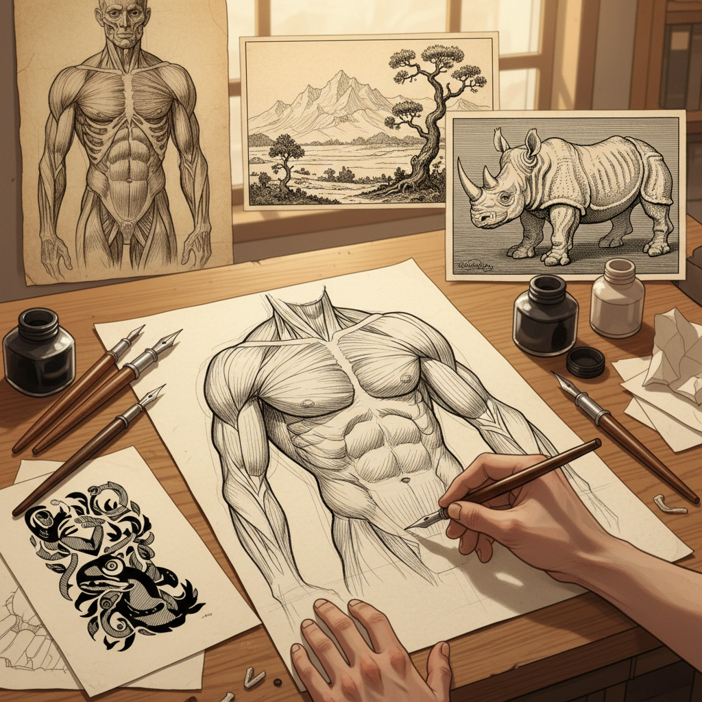

# Hatching 排线法

> "Hatching is drawing with lines — parallel strokes that, through their direction, density, and crossing, can describe any form, any shadow, any texture the eye can perceive." — Unknown

## 概述

排线法（Hatching）是使用平行线条来表现明暗和质感的绘画技法。通过控制线条的密度、方向、粗细和交叉方式，艺术家可以创造出丰富的调子变化。Hatching的变体包括：Cross-hatching（交叉排线，两组不同方向的线条交叉）、Contour hatching（轮廓排线，线条跟随形体的轮廓）和Random hatching（随机排线）。

排线法是西方绘画和版画中最基本也最重要的技法之一——从文艺复兴大师的素描到当代插画，排线法无处不在。它是铜版画（engraving）和蚀刻版画（etching）的核心技法，也是钢笔画和铅笔素描的基础。

## 核心特征

| 特征 | 描述 |
|------|------|
| 平行线 | 平行线条为基本元素 |
| 密度 | 通过密度表现明暗 |
| 方向 | 线条方向表现形体 |
| 交叉 | 交叉排线增加暗度 |
| 基础 | 绘画的基础技法 |
| 通用 | 适用于多种媒介 |

## 视觉特征

- **线条**：可见的平行线条
- **方向**：线条的方向性
- **交叉**：交叉线条的层次
- **渐变**：通过密度变化的渐变
- **质感**：线条创造的质感
- **形体**：线条跟随形体

## 代表作品

| 作品 | 艺术家 | 年代 | 意义 |
|------|--------|------|------|
| *Studies and drawings* | Leonardo da Vinci | 15世纪 | 文艺复兴排线 |
| *Melencolia I* | Albrecht Dürer | 1514 | 版画排线的巅峰 |
| *Etchings* | Rembrandt | 17世纪 | 蚀刻排线 |
| *Illustrations* | Gustave Doré | 19世纪 | 插图排线 |
| *Pen drawings* | Various | 当代 | 当代钢笔排线 |

## 历史时间线

| 时期 | 事件 |
|------|------|
| 古代 | 早期线条绘画 |
| 15世纪 | 文艺复兴素描中的系统化 |
| 15-16世纪 | 铜版画中排线的发展 |
| 17世纪 | 蚀刻版画中的自由排线 |
| 19世纪 | 插图黄金时代的排线 |
| 当代 | 数字工具中的排线模拟 |

## 中国语境

排线法在中国传统绘画中有独特的对应——中国画中的"皴法"（如披麻皴、斧劈皴、雨点皴等）本质上就是用线条或笔触来表现山石的质感和明暗，与西方的Hatching有异曲同工之妙。中国的素描教育中，排线是最基本的训练内容。当代中国的钢笔画和插画领域中，排线技法被广泛使用。一些中国当代艺术家将传统皴法与西方排线法融合，创造出独特的视觉语言。

## AI生成概念图

## 与其他风格的关系

- **Stippling** → 点画法
- **Engraving** → 铜版画
- **Etching** → 蚀刻版画
- **Pen and Ink** → 钢笔画
- **Drawing** → 素描
- **Cross-hatching** → 交叉排线

---

*浮光艺志 | Chronicle of Artistry*
