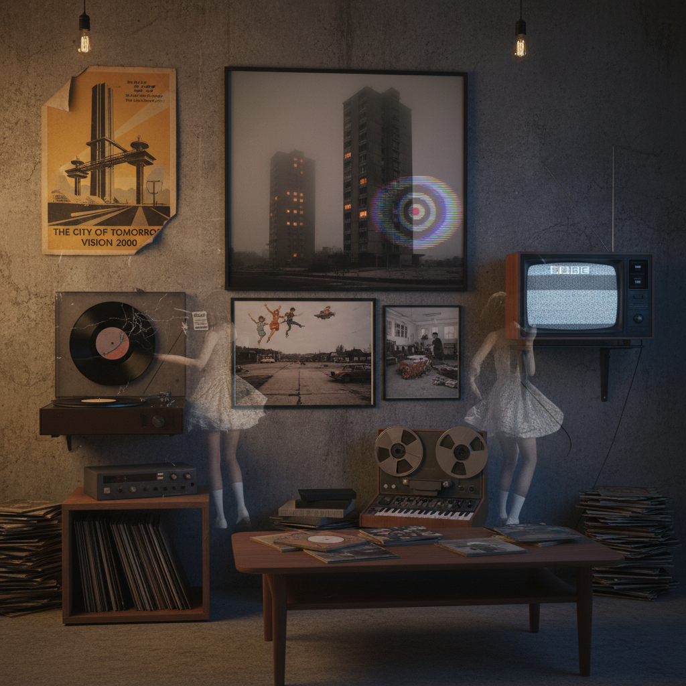

# Hauntology Art 幽灵学艺术

> "Hauntology is the presence of absence — the ghost of futures that never arrived, the static between radio stations where lost broadcasts still echo, the crackle of vinyl that carries the memory of a world that was promised but never delivered, a cultural condition where we are haunted not by the dead but by the lost futures of modernity, where every new creation carries within it the spectre of what could have been, and where nostalgia becomes not a longing for the past but a mourning for futures that were cancelled." — Mark Fisher

## 概述

幽灵学艺术（Hauntology Art）源自雅克·德里达（Jacques Derrida）1993年在《马克思的幽灵》中提出的"hauntology"概念，后经英国文化理论家马克·费舍尔（Mark Fisher）和西蒙·雷诺兹（Simon Reynolds）在2000年代重新阐释，成为一种重要的文化美学。幽灵学关注的是"失落的未来"——那些20世纪中期曾经被许诺但从未实现的乌托邦愿景，以及这些未实现的可能性如何"幽灵般"地萦绕在当代文化中。

在视觉和音乐领域，幽灵学美学表现为：对旧媒介（黑胶唱片、VHS磁带、公共信息影片）的迷恋、对英国战后现代主义建筑和公共服务广播的怀念、以及一种"时间错位"的感觉——过去和未来在当下重叠。代表性的音乐厂牌Ghost Box Records和艺术家如The Caretaker（Leyland Kirby）通过采样和处理旧录音来创造这种"时间幽灵"的听觉体验。

## 核心特征

| 特征 | 描述 |
|------|------|
| 失落 | 失落的未来 |
| 幽灵 | 幽灵般的存在 |
| 媒介 | 旧媒介的衰变 |
| 时间 | 时间的错位 |
| 怀旧 | 对未来的怀旧 |
| 公共 | 公共服务美学 |

## 视觉特征

- **衰变**：磁带和唱片的衰变痕迹
- **建筑**：战后现代主义建筑
- **公共**：公共信息影片的美学
- **模糊**：模糊和褪色的图像
- **拼贴**：时间错位的拼贴
- **字体**：复古的公共服务字体

## 代表作品

| 作品 | 艺术家 | 年代 | 意义 |
|------|--------|------|------|
| *An Empty Bliss Beyond This World* | The Caretaker | 2011 | 记忆衰退的声音 |
| *Ghost Box Records covers* | Julian House | 2004起 | 幽灵学的视觉语言 |
| *Patience (After Sebald)* | Grant Gee | 2012 | 幽灵学纪录片 |
| *The Ghosts of My Life* | Mark Fisher | 2014 | 幽灵学理论 |
| *Everywhere at the End of Time* | The Caretaker | 2016-19 | 记忆消逝的史诗 |

## 历史时间线

| 时期 | 事件 |
|------|------|
| 1993 | 德里达提出hauntology概念 |
| 2004 | Ghost Box Records成立 |
| 2006 | Mark Fisher开始k-punk博客 |
| 2011 | The Caretaker的里程碑专辑 |
| 2016-19 | Everywhere at the End of Time |

## 中国语境

幽灵学在中国知识界和文化圈有一定的影响力，特别是在马克·费舍尔的著作被翻译引介之后。中国的"失落的未来"有其独特的面向——改革开放初期对现代化的乌托邦想象、90年代国企改制中消失的集体主义生活方式、以及那些被快速城市化吞没的旧城区和工业遗址。中国的一些实验音乐人和视觉艺术家在创作中探索类似的"时间幽灵"主题——对消逝的社会主义美学的重访、对旧媒介（收音机、录像带、老电视节目）的采样和再创作。中国的"废墟摄影"和"工业遗产"运动也与幽灵学有共鸣。

## AI生成概念图

## 与其他风格的关系

- **Vaporwave** → 蒸汽波
- **Retrowave** → 复古波
- **Found Footage** → 发现影像
- **Collage Art** → 拼贴艺术
- **Brutalism** → 粗野主义
- **Post-Punk** → 后朋克

---

*浮光艺志 | Chronicle of Artistry*
