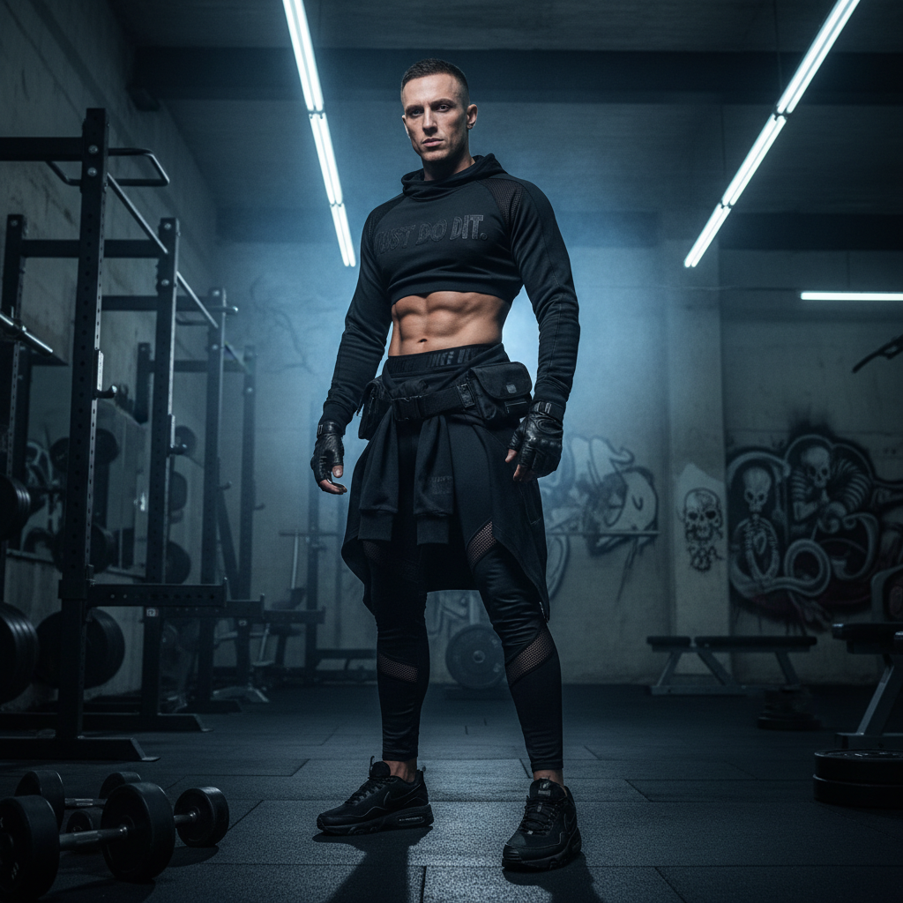
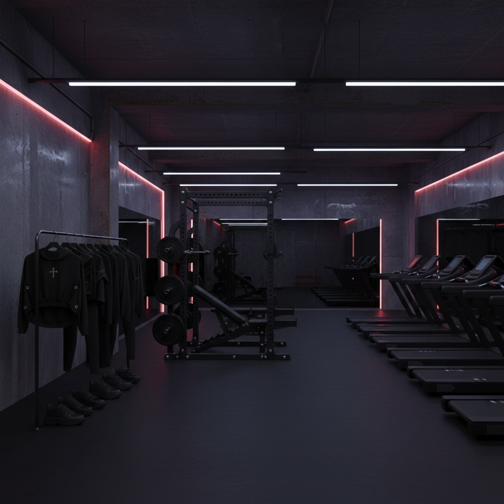

# Health Goth 健康哥特





> **"穿全黑Nike去健身房——当哥特遇见运动科学。"**

## 概述

| 维度 | 描述 |
|------|------|
| 时期 | 2013–2016（概念期）/ 持续影响至今 |
| 别名 | Health Goth, Gym Goth, Dark Athleisure, Gothic Sportswear |
| 核心色彩 | 黑色、深灰、白色（仅作对比）、荧光色点缀 |
| 关键元素 | 全黑运动服、Nike Air Max、压缩裤、网眼面料 |
| 代表人物 | Chris Kyvetos (创始人)、Rick Owens 运动系列 |
| 关联风格 | Gorpcore, Techwear, Cybergoth, Normcore |

---

## 历史脉络

### 2013：Facebook 页面的诞生

"Health Goth" 由波特兰音乐人 **Chris Kyvetos** 和 **Mike Grabarek** 在 2013 年创建的同名 Facebook 页面上首次提出。

最初的定义是一种**视觉拼贴实验**：
- 将哥特美学（黑色、暗黑、工业）与运动/健身文化（Nike、Adidas、健身房）混合
- 挑战"哥特=不运动"和"运动=阳光健康"的刻板印象
- 探索身体、技术和暗黑美学的交叉

### 2014–2015：媒体爆发

Health Goth 在 2014 年被主流时尚媒体报道后迅速传播：
- 《Dazed》、《i-D》、《The Guardian》等媒体报道
- Nike 和 Adidas 的全黑系列被追认为 Health Goth
- Alexander Wang × H&M (2014) 的运动暗黑风格
- Rick Owens 的运动鞋和运动系列

### 文化背景

Health Goth 的出现反映了几种文化趋势的交汇：
1. **Athleisure 的兴起**：运动服成为日常穿着
2. **哥特文化的进化**：从"反体制"到"暗黑美学"
3. **身体政治**：哥特/另类文化开始拥抱身体健康
4. **技术崇拜**：运动科技面料的未来感

### 2016–至今：遗产

Health Goth 作为一个标签在 2016 年后逐渐淡出，但它的影响深远：
- **Techwear** 继承了它的"全黑+功能性"逻辑
- **Gorpcore** 的暗色版本
- Nike/Adidas 的全黑系列成为常态
- "暗黑运动风"成为一种持续存在的穿搭选项

---

## 视觉语法

### 色彩系统

```
主色：
  黑色 (#000000) — 绝对主导
  深灰 (#333333) — 层次变化
  白色 (#FFFFFF) — 仅作logo/线条对比

点缀色（极少量）：
  荧光绿 (#39FF14) — Nike logo
  荧光橙 (#FF4500) — 安全色
  银色 (#C0C0C0) — 反光材料

质感：
  网眼/mesh — 透气运动面料
  压缩面料 — 紧身裤、运动内衣
  反光材料 — 3M 反光条
  橡胶 — 鞋底、配件
  尼龙 — 运动包、外套
```

### 标志性元素

| 类别 | 元素 |
|------|------|
| 鞋 | Nike Air Max 90/95（全黑）、Adidas Tubular |
| 上衣 | 黑色压缩衣、网眼运动背心、连帽衫 |
| 下装 | 黑色压缩裤/紧身裤、运动短裤 |
| 配饰 | 运动腰包、黑色棒球帽、运动手套 |
| 品牌 | Nike（全黑）、Adidas（全黑）、Under Armour |
| 空间 | 健身房、跑道、工业空间 |

### Health Goth vs Techwear vs Gorpcore

| 维度 | Health Goth | Techwear | Gorpcore |
|------|------------|----------|----------|
| 来源 | 哥特+运动 | 赛博朋克+军事 | 户外运动 |
| 品牌 | Nike, Adidas | ACRONYM, Nike ACG | Arc'teryx, Salomon |
| 场景 | 健身房→街头 | 城市→未来 | 山野→城市 |
| 色彩 | 全黑 | 全黑+灰 | 自然色+安全色 |
| 身体 | 强调身体线条 | 隐藏身体 | 不关注身体 |

---

## 与千禧怀旧的关系

### 2000s 运动品牌文化
- 2000s 的 Nike Air Max 是街头文化的核心
- 全黑 Air Max 95 在英国 grime 文化中的地位
- Health Goth 将这种"街头运动鞋文化"与哥特美学结合

### 对"健康"概念的重新定义
- 传统观念：健康 = 阳光、户外、彩色
- Health Goth：健康也可以是暗黑的、工业的、技术的
- 这种重新定义影响了后来的 wellness 文化

---

## 中国语境

- "暗黑运动风"穿搭
- 全黑Nike/Adidas在中国街头的流行
- 健身文化与潮流文化的交叉
- "机能风"穿搭中的运动元素
- 与"赛博朋克"穿搭的交叉

---

## 设计应用

| 场景 | 应用方式 |
|------|----------|
| 品牌设计 | 全黑+白色线条+无衬线字体+几何 |
| 包装 | 黑色+哑光+极简信息 |
| 空间 | 工业风+黑色器械+极简照明 |
| UI | 深色模式+高对比+运动数据可视化 |

---

## 延伸阅读

- "What is Health Goth?" (Dazed, 2014)
- Health Goth Facebook 页面原始内容
- Rick Owens 运动系列分析

---

## 相关风格

← [Cybergoth 赛博哥特](cybergoth.md) | [Gorpcore 户外核](gorpcore.md) →

↑ [返回千禧怀旧目录](README.md) | [返回总目录](../README.md)
