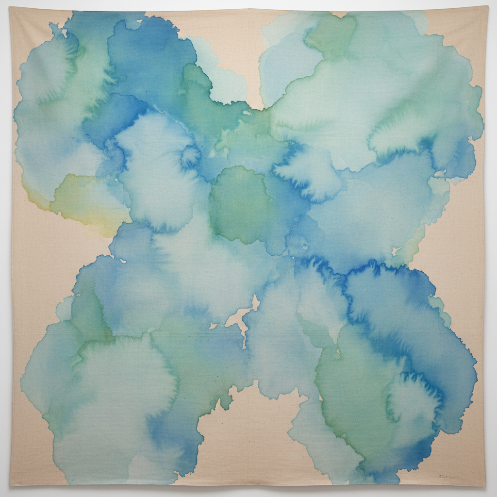

# Helen Frankenthaler 海伦·弗兰肯塔勒

> "A really good picture looks as if it's happened at once." — Helen Frankenthaler

## 概述

海伦·弗兰肯塔勒（Helen Frankenthaler，1928–2011）是美国色域绘画（Color Field Painting）的先驱，发明了"浸染法"（soak-stain technique）——将稀释的颜料直接倒在未上底漆的画布上，让色彩如水彩般渗透纤维，创造出轻盈、透明、如同呼吸的色彩平面。

## 核心特征

| 特征 | 描述 |
|------|------|
| 浸染技法 | 稀释颜料渗入未处理画布 |
| 透明色层 | 如水彩般的轻盈与流动 |
| 有机形态 | 自然流淌形成的不规则色块 |
| 大尺幅 | 巨型画布上的色彩呼吸 |
| 风景暗示 | 抽象中隐含的自然记忆 |
| 即兴性 | 一次性完成的直觉创作 |

## 代表作品

| 作品 | 年代 | 意义 |
|------|------|------|
| *Mountains and Sea* | 1952 | 浸染法的诞生——改变了绘画史 |
| *Interior Landscape* | 1964 | 色彩的内在风景 |
| *The Bay* | 1963 | 蓝绿色的海湾记忆 |
| *Moveable Blue* | 1973 | 色彩的自由漂浮 |

## AI生成概念图

## 与其他风格的关系

- **Color Field Painting** → 色域绘画的开创者
- **Abstract Expressionism** → 第二代抽象表现主义
- **Morris Louis / Kenneth Noland** → 直接受她启发
- **Rothko** → 共享对色彩冥想的追求
