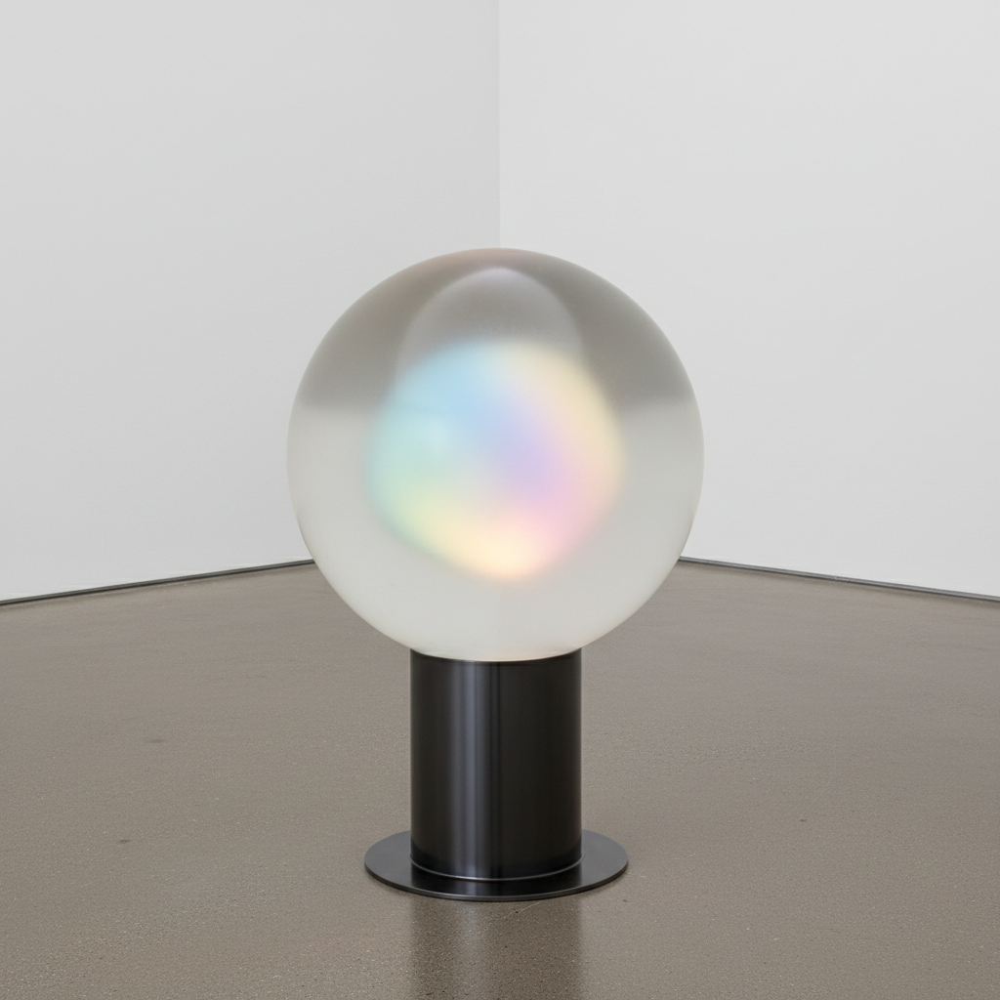

# Helen Pashgian 海伦·帕什吉安

> **时期：** 1934–至今  
> **关键词：** 树脂球体、内部光线、光与空间运动、凝固的光

## 概述

Helen Pashgian 是美国雕塑家，"光与空间"运动的成员，以铸造树脂球体和柱体闻名。她的作品在半透明的树脂体内部嵌入色彩元素，创造出从内部发光的效果——如同凝固的光线或被困在琥珀中的色彩。她是该运动中少数女性成员之一，长期被忽视直到近年重新发现。

## 风格特征

- **内部光线**：色彩元素被封存在透明树脂内部，从内部发光
- **球体和柱体**：偏好完美的几何形态作为光的容器
- **半透明层次**：多层树脂创造出深度和朦胧感
- **色彩的悬浮**：色彩似乎悬浮在透明体量的内部空间中
- **精密工艺**：铸造过程要求极高的技术精度和耐心

## 代表作品

- *Untitled (Spheres)*系列（1968–1970s）
- *Untitled (Columns)*系列（2009–至今）
- LACMA 大型柱体装置（2014）
- 早期嵌入式树脂球体

## 历史意义

Pashgian 是"光与空间"运动中被重新发现的重要女性艺术家，她的作品证明了该运动不仅关于宏大的建筑干预，也关于亲密的、凝缩的光线体验。她的树脂球体是"凝固的光"这一概念最纯粹的物质化。

## 概念图

