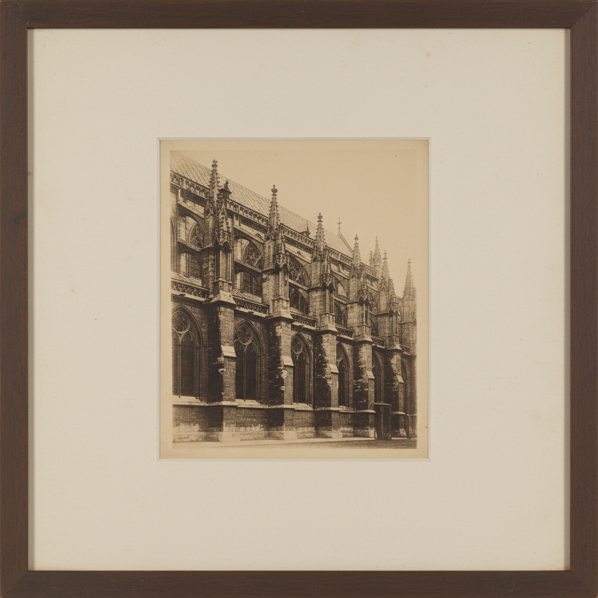

# Heliogravure Art 日光凹版艺术

> "Heliogravure is the ancestor of photogravure — Niépce's dream of fixing the sun's image in printer's ink realized through a copper plate dusted with asphaltum, exposed to light through a transparency, then etched in acid to create an intaglio matrix that prints photographic images with the permanence and richness of a hand-pulled engraving." — Unknown

## 概述

日光凹版艺术（Heliogravure Art）是照相凹版（photogravure）的早期形式——由尼埃普斯（Niépce）和塔尔博特（Talbot）等先驱开发，利用光敏材料在铜版上创造凹版印刷矩阵。日光凹版是摄影术和版画术结合的最早尝试之一，为后来的照相凹版和现代凹版印刷奠定了基础。

日光凹版艺术的实践包括：1）感光涂层——在铜版上涂布感光沥青或明胶；2）日光曝光——在阳光下通过底片曝光；3）酸蚀——用酸液腐蚀未硬化的部分；4）印刷——在凹版印刷机上印刷；5）色调控制——通过曝光时间和腐蚀控制色调；6）手工修版——手工修整版面细节；7）当代日光凹版——将传统工艺与现代创作结合。

## 核心特征

| 特征 | 描述 |
|------|------|
| 日光 | 利用日光曝光 |
| 铜版 | 在铜版上制作 |
| 先驱 | 摄影印刷的先驱 |
| 凹版 | 凹版印刷方式 |
| 永久 | 永久性的印刷品 |
| 历史 | 重要的历史意义 |

## 视觉特征

- **深沉**：深沉的凹版黑色
- **质感**：油墨的丰富质感
- **连续**：连续的色调过渡
- **古典**：古典版画的气质
- **温暖**：温暖的色调倾向
- **永恒**：永恒感的视觉品质

## 代表作品

| 作品 | 艺术家/文化 | 年代 | 意义 |
|------|-------------|------|------|
| *Niépce heliographs* | 法国 | 1820年代 | 尼埃普斯的日光版画 |
| *Talbot photoglyphs* | 英国 | 1850年代 | 塔尔博特的光刻版画 |
| *Charles Nègre prints* | 法国 | 1850年代 | 内格尔的日光凹版 |
| *Early photomechanical prints* | 欧洲 | 19世纪中 | 早期照相机械印刷 |
| *Contemporary heliogravure* | 国际 | 当代 | 当代日光凹版 |

## 历史时间线

| 时期 | 事件 |
|------|------|
| 1826年 | 尼埃普斯的早期日光版画实验 |
| 1850年代 | 塔尔博特的光刻版画专利 |
| 1850-60年代 | 多位先驱的改进 |
| 1879年 | Klíč发明现代照相凹版 |
| 当代 | 作为历史工艺的学术研究 |

## 中国语境

日光凹版在中国主要作为摄影史和版画史的研究对象。中国的摄影教育中，日光凹版作为摄影印刷术的起源——在摄影史课程中教授。中国的版画教育中，日光凹版作为照相凹版的前身——在版画技术史中被介绍。中国当代的替代摄影工艺实践者对日光凹版有学术兴趣——作为理解摄影印刷发展的重要环节。中国的博物馆和图书馆中，早期日光凹版印刷品——作为珍贵的历史文献被收藏。中国的艺术史研究中，日光凹版作为摄影与版画交汇的关键节点——在相关论文中被讨论。

## AI生成概念图

## 与其他风格的关系

- **Photogravure** → 照相凹版
- **Etching** → 蚀刻版画
- **Photography** → 摄影
- **Intaglio** → 凹版印刷
- **Heliography** → 日光摄影
- **Printmaking** → 版画

---

*浮光艺志 | Chronicle of Artistry*
