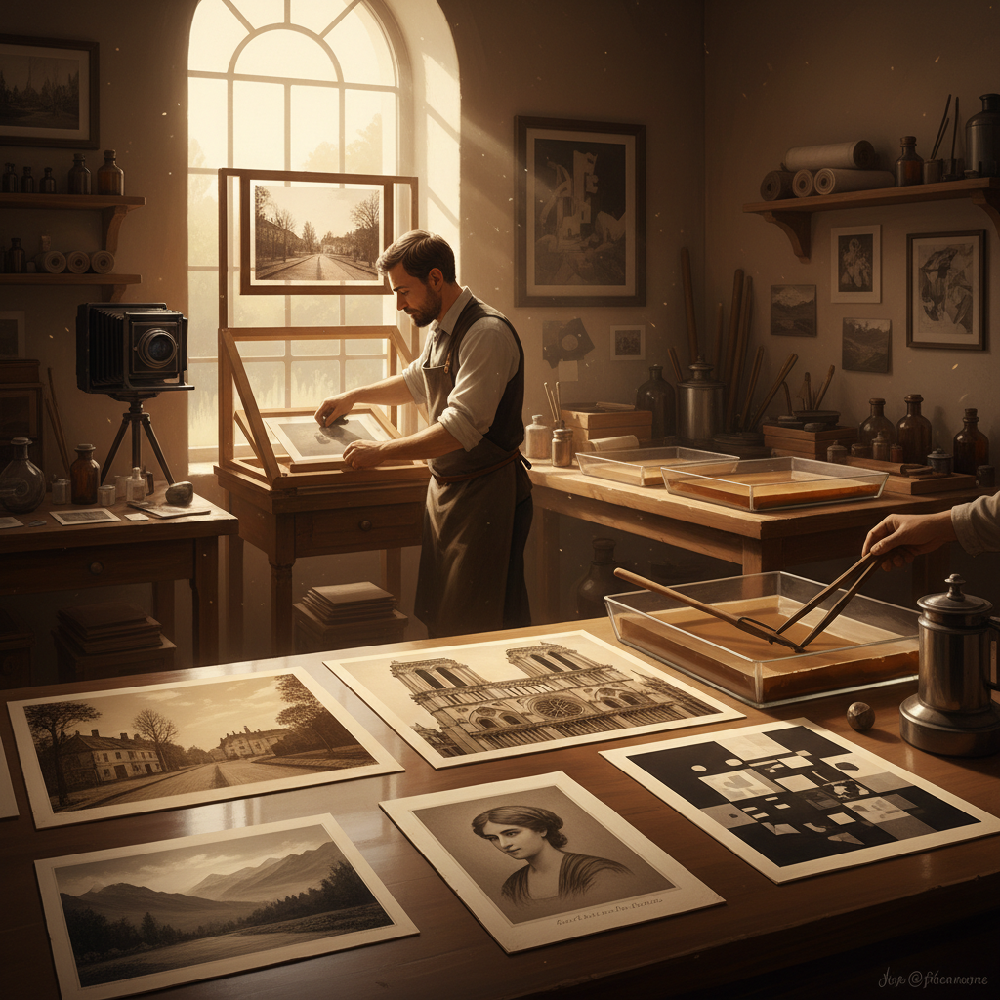

# Heliogravure 日光凹版

> "Heliogravure is where the sun meets the engraver's art — sunlight carving images into metal through the alchemy of light-sensitive gelatin, creating prints that honor both the precision of photography and the soul of the handmade." — Unknown

## 概述

日光凹版（Heliogravure / Héliogravure）是照相凹版（photogravure）的早期形式和法语名称——有时特指由尼塞福尔·尼埃普斯（Nicéphore Niépce）和后来的查尔斯·内格尔（Charles Nègre）发展的早期光化学蚀刻工艺。"Hélio"来自希腊语"太阳"，"gravure"是法语"雕刻"——即"用阳光雕刻"。

日光凹版与照相凹版的区别主要在于历史时期和具体工艺细节。早期的日光凹版使用沥青（bitumen of Judea）作为感光材料——尼埃普斯在1826年用这种方法创造了世界上第一张永久性照片。后来的日光凹版发展为使用明胶和重铬酸盐的更精细工艺。在法语世界中，"héliogravure"一词至今仍用于指代高品质的照相凹版印刷。

## 核心特征

| 特征 | 描述 |
|------|------|
| 阳光 | 利用阳光曝光 |
| 蚀刻 | 化学蚀刻金属版 |
| 早期 | 照相凹版的早期形式 |
| 精细 | 精细的影调再现 |
| 历史 | 摄影史的重要环节 |
| 手工 | 手工制版和印刷 |

## 视觉特征

- **影调**：丰富的影调层次
- **质感**：版画的物质质感
- **温暖**：温暖的油墨色调
- **精细**：精细的细节表现
- **古典**：古典的印刷美感
- **深度**：深邃的暗部表现

## 代表作品

| 作品 | 艺术家 | 年代 | 意义 |
|------|--------|------|------|
| *Point de Vue* | Niépce | 1826 | 世界第一张照片 |
| *Héliogravures* | Charles Nègre | 1850s | 早期日光凹版 |
| *French photogravures* | Various | 19世纪 | 法国日光凹版传统 |
| *Art reproductions* | Various | 19世纪末 | 艺术品复制 |
| *Contemporary héliogravure* | Various | 当代 | 当代日光凹版 |

## 历史时间线

| 时期 | 事件 |
|------|------|
| 1826 | Niépce创造第一张永久照片 |
| 1850s | Nègre发展日光凹版工艺 |
| 1860s-70s | 日光凹版的技术改进 |
| 1879 | Klíč完善为现代照相凹版 |
| 19世纪末 | 日光凹版在法国的广泛应用 |
| 当代 | 日光凹版的艺术复兴 |

## 中国语境

日光凹版在中国主要作为摄影史和版画史的知识被介绍。中国的摄影教育中，日光凹版作为摄影术起源的重要环节被讲授。中国的版画教育中，日光凹版作为照相凹版的历史前身被介绍。中国的一些替代工艺摄影爱好者对日光凹版的历史和技法有研究兴趣。

## AI生成概念图

## 与其他风格的关系

- **Photogravure** → 照相凹版
- **Intaglio** → 凹版画
- **Photography History** → 摄影史
- **Etching** → 蚀刻版画
- **Sun Printing** → 日光印刷
- **Alternative Process** → 替代工艺

---

*浮光艺志 | Chronicle of Artistry*
