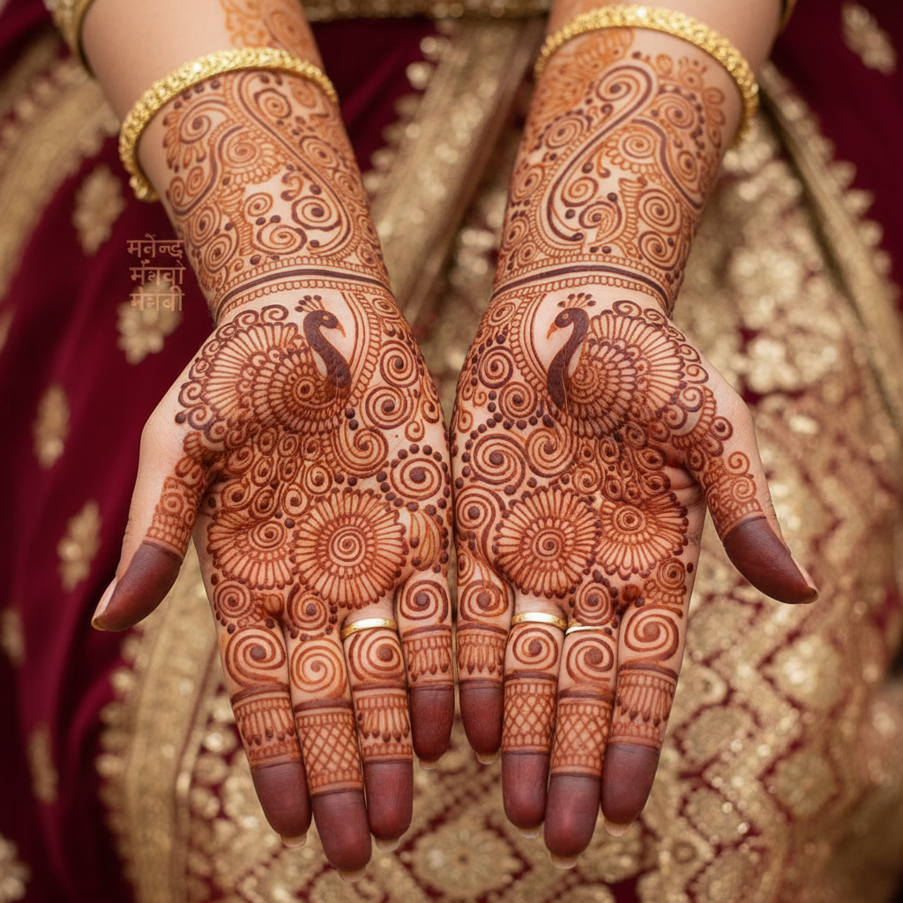

# Henna / Mehndi 指甲花彩绘 | مهندی / मेहंदी

> **"皮肤是最古老的画布——新娘的手上开满了祝福的花园。"**

## 概述

指甲花彩绘（Henna / Mehndi / مهندی / मेहंदी）是南亚、中东和北非的传统身体装饰艺术，使用指甲花（Lawsonia inermis）叶片磨成的糊状物在皮肤上绘制精美图案。"Mehndi"源自梵语"mendhikā"，"Henna"源自阿拉伯语"حناء"。这种艺术有5000年以上的历史，在婚礼、节日和庆典中扮演核心角色——特别是南亚婚礼中的"Mehndi之夜"（مہندی کی رات）。图案在皮肤上留下红棕色的临时印记，持续1-3周。

## 主要地区风格

| 地区 | 特征 |
|------|------|
| 印度 | 精细花卉、孔雀、莲花，覆盖整个手掌 |
| 巴基斯坦 | 几何和花卉混合，精细线条 |
| 阿拉伯 | 大面积填充，几何图案，粗线条 |
| 摩洛哥 | 几何为主，三角形和菱形 |
| 非洲 | 大胆几何，粗线条 |

## 核心特征

- **临时性**：图案持续1-3周后自然消退
- **天然染料**：指甲花叶片的天然色素
- **手绘**：用锥形管或注射器手绘
- **婚礼传统**：新娘Mehndi是核心仪式
- **精细线条**：极细的线条和点
- **对称构图**：通常左右手对称

## 常见图案

| 图案 | 含义 |
|------|------|
| 孔雀 | 美丽、爱情 |
| 莲花 | 纯洁、新生 |
| 藤蔓 | 生命延续 |
| 太阳/月亮 | 永恒的爱 |
| 新郎形象 | 隐藏在图案中的新郎名字 |
| 曼陀罗 | 宇宙、完整 |

## 视觉特征

- 红棕色在皮肤上的温暖色调
- 极精细的线条和点
- 有机的花卉和藤蔓
- 手掌和手背的完整覆盖
- 对称的构图
- 负空间的巧妙运用

## 与其他风格的关系

| 风格 | 关系 |
|------|------|
| Rangoli地画 | 共享印度装饰传统 |
| 伊斯兰几何 | 共享几何装饰传统 |
| 纹身艺术 | 共享身体装饰传统 |
| Paisley佩斯利 | 共享波斯/印度图案 |
| 当代身体艺术 | Henna影响全球身体装饰 |

## 概念图

---

*浮光艺志 | Chronicle of Artistry*
