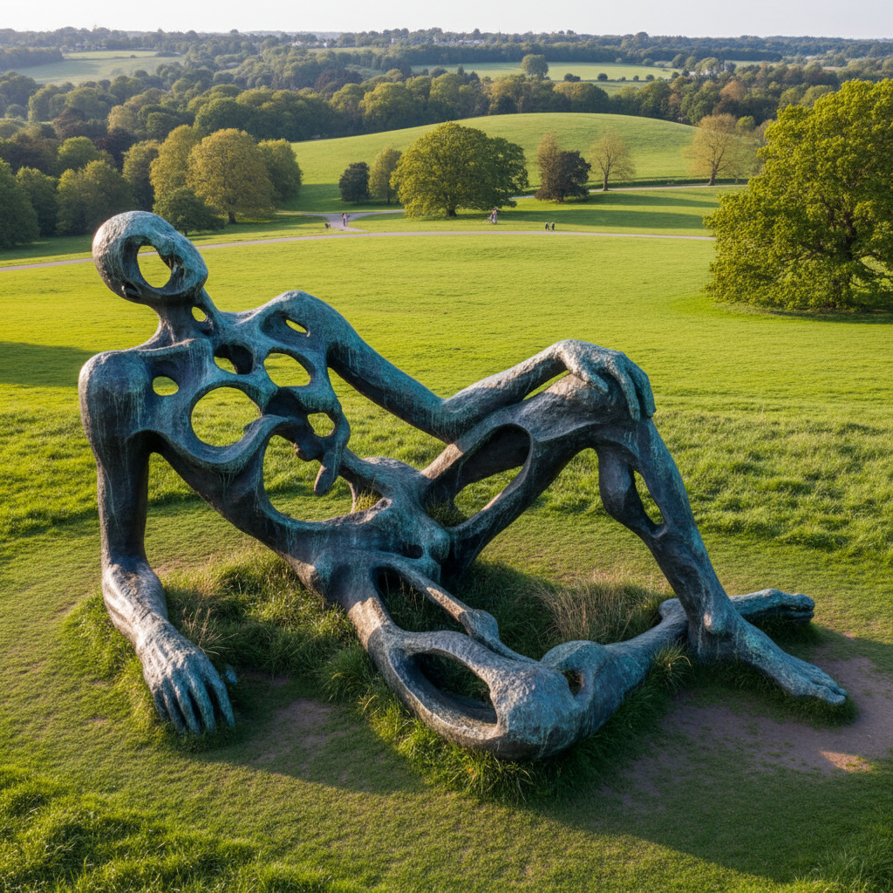

# Henry Moore 亨利·摩尔

> **流派**: 现代主义雕塑 · 有机抽象  
> **时期**: 1898–1986 英国  
> **关键词**: 斜倚人体、空洞形态、青铜巨作、风景与身体

## 概述

亨利·摩尔是20世纪最重要的英国雕塑家。他以半抽象的人体形态——特别是斜倚的女性身体——闻名于世。他的雕塑将人体与风景融为一体，用空洞和曲面创造出一种既原始又现代的有机美学。

## 视觉特征

- **斜倚人体**: 半抽象的躺卧女性形态是核心主题
- **空洞与穿透**: 身体中的孔洞让空间穿过雕塑
- **有机曲面**: 光滑的青铜表面如同被水流冲刷的石头
- **巨大尺度**: 户外放置的大型青铜雕塑
- **骨骼结构**: 内部结构如同骨骼和关节的抽象

## 代表作品

- 《斜倚的人体》系列 (1929–1982)
- 《国王与王后》(1952–53)
- 《核能》(1967)
- 《刀刃两件套》(1962–65)

## 历史影响

摩尔让雕塑走出博物馆进入公共空间，证明了抽象形态可以与自然环境和谐共存。他的有机抽象影响了后来的公共艺术和景观设计。

## 相关风格

- [Alberto Giacometti 阿尔贝托·贾科梅蒂](alberto-giacometti.md)
- [Constantin Brancusi 康斯坦丁·布朗库西](constantin-brancusi.md)
- [Barbara Hepworth 芭芭拉·赫普沃斯](barbara-hepworth.md)
