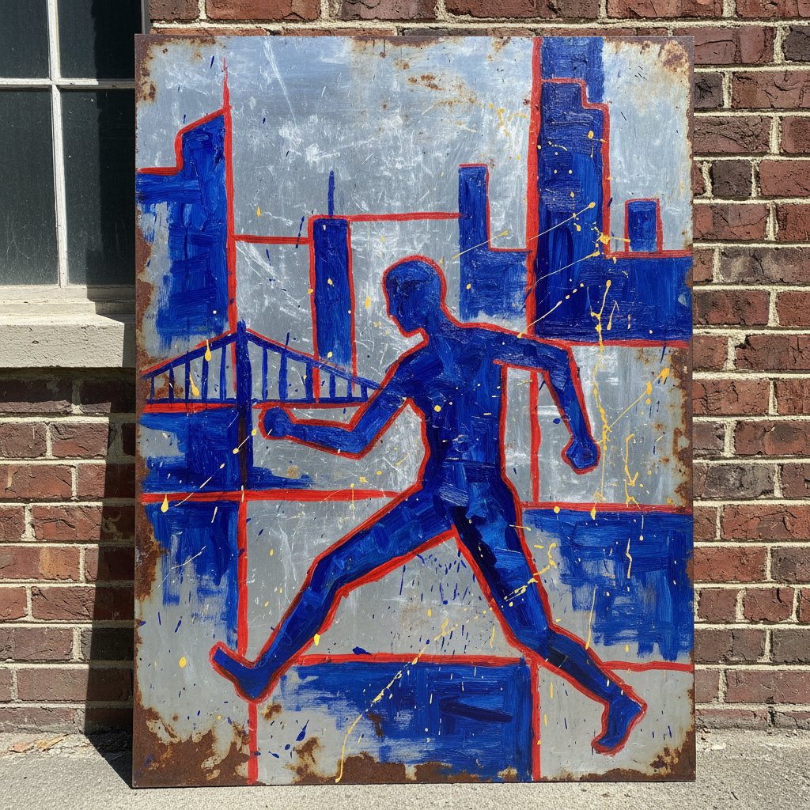

# Henry Taylor 亨利·泰勒

> **时期：** 1958–至今  
> **关键词：** 即兴肖像、粗犷笔触、洛杉矶黑人社区、日常史诗

## 概述

Henry Taylor 是美国当代画家，以粗犷有力的笔触和即兴式构图描绘洛杉矶黑人社区的日常生活。他的画面看似随意，实则充满情感张力，将朋友、家人、无家可归者和历史事件并置于同一视觉语言中。

## 风格特征

- **粗犷笔触**：大面积平涂与快速笔触并存，拒绝精细修饰
- **鲜明色彩**：大胆使用纯色——钴蓝、朱红、柠檬黄——营造视觉冲击
- **即兴构图**：人物比例自由变形，空间关系非学院化
- **材料多样**：在画布、纸板、烟盒、旧床单等各种载体上作画
- **叙事直接**：画面常包含文字、日期或地点标注，具有日记性质

## 代表作品

- *The 4th*（2012）
- *Cicely and Miles Visit the Obamas*（2017）
- *I'll Put a Spell on You*（2004）

## 历史意义

Taylor 代表了一种拒绝市场打磨的原始绘画力量，他的作品证明"好画"不需要技术完美，而需要情感真实。2022年威尼斯双年展的参展使他获得了迟来的国际认可。

## 概念图

