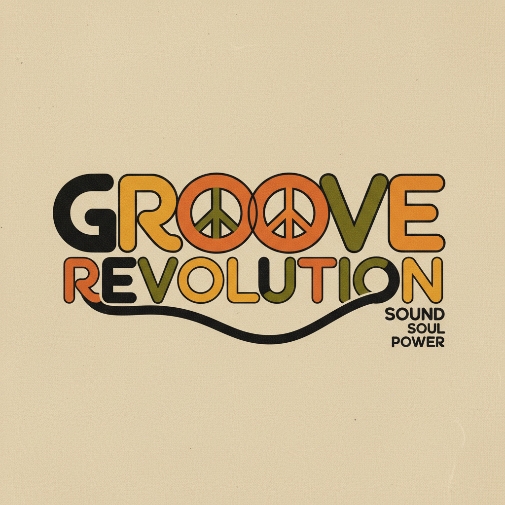

# Herb Lubalin 赫布·卢巴林

> **时期：** 1918–1981  
> **关键词：** 表现性排版、Avant Garde字体、文字即图像、纽约学派

## 概述

Herb Lubalin 是美国平面设计师和字体设计师，以将文字本身变成图像而闻名。他设计的Avant Garde Gothic字体和《Avant Garde》杂志标志成为1960-70年代美国视觉文化的标志——文字不再只是承载信息的容器，而是具有表现力的视觉主角。

## 风格特征

- **文字即图像**：字母的形态本身构成视觉叙事
- **紧密排版**：字母之间极度紧凑，形成视觉整体
- **连字设计**：字母之间的创意连接和融合
- **几何字体**：基于圆形和直线的几何化字体设计
- **概念排版**：排版传达概念而非仅仅承载文字

## 代表作品

- *Avant Garde Gothic 字体*（1970）
- *Avant Garde 杂志*标志
- *Mother & Child 标志*
- *Families 杂志标志*

## 概念图

