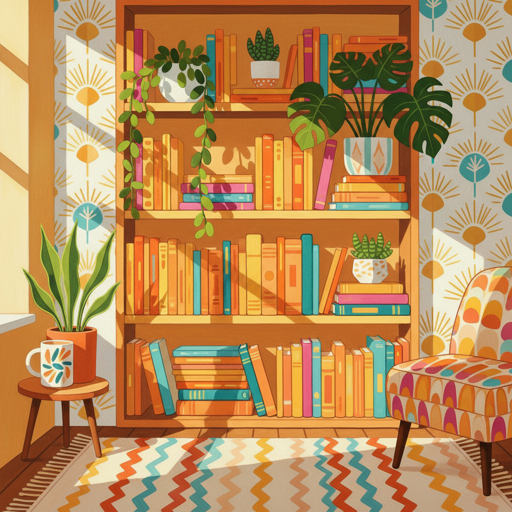

# Hilary Pecis 希拉里·佩西斯

> **时期：** 1979–至今  
> **关键词：** 日常静物、室内风景、平面色彩、加州阳光

## 概述

Hilary Pecis 是美国当代画家，以描绘日常生活场景的明亮色彩绘画闻名。她的作品捕捉书架、餐桌、花园和室内空间，用平面化的色彩和简洁的构图将普通场景转化为令人愉悦的视觉诗歌——一种属于加州阳光下的当代静物传统。

## 风格特征

- **平面色彩**：大面积平涂，减少明暗变化，保持画面的装饰性平衡
- **日常场景**：书架、盆栽、餐桌、后院——最普通的生活空间
- **明亮色调**：以加州阳光般的暖色为主，偶尔出现深绿和钴蓝的对比
- **图案密度**：画面中充满书脊、瓷砖、织物等重复图案，视觉信息丰富
- **照片基础**：基于手机照片，保留快照的随意构图和当代感

## 代表作品

- *Backyard BBQ*（2020）
- *Bookshelf*（2019）
- *Kitchen Table*（2021）
- *Garden View*（2020）

## 历史意义

Pecis 代表了当代绘画中"日常美学"的回归——在宏大叙事和政治议题主导的艺术界，她证明了描绘一个书架或一张餐桌同样可以是有意义的艺术行为，只要观看的方式足够专注。

## 概念图

