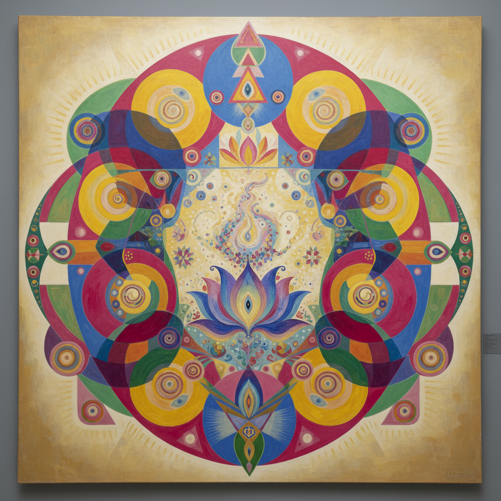

# Hilma af Klint 希尔玛·阿夫·克林特

> "The pictures were painted directly through me, without any preliminary drawings." — Hilma af Klint

## 概述

希尔玛·阿夫·克林特（Hilma af Klint，1862–1944）是瑞典画家，被认为是西方抽象艺术的真正先驱——她的抽象画作比康定斯基、蒙德里安早了数年。受神智学和通灵实践启发，她创作了大量色彩鲜艳的几何与有机形式画作，探索宇宙、灵性和二元对立的视觉语言。生前几乎无人知晓，直到1986年才被重新发现。

## 核心特征

| 特征 | 描述 |
|------|------|
| 先驱抽象 | 比康定斯基更早的纯抽象 |
| 灵性几何 | 圆、螺旋、花瓣的宇宙符号 |
| 鲜艳色彩 | 粉、蓝、黄、绿的大胆配色 |
| 巨大尺幅 | 超过3米高的画作 |
| 系列创作 | 按灵性主题组织的系列 |
| 二元对立 | 男/女、物质/精神的视觉化 |

## 代表作品

| 作品 | 年代 | 意义 |
|------|------|------|
| *The Ten Largest* | 1907 | 人类生命阶段的巨幅抽象 |
| *Group IV, The Ten Largest, No. 7* | 1907 | 成年期的宇宙花朵 |
| *Altarpiece No. 1* | 1915 | 灵性三角的金字塔 |
| *The Swan, No. 17* | 1915 | 黑白二元的融合 |

## AI生成概念图

## 与其他风格的关系

- **Kandinsky** → 比康定斯基更早实现抽象
- **Theosophy** → 神智学的视觉翻译
- **Mondrian** → 共享灵性几何的追求
- **Contemporary Art** → 2018年古根海姆回顾展引发重新评价
