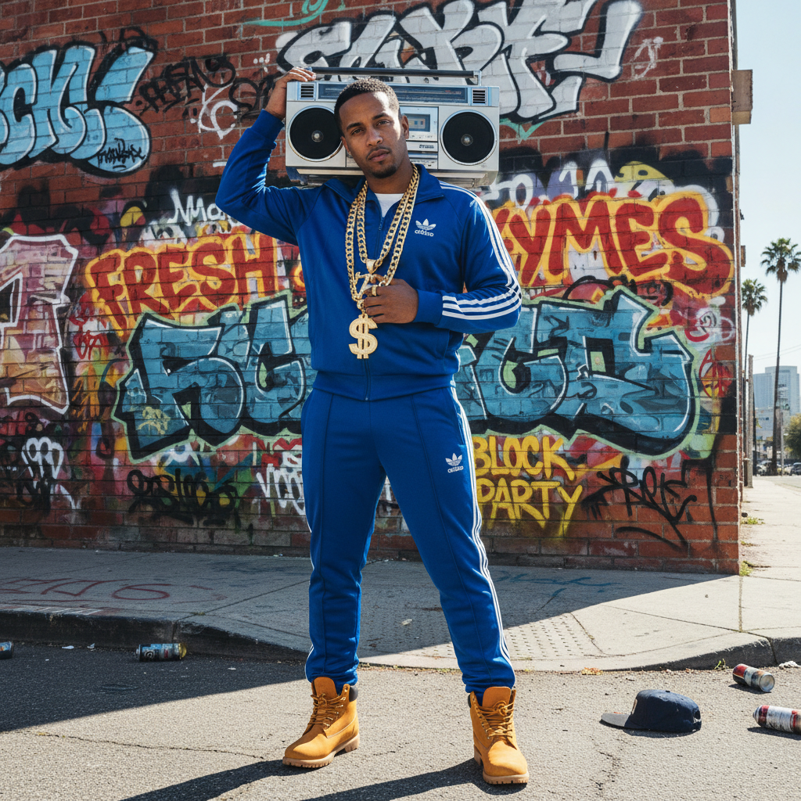

# Hip-Hop Aesthetic 嘻哈美学



> **"金链子、Boombox、涂鸦、Timberland——从布朗克斯到全球文化。"**

## 概述

| 维度 | 描述 |
|------|------|
| 时期 | 1973 起源 / 1990s–2000s 黄金时代 / 至今 |
| 别名 | Hip-Hop, Rap Aesthetic, Urban Culture |
| 核心色彩 | 金色、黑色、红色、白色、品牌色 |
| 关键元素 | 金链、Oversized、涂鸦、球鞋、Boombox |
| 代表人物 | Run-DMC、Tupac、Jay-Z、Kanye West |
| 关联风格 | Streetwear, Bling, Trap, Gorpcore |

---

## 历史脉络

### 从街区派对到全球统治

| 年份 | 事件 |
|------|------|
| 1973 | DJ Kool Herc 在布朗克斯举办第一场 Hip-Hop 派对 |
| 1983 | Run-DMC——Hip-Hop 时尚的定义者 |
| 1986 | Run-DMC × Adidas——第一个球鞋联名 |
| 1990s | 东西海岸对抗——黄金时代 |
| 1996 | Tupac & Biggie——Hip-Hop 的悲剧与传奇 |
| 2000s | Bling 时代——Jay-Z、P. Diddy |
| 2010s | Kanye West 重新定义 Hip-Hop 时尚 |
| 2020s | Hip-Hop = 全球最主流的音乐和文化 |

### 核心哲学

Hip-Hop 美学的精神是**"从无到有——用风格证明存在"**：
- "我来自底层，但我穿得比你好"
- 品牌 = 成功的证明
- 大 = 好（Oversized、大金链、大车）
- 街头 = 真实
- "不要告诉我什么是酷——我定义什么是酷"

---

## 视觉语法

### 色彩系统

```
主色：
  金色 (#FFD700) — 财富、成功
  黑色 (#000000) — 力量、酷
  白色 (#FFFFFF) — Air Force 1
  红色 (#FF0000) — 能量、血

辅色：
  紫色 (#800080) — 皇室
  绿色 (#008000) — 美元
  品牌色 — Gucci/LV/Versace

规则：
  - 金色 = 成功
  - 品牌Logo要大要明显
  - Oversized 比 Fitted 更酷
  - 球鞋必须干净

质感：
  皮革 — 夹克、球鞋
  金属 — 链条、手表
  丝绒 — 运动套装
  牛仔 — 宽松、低腰
```

### 标志性元素

| 类别 | 元素 |
|------|------|
| 配饰 | 金链、大表、钻石耳钉、Grillz |
| 服装 | Oversized T恤、宽松牛仔裤、运动套装 |
| 鞋 | Air Force 1、Timberland、Jordan |
| 文化 | 涂鸦、DJ、MC、B-Boy |
| 品牌 | Adidas、Nike、Gucci、Louis Vuitton |
| 载体 | 音乐录影带、专辑封面、涂鸦墙 |

---

## 与千禧怀旧的关系

### 90s/2000s Hip-Hop 怀旧
- "那个时代的 Hip-Hop 更真实"
- Tupac/Biggie = 永恒的文化图腾
- 宽松牛仔裤+Timberland = 90s 怀旧
- Boombox/磁带 = 前数字时代的浪漫

### 从 Bling 到 Minimalism
- 2000s: 越大越好（Bling 时代）
- 2010s: Kanye 带来极简转向
- 2020s: 两种路线并存
- Hip-Hop 时尚的演变 = 文化的演变

---

## 中国语境

- 《中国有嘻哈》(2017) = 中国 Hip-Hop 主流化
- 中国说唱文化的独特发展
- "潮流"/"街头"在中国的本土化
- 与"国潮"的融合
- 中国 Hip-Hop 视觉的独特美学

---

## 设计应用

| 场景 | 应用方式 |
|------|----------|
| 音乐 | 涂鸦字体+金色+街头摄影+大胆 |
| 品牌 | 街头文化+联名+限量+社区 |
| 空间 | 涂鸦墙+工业风+球鞋展示 |
| 数字 | 大字体+动态+街头元素+品牌色 |

---

## 相关风格

← [Streetwear 街头服饰](streetwear.md) | [Gorpcore 户外核](gorpcore.md) →

↑ [返回千禧怀旧目录](README.md) | [返回总目录](../README.md)
