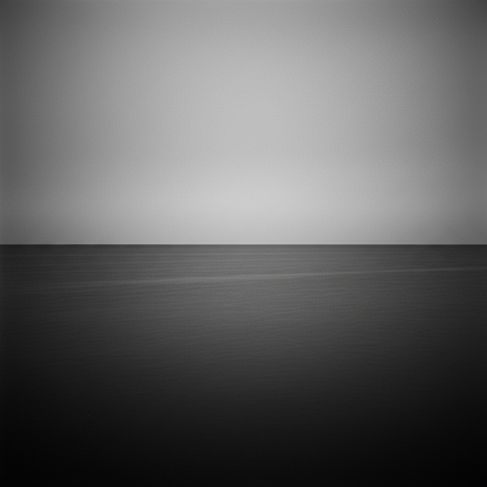

# Hiroshi Sugimoto 杉本博司

> **流派**: 当代摄影 · 观念摄影  
> **时期**: 1948–至今 日本/美国  
> **关键词**: 长时间曝光、时间凝固、海景、剧场、蜡像

## 概述

杉本博司是当代最具哲学深度的摄影师之一。他的作品探索时间、记忆和存在的本质。他用超长时间曝光拍摄电影院（整部电影压缩为一个白色光屏）、用8×10大画幅相机拍摄全球各地的海平线（水与天的永恒分界）、拍摄蜡像馆中的历史人物（真实与虚假的边界）。每个系列都是对"摄影能捕捉什么"的深刻追问。

## 视觉特征

- **极致清晰**: 8×10大画幅相机的超高分辨率
- **黑白影调**: 纯粹的黑白灰阶，极其精细
- **长曝光**: 将时间流逝压缩为单一画面
- **对称构图**: 严格的水平线和中心对称
- **空无美学**: 大面积留白，接近抽象

## 代表作品

- 《海景》(Seascapes) 系列 (1980–)
- 《剧场》(Theaters) 系列 (1978–)
- 《肖像》(Portraits) — 蜡像馆系列
- 《建筑》(Architecture) 系列
- 《闪电原野》(Lightning Fields, 2009)

## 历史影响

杉本博司证明了摄影可以像禅宗公案一样深邃。他的海景系列将摄影推向了抽象绘画的领域，他的剧场系列则揭示了时间的不可见性。他是连接东方美学与西方观念艺术的重要桥梁。

## 相关风格

- [Minimalism 极简主义](minimalism.md)
- [Conceptual Photography 观念摄影](conceptual-photography.md)
- [Long Exposure 长曝光摄影](long-exposure.md)
