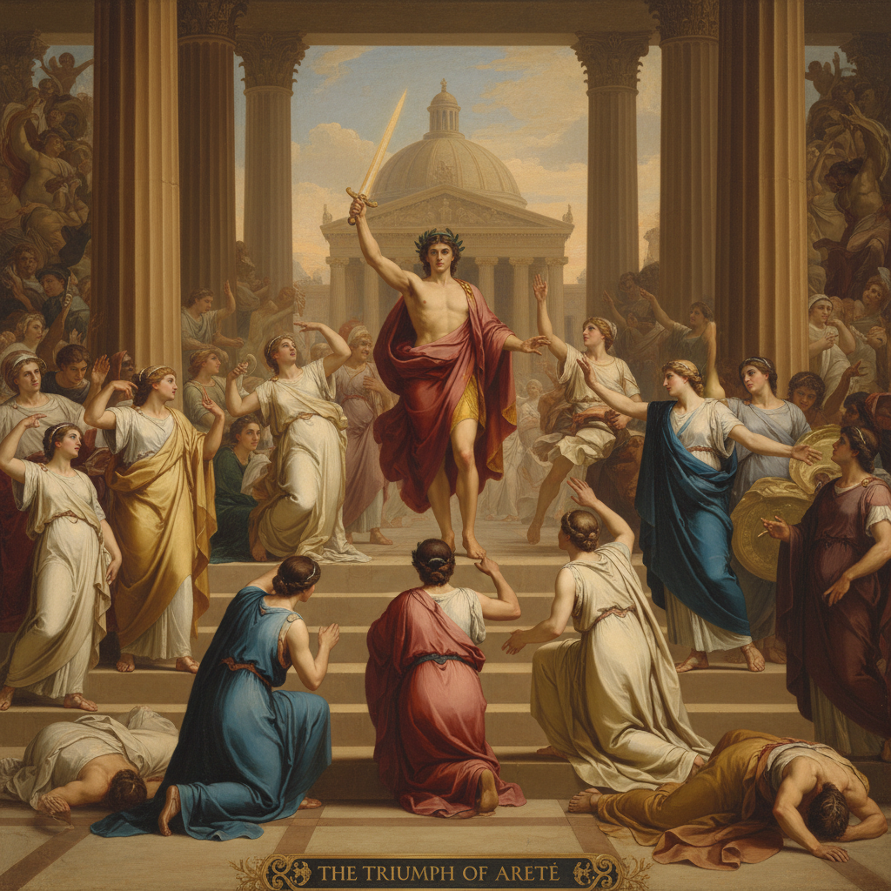

# History Painting 历史画

> **时期：** 15世纪–19世纪  
> **关键词：** 宏大叙事、英雄主义、古典题材、学院等级、道德教化

## 概述

History Painting（历史画）曾被欧洲学院体系视为绘画的最高等级——描绘圣经故事、古典神话、历史事件和文学场景的大型叙事画。从拉斐尔的梵蒂冈壁画到德拉克洛瓦的《自由引导人民》，历史画承载着国家记忆、道德理想和英雄崇拜，是权力与艺术最紧密的结合。

## 风格特征

- **宏大尺幅**：通常为大型画布或壁画
- **叙事性**：讲述可辨识的故事或事件
- **理想化人体**：古典比例的英雄形象
- **戏剧构图**：高潮时刻的动态安排
- **道德寓意**：传达美德、牺牲、正义

## 代表人物与作品

- 雅克-路易·大卫《荷拉斯兄弟之誓》
- 德拉克洛瓦《自由引导人民》
- 本杰明·韦斯特《沃尔夫将军之死》
- 列宾《伏尔加河上的纤夫》

## 概念图

