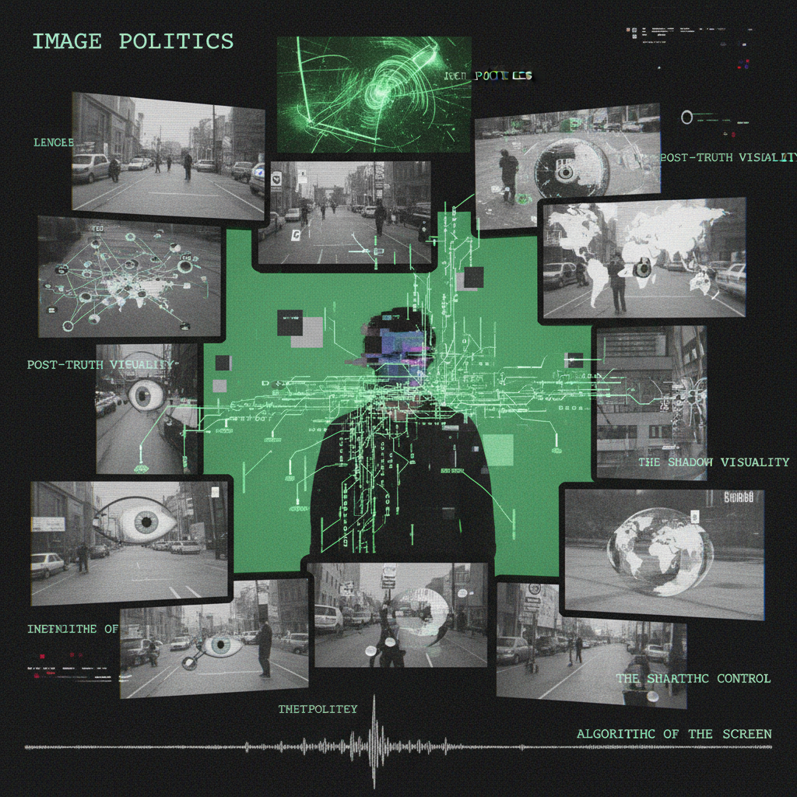

# Hito Steyerl 希托·施泰尔

> **时期：** 1966–至今  
> **关键词：** 后互联网艺术、图像政治、数字资本主义、论文电影

## 概述

Hito Steyerl 是德国艺术家和作家，以探索数字图像在当代资本主义中的流通和政治而闻名。她的视频论文将理论分析、幽默叙事和视觉特效混合在一起，讨论无人机视角、人工智能、免税港艺术仓库和"差图像"的政治。

## 风格特征

- **论文电影**：视频作为视觉化的理论写作
- **绿幕美学**：刻意暴露数字制作的人工性
- **图像考古**：追踪图像在网络中的流通和变异
- **幽默理论**：用喜剧手法讨论严肃的政治经济学
- **沉浸式装置**：多屏幕、LED地板等技术化展示

## 代表作品

- *How Not to Be Seen*（2013）
- *Liquidity Inc.*（2014）
- *Factory of the Sun*（2015）
- *This is the Future*（2019）

## 概念图

