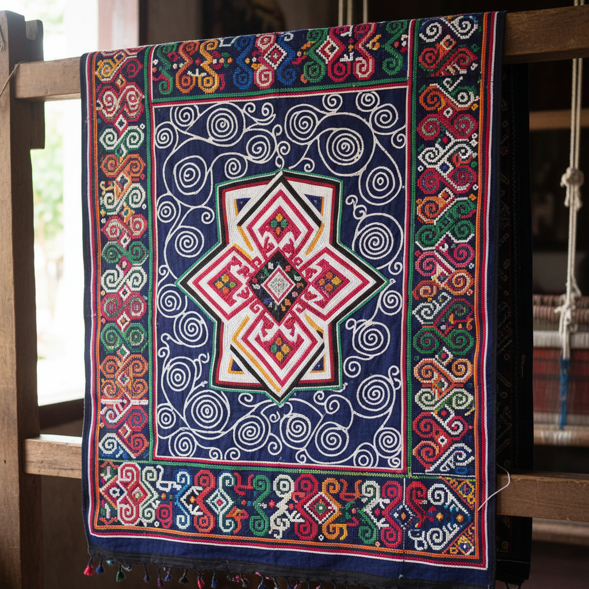

# Hmong Textile Art 苗族纺织艺术 | Paj Ntaub

> **"每一针都是一段迁徙的记忆——苗族女性用蜡染和刺绣书写没有文字的历史。"**

## 概述

苗族纺织艺术（Hmong Textile Art / Paj Ntaub，意为"花布"）是分布于中国西南、越南、老挝、泰国的苗族（Hmong/Miao）女性创造的传统纺织艺术。由于苗族历史上没有统一文字，纺织品成为记录历史、神话和迁徙记忆的重要媒介。主要技法包括蜡染（batik）、十字绣、贴布绣和反向贴布绣。苗族蜡染以靛蓝色为主，图案包含螺旋纹、蝴蝶、龙、鸟和几何迷宫，每种图案都承载着特定的文化含义。

## 主要技法

| 技法 | 特征 |
|------|------|
| 蜡染 Batik | 用蜡刀在布上画图案后靛蓝染色 |
| 十字绣 | 精密的计数十字绣 |
| 贴布绣 Appliqué | 彩色布片拼贴 |
| 反向贴布绣 | 多层布料剪裁露出下层 |
| 织锦 | 背带织机上的提花织造 |
| 银饰 | 银片和银线的装饰 |

## 核心特征

- **无文字记录**：纺织品是历史和神话的载体
- **靛蓝蜡染**：蜡刀绘制的精细图案
- **螺旋纹**：最基本的苗族视觉元素
- **对称构图**：严格的左右对称
- **迷宫图案**：象征迁徙路线的几何迷宫
- **身份标识**：不同支系有独特的纹样系统

## 常见图案

| 图案 | 含义 |
|------|------|
| 螺旋纹 | 生命循环、宇宙 |
| 蝴蝶 | 苗族始祖"蝴蝶妈妈" |
| 龙纹 | 保护、力量 |
| 鸟纹 | 自由、灵魂 |
| 迷宫/回纹 | 迁徙路线、归乡之路 |
| 铜鼓纹 | 祭祀、权力 |

## 视觉特征

- 靛蓝白色的蜡染对比
- 精密的十字绣几何图案
- 鲜艳的贴布绣色彩
- 严格的对称构图
- 密集的图案填充
- 银饰的金属光泽点缀

## 与其他风格的关系

| 风格 | 关系 |
|------|------|
| Mola反向贴布绣 | 共享反向贴布绣技法 |
| 印尼Batik | 共享蜡染技法 |
| Yoruba Adire | 共享靛蓝防染传统 |
| 中国少数民族纺织 | 共享西南少数民族传统 |
| 当代纤维艺术 | Hmong纺织影响全球 |

## 概念图

---

*浮光艺志 | Chronicle of Artistry*
