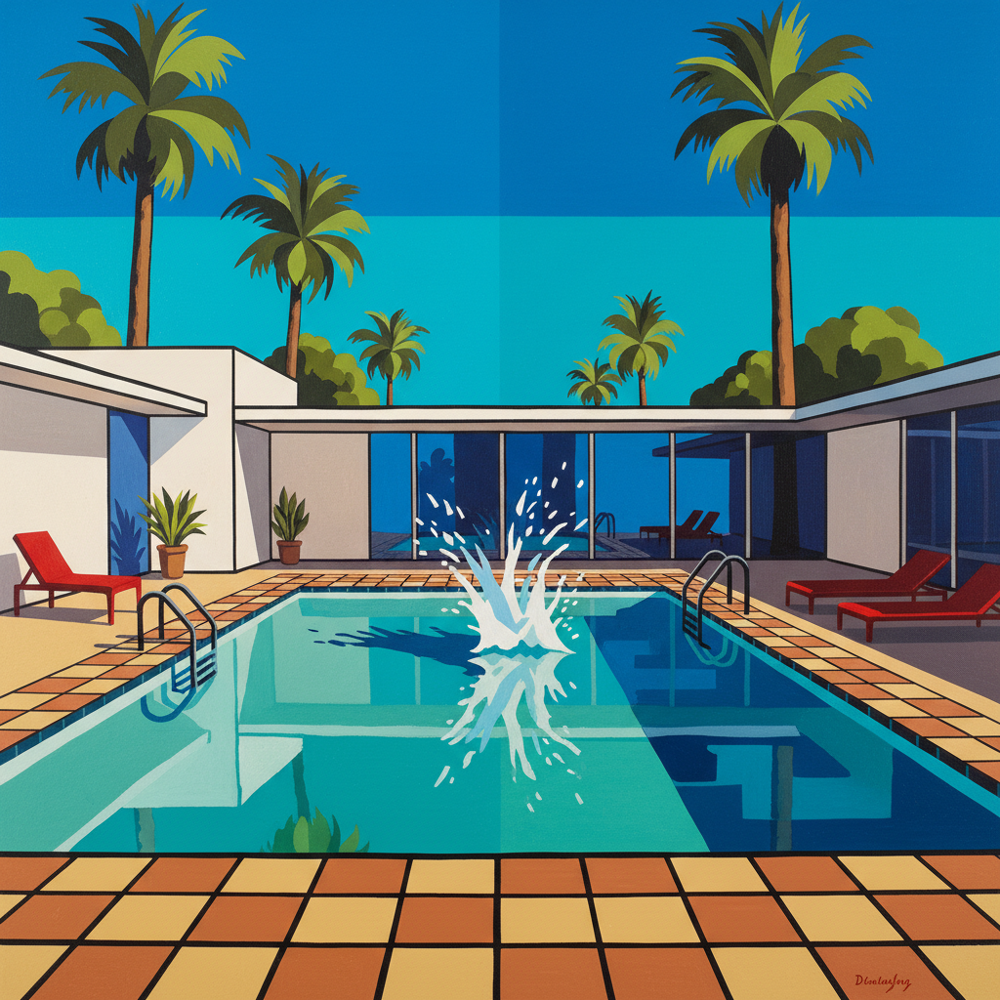

# David Hockney 大卫·霍克尼

> "I've finally figured out what's wrong with photography. It's a one-eyed man looking through a little hole." — David Hockney

## 概述

大卫·霍克尼（David Hockney，1937–）是英国最具影响力的在世艺术家之一，以加州泳池画、多视点拼贴摄影和iPad绘画闻名。他的作品横跨六十余年，始终保持着对"观看"本身的探索——如何在平面上再现我们真正看到的世界。

霍克尼拒绝被任何一种风格定义——从波普到写实到立体主义摄影到数字绘画，他永远在寻找新的观看方式。

## 核心特征

| 特征 | 描述 |
|------|------|
| 加州光线 | 明亮的、平坦的加州阳光 |
| 泳池主题 | 蓝色水面的光影变化 |
| 多视点 | 拼贴摄影——打破单点透视 |
| 数字绘画 | iPad和iPhone作为画笔 |
| 色彩明快 | 鲜艳的、平涂的色彩 |
| 空间探索 | 反透视——中国卷轴画的影响 |

## 视觉特征

- **色彩**：明亮的蓝、绿、粉——加州色调
- **光线**：平坦的、均匀的阳光——无戏剧性阴影
- **水面**：蓝色泳池中光的波纹和反射
- **空间**：多视点的、展开的空间
- **笔触**：平涂与细节的结合
- **构图**：几何化的建筑和景观

## 代表作品

| 作品 | 年代 | 意义 |
|------|------|------|
| *A Bigger Splash* | 1967 | 加州梦的图标 |
| *Portrait of an Artist (Pool with Two Figures)* | 1972 | 最贵的在世艺术家作品 |
| *Pearblossom Hwy.* | 1986 | 多视点摄影的经典 |
| *The Arrival of Spring in Woldgate* | 2011 | iPad绘画的里程碑 |
| *A Bigger Grand Canyon* | 1998 | 巨幅多画布风景 |

## 真实作品（公共领域）

| 作品 | 来源 |
|------|------|
| *A Bigger Splash* | [Tate](https://www.tate.org.uk/art/artworks/hockney-a-bigger-splash-t03254) |
| *Mr and Mrs Clark and Percy* | [Tate](https://www.tate.org.uk/art/artworks/hockney-mr-and-mrs-clark-and-percy-t01269) |
| *Pearblossom Hwy.* | [Getty Museum](https://www.getty.edu/art/collection/object/103QP2) |

> ⚠️ 本条目优先使用真实作品。

## AI生成概念图

## 与其他风格的关系

- **Pop Art** → 早期与波普艺术关联
- **Cubism** → 多视点摄影受立体主义启发
- **Chinese Scroll** → 反透视受中国卷轴画影响
- **Digital Art** → iPad绘画的先驱
