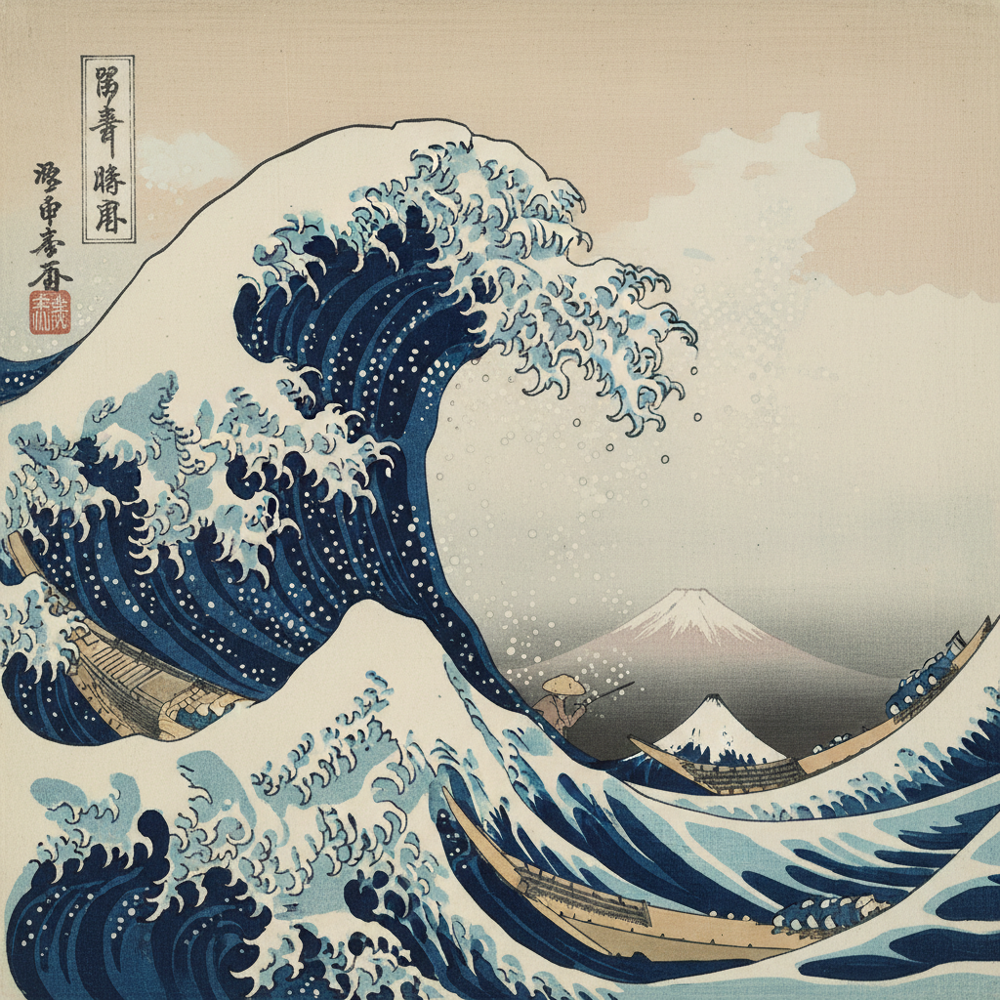

# Katsushika Hokusai 葛饰北斋

> "From the age of six I had a mania for drawing. At seventy-three I had learned a little about the real structure of nature. When I am eighty I shall have made still more progress. At ninety I shall penetrate the mystery of things. At a hundred I shall have reached something marvellous. At a hundred and ten, every dot and every stroke will be as though alive." — Hokusai

## 概述

葛饰北斋（かつしか ほくさい / Katsushika Hokusai，1760–1849）是日本江户时代最伟大的浮世绘画师，也是对西方现代艺术影响最深远的东方艺术家。他的《富岳三十六景》系列（尤其是《神奈川冲浪里》）是世界上辨识度最高的艺术图像之一。

北斋一生改名30余次、搬家93次，创作了超过30000幅作品，涵盖版画、绘本、肉笔画等多种形式，题材从风景到妖怪无所不包。他90岁高龄仍在创作，是艺术史上最长寿、最多产的大师之一。

## 核心特征

| 特征 | 描述 |
|------|------|
| 构图革新 | 大胆的对角线、不对称、极端裁切 |
| 动态捕捉 | 瞬间动态的凝固——浪花、风、飞鸟 |
| 普鲁士蓝 | 大量使用进口的柏林蓝（Prussian Blue） |
| 万物描绘 | 从富士山到幽灵，从花鸟到春画 |
| 线条力量 | 精确有力的轮廓线 |
| 透视融合 | 将西方透视法融入日本平面构图 |

## 视觉特征

- **线条**：精确、流畅、充满力量的轮廓线
- **色彩**：靛蓝（普鲁士蓝）为主色调，配以朱红、绿、黄
- **构图**：大胆的对角线和不对称布局
- **动态**：浪花飞溅、风吹树弯的瞬间凝固
- **空间**：近大远小的戏剧性透视
- **细节**：极精细的线刻和渐变

## 代表作品

| 作品 | 年代 | 意义 |
|------|------|------|
| *神奈川冲浪里 (The Great Wave)* | c.1831 | 世界上最著名的艺术图像之一 |
| *凯风快晴 (Red Fuji)* | c.1831 | 富岳三十六景代表作 |
| *富岳三十六景* 系列 | 1830-32 | 46幅（含追加10幅）风景版画 |
| *北斋漫画* | 1814-78 | 15卷绘本——4000+幅速写 |
| *百物語* 系列 | c.1831 | 妖怪画的巅峰 |

## 真实作品（公共领域）

北斋的作品已进入公共领域：

| 作品 | 来源 |
|------|------|
| *The Great Wave off Kanagawa* | [Met Museum](https://www.metmuseum.org/art/collection/search/45434) / [Wikimedia](https://commons.wikimedia.org/wiki/File:Tsunami_by_hokusai_19th_century.jpg) |
| *Red Fuji* | [Wikimedia](https://commons.wikimedia.org/wiki/File:Red_Fuji_southern_wind_clear_morning.jpg) |
| *Hokusai Manga* | [Library of Congress](https://www.loc.gov/pictures/collection/jpd/) |

> ⚠️ 本条目优先使用真实作品。如需本地图片，请从上述来源手动下载后放入 `assets/artworks/hokusai/` 并压缩。

## AI生成概念图（备用）

## 对西方的影响

- **印象派**：莫奈收藏了大量浮世绘，建造日本花园
- **梵高**：临摹北斋和广重的版画
- **德彪西**：《大海》的封面使用了《神奈川冲浪里》
- **新艺术运动**：北斋的曲线和自然图案直接影响了 Art Nouveau
- **Japonisme**：北斋是日本主义运动的核心灵感来源

## 与其他风格的关系

- **Ukiyo-e 浮世绘** → 浮世绘的最高成就
- **Japonisme** → 西方日本主义的核心灵感
- **Impressionism** → 构图和色彩影响了印象派
- **Art Nouveau** → 曲线和自然图案的灵感来源
- **Manga** → 北斋漫画是现代漫画的词源

---

*浮光艺志 | Chronicle of Artistry*
