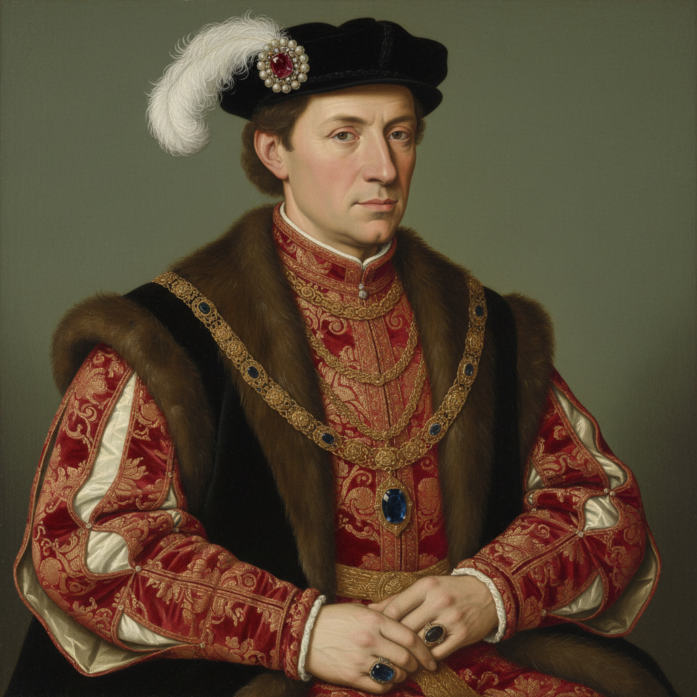

# Hans Holbein the Younger 小汉斯·荷尔拜因

> "Holbein's portraits are mirrors of the soul." — Art historian

## 概述

小汉斯·荷尔拜因（Hans Holbein the Younger，1497–1543）是德国-英国文艺复兴肖像画家，以极其精确的写实技巧和对人物心理的深刻洞察闻名。他是亨利八世的宫廷画家，为都铎王朝留下了最权威的视觉记录。

荷尔拜因的肖像画达到了一种近乎超自然的精确——每一根毛发、每一颗宝石、每一道皱纹都被忠实记录，同时又传达出人物的内在性格和社会地位。

## 核心特征

| 特征 | 描述 |
|------|------|
| 极致写实 | 照相般精确的细节描绘 |
| 心理洞察 | 通过姿态和表情揭示性格 |
| 物质再现 | 织物、珠宝、金属的完美质感 |
| 简洁背景 | 纯色或简单背景突出人物 |
| 宫廷记录 | 都铎王朝的权威视觉档案 |
| 象征物品 | 手中物品暗示身份和学识 |

## 视觉特征

- **细节**：显微镜般的精确——毛发、织物纹理
- **背景**：通常为纯色——蓝或绿
- **质感**：丝绸、天鹅绒、金属的极致再现
- **光线**：均匀的、清晰的——无戏剧性阴影
- **构图**：半身像，四分之三侧面
- **色彩**：丰富但克制——服饰的华丽

## 代表作品

| 作品 | 年代 | 意义 |
|------|------|------|
| *The Ambassadors* | 1533 | 文艺复兴肖像的巅峰 |
| *Portrait of Henry VIII* | 1537 | 权力的图标 |
| *Portrait of Erasmus* | 1523 | 人文主义者的肖像 |
| *Portrait of Thomas More* | 1527 | 政治家的内心 |
| *The Body of the Dead Christ* | 1521 | 最残酷的基督像 |

## 真实作品（公共领域）

| 作品 | 来源 |
|------|------|
| *The Ambassadors* | [National Gallery](https://www.nationalgallery.org.uk/paintings/hans-holbein-the-younger-the-ambassadors) |
| *Portrait of Erasmus* | [National Gallery](https://www.nationalgallery.org.uk/paintings/hans-holbein-the-younger-erasmus) |
| *Portrait of Henry VIII* | [Thyssen-Bornemisza](https://www.museothyssen.org/) |

> ⚠️ 本条目优先使用真实作品。

## AI生成概念图

## 与其他风格的关系

- **Northern Renaissance** → 北方文艺复兴肖像画的巅峰
- **Dürer** → 与丢勒并列为德国文艺复兴双峰
- **Photorealism** → 极致写实的精神先祖
- **Court Painting** → 宫廷肖像画的典范
