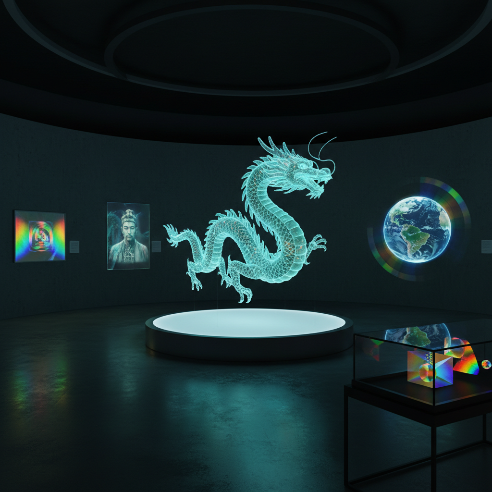

# Hologram Art 全息艺术

> "A hologram captures light itself — not merely its intensity as a photograph does, but its phase, its direction, its very wavefront. When you look at a hologram, you see light that has been frozen in time and released again, recreating a three-dimensional ghost of an object that may no longer exist. It is the closest we have come to bottling light." — Unknown

## 概述

全息艺术（Hologram Art）是利用全息技术（holography）创造三维光学图像的艺术形式——通过激光干涉和衍射原理，在二维介质上记录并再现完整的三维光场信息，使观者无需特殊眼镜即可看到悬浮在空间中的立体图像。

全息艺术的实践包括：1）传统全息图——用激光在感光材料上记录的静态三维图像；2）彩虹全息——可在白光下观看的全息图；3）数字全息——用计算机生成的全息图案；4）全息投影——利用佩珀尔幻象等技术创造的大型全息表演；5）全息装置——将全息技术融入艺术装置；6）全息肖像——人物的全息三维肖像；7）全息珠宝和时尚——将全息元素融入可穿戴艺术。

## 核心特征

| 特征 | 描述 |
|------|------|
| 三维 | 真正的三维视觉 |
| 光学 | 基于光学原理 |
| 虚幻 | 虚幻的悬浮感 |
| 科技 | 高科技媒介 |
| 精密 | 纳米级精度 |
| 未来 | 未来感的美学 |

## 视觉特征

- **三维**：真正的三维深度感
- **虹彩**：角度变化时的色彩变化
- **透明**：半透明的悬浮图像
- **精细**：极其精细的细节
- **光泽**：金属般的光泽质感
- **动态**：视角变化时图像变化

## 代表作品

| 作品 | 艺术家 | 年代 | 意义 |
|------|--------|------|------|
| *Holographic art* | Salvador Dalí | 1972 | 早期全息艺术探索 |
| *Holographic portraits* | Various | 1970年代至今 | 全息肖像 |
| *Digital holograms* | Various | 当代 | 数字全息 |
| *Pepper's Ghost shows* | Various | 当代 | 大型全息表演 |
| *Holographic installations* | Various | 当代 | 全息装置艺术 |

## 历史时间线

| 时期 | 事件 |
|------|------|
| 1947 | Dennis Gabor发明全息术 |
| 1960年代 | 激光全息术的发展 |
| 1972 | 达利创作全息艺术 |
| 1980年代 | 彩虹全息和白光全息 |
| 当代 | 数字全息和全息投影表演 |

## 中国语境

全息艺术在中国近年来发展迅速。中国的全息投影技术在大型活动和商业演出中广泛应用——从春晚的全息舞台效果到各种商业发布会的全息展示。中国的一些科技艺术家将全息技术与中国传统文化元素结合——用全息技术再现古代书画、重现历史场景、或创造融合传统美学的当代全息装置。中国的全息技术产业发展迅速，深圳等城市是全球全息显示设备的重要生产基地。中国的博物馆和展览馆越来越多地使用全息技术进行文物展示和历史再现——如故宫的数字全息展览。中国的全息演唱会和虚拟偶像表演也在快速发展。

## AI生成概念图

## 与其他风格的关系

- **Laser Art** → 激光艺术
- **Light Art** → 光艺术
- **Digital Art** → 数字艺术
- **New Media Art** → 新媒体艺术
- **Installation Art** → 装置艺术
- **Science Art** → 科学艺术

---

*浮光艺志 | Chronicle of Artistry*
