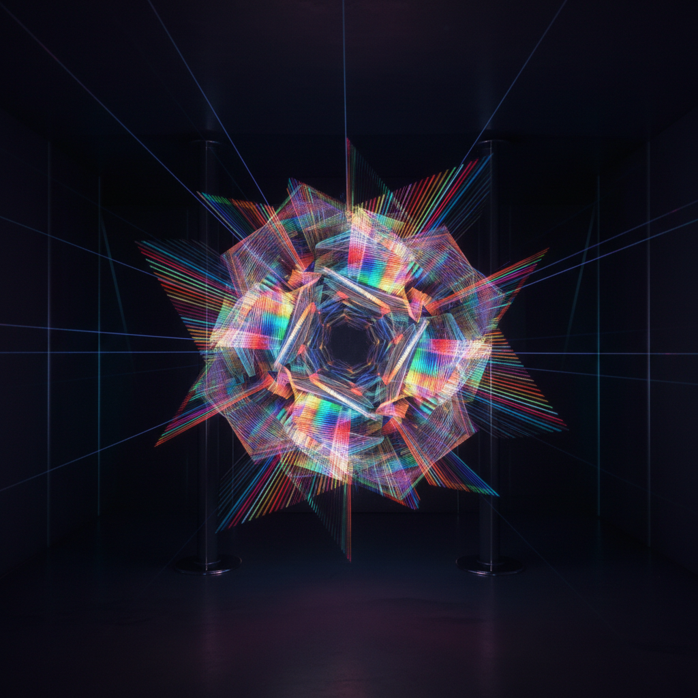

# Holographic Art 全息艺术

> **时期：** 1960年代–至今  
> **关键词：** 激光干涉、三维幻象、彩虹光谱、空间悬浮、科技美学

## 概述

Holographic Art（全息艺术）利用激光干涉原理在平面介质上记录和再现三维光场信息，创造出悬浮在空间中的立体幻象。从丹尼斯·加博尔1947年的理论发明到当代艺术家的创作实践，全息术将光本身变为雕塑材料——观者移动时图像随之变化，打破了传统艺术固定视角的限制。

## 风格特征

- **三维悬浮**：图像漂浮在介质前方或后方
- **视角变化**：随观者位置改变的动态图像
- **彩虹光谱**：白光全息的虹彩色散效果
- **透明层叠**：多层信息的空间叠加
- **光即材料**：以光波本身作为创作媒介

## 代表人物与作品

- 丹尼斯·加博尔（全息术发明者，诺贝尔奖）
- 萨尔瓦多·达利（全息肖像实验）
- 保拉·道森（全息艺术先驱）
- 马修·舒尔茨（当代全息装置）

## 概念图

