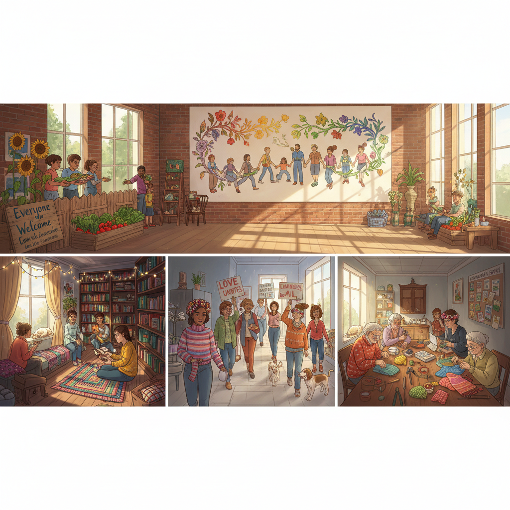

# Hopepunk Art 希望朋克艺术

> "Hopepunk is the radical assertion that caring about things, that fighting for things, that believing things can be better is not naive or childish but the most punk thing you can do in a world that profits from your cynicism and despair — it is the insistence that kindness and softness are not weakness, that choosing to be optimistic is a political act, that community and mutual aid are revolutionary, and that the most rebellious thing in an age of irony is sincerity, in an age of cruelty is compassion, and in an age of hopelessness is hope itself." — Alexandra Rowland

## 概述

希望朋克（Hopepunk）是作家亚历山德拉·罗兰（Alexandra Rowland）在2017年提出的一个文化概念，作为对"grimdark"（黑暗现实主义）的回应。希望朋克主张：在一个鼓励犬儒主义和绝望的世界中，选择希望、善良和关怀本身就是一种激进的反抗行为。"朋克"不在于愤怒和破坏，而在于拒绝接受"事情不可能变好"的叙事。

希望朋克的视觉美学强调：社区和互助、温暖和包容、日常的善意行为、多样性和团结、修复而非破坏、以及在困难中坚持的美。它与太阳朋克有重叠但更强调人际关系和情感维度，而非技术解决方案。希望朋克的视觉语言包括：温暖的色调、社区花园、共享空间、手工制作、以及人们互相帮助的场景。

## 核心特征

| 特征 | 描述 |
|------|------|
| 希望 | 激进的希望 |
| 善良 | 善良作为反抗 |
| 社区 | 社区和互助 |
| 真诚 | 真诚作为朋克 |
| 修复 | 修复而非破坏 |
| 关怀 | 关怀作为政治行为 |

## 视觉特征

- **温暖**：温暖的色调和光线
- **社区**：人们聚集和互助
- **花园**：社区花园和共享空间
- **手工**：手工制作和修复
- **多样**：多样性和包容
- **日常**：日常善意的美化

## 代表作品

| 作品 | 艺术家 | 年代 | 意义 |
|------|--------|------|------|
| *Hopepunk Tumblr post* | Alexandra Rowland | 2017 | 希望朋克的命名 |
| *The Wayfarers series* | Becky Chambers | 2014起 | 希望朋克小说 |
| *Steven Universe* | Rebecca Sugar | 2013-20 | 希望朋克动画 |
| *Mutual aid illustrations* | Various | 2020年代 | 互助主题插画 |
| *Community garden art* | Various | 2020年代 | 社区花园艺术 |

## 历史时间线

| 时期 | 事件 |
|------|------|
| 2017 | Alexandra Rowland命名hopepunk |
| 2018 | 概念在网络上传播 |
| 2019 | 学术界开始讨论 |
| 2020 | 疫情中互助运动的兴起 |
| 当代 | 希望朋克的持续发展 |

## 中国语境

希望朋克在中国有独特的文化土壤。中国社会中的"正能量"话语虽然有其官方色彩，但民间对善意、互助和社区连接的渴望是真实的。中国的"公益"文化、社区志愿者运动、以及疫情期间的邻里互助都体现了希望朋克的精神。中国的一些插画师和设计师在创作中表达类似的主题——温暖的社区生活、人与人之间的善意连接、以及在困难中坚持的美。中国传统文化中的"仁"和"义"概念、以及"天下为公"的理想也与希望朋克有深层的共鸣。中国的独立游戏和动画中也有越来越多的希望朋克叙事。

## AI生成概念图

## 与其他风格的关系

- **Solarpunk** → 太阳朋克
- **Cottagecore** → 田园核
- **Community Art** → 社区艺术
- **Folk Art** → 民间艺术
- **Illustration** → 插画艺术
- **Wholesome Aesthetic** → 治愈系美学

---

*浮光艺志 | Chronicle of Artistry*
