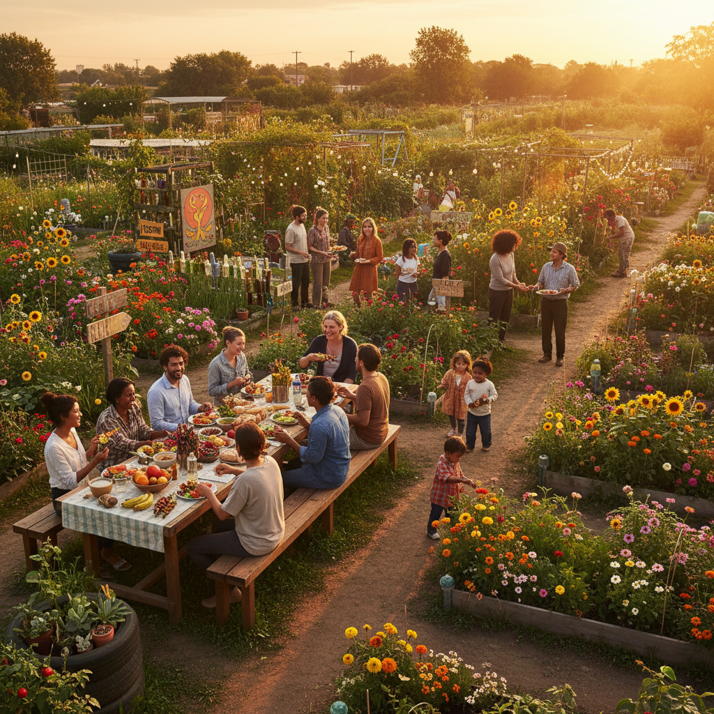

# Hopepunk 希望朋克



> **"在绝望的世界里选择善良——不是天真，是最激进的反抗。"**

## 概述

| 维度 | 描述 |
|------|------|
| 时期 | 2017–至今 |
| 别名 | Hopepunk, 希望朋克 |
| 核心色彩 | 温暖金、草地绿、天空蓝、花朵粉、阳光黄 |
| 关键元素 | 社区、关怀、抵抗性乐观、集体行动、温柔力量 |
| 代表人物 | Alexandra Rowland(命名者), Becky Chambers(文学) |
| 关联风格 | Solarpunk, Cottagecore, Wholesome, Studio Ghibli |

---

## 历史脉络

| 年份 | 事件 |
|------|------|
| 2017 | Alexandra Rowland在Tumblr上创造"Hopepunk"一词 |
| 2018 | Hopepunk作为对Grimdark的回应在文学界流行 |
| 2019 | Becky Chambers《Wayfarers》系列——Hopepunk文学经典 |
| 2020 | 疫情期间——Hopepunk精神的现实需求 |
| 2020s | Hopepunk从文学扩展到视觉美学和生活方式 |

### 核心哲学

Hopepunk的精神是**"选择善良和希望——本身就是一种朋克式的反抗"**：
- Alexandra Rowland："Hopepunk的对立面不是Grimdark——是冷漠"
- "在一个鼓励你放弃的世界里——坚持关心就是反叛"
- "不是'一切都会好的'——是'我们会让它变好的'"
- "温柔不是软弱——温柔是最难的力量"
- "社区 > 个人英雄——集体行动 > 孤独抗争"

---

## 视觉语法

### 色彩系统

```
主色：
  温暖金 (#DAA520) — 希望、温暖
  草地绿 (#7CFC00) — 生长、社区
  天空蓝 (#87CEEB) — 开阔、可能
  花朵粉 (#FFB6C1) — 温柔、关怀

辅色：
  阳光黄 (#FFD700) — 乐观、能量
  泥土棕 (#8B4513) — 扎根、真实
  薰衣草 (#E6E6FA) — 平静、治愈

视觉特征：
  温暖光线 — 金色时刻、壁炉光
  社区场景 — 共同劳动、分享食物
  自然元素 — 花园、植物、动物
  手工制品 — 编织、烘焙、修补
  多样性 — 不同的人在一起

规则：
  - 温暖 > 冷酷
  - 集体 > 个人
  - 行动 > 空想
  - 真实 > 完美
  - 包容 > 排斥
```

### 标志性元素

| 类别 | 元素 |
|------|------|
| 场景 | 社区花园、共享厨房、修理咖啡馆 |
| 行动 | 互助、修补、种植、分享 |
| 人物 | 多样、普通、温暖、坚定 |
| 自然 | 花园、阳光、季节、生长 |
| 物品 | 手工、修补、旧物新用 |
| 态度 | 温柔但坚定、乐观但不天真 |

---

## 与千禧怀旧/当代的关系

### Hopepunk vs 其他-punk
| 风格 | 核心情绪 |
|------|----------|
| Cyberpunk | 愤怒+绝望 |
| Grimdark | 黑暗+残酷 |
| Solarpunk | 乐观+技术 |
| **Hopepunk** | **温柔+抵抗** |

### 与Solarpunk的区别
- Solarpunk关注技术解决方案——Hopepunk关注人际关系
- Solarpunk是"我们能建造什么"——Hopepunk是"我们如何对待彼此"
- 两者可以重叠——但核心不同

---

## 设计应用

| 场景 | 应用方式 |
|------|----------|
| 品牌 | 社区+关怀+可持续+温暖 |
| 空间 | 社区中心+共享空间+花园 |
| 出版 | 温暖插画+多样性+希望 |
| 游戏 | 合作>竞争+社区建设 |

---

## 相关风格

← [Solarpunk 太阳朋克](solarpunk.md) | [Cottagecore 田园核](cottagecore.md) →

↑ [返回千禧怀旧目录](README.md) | [返回总目录](../README.md)
