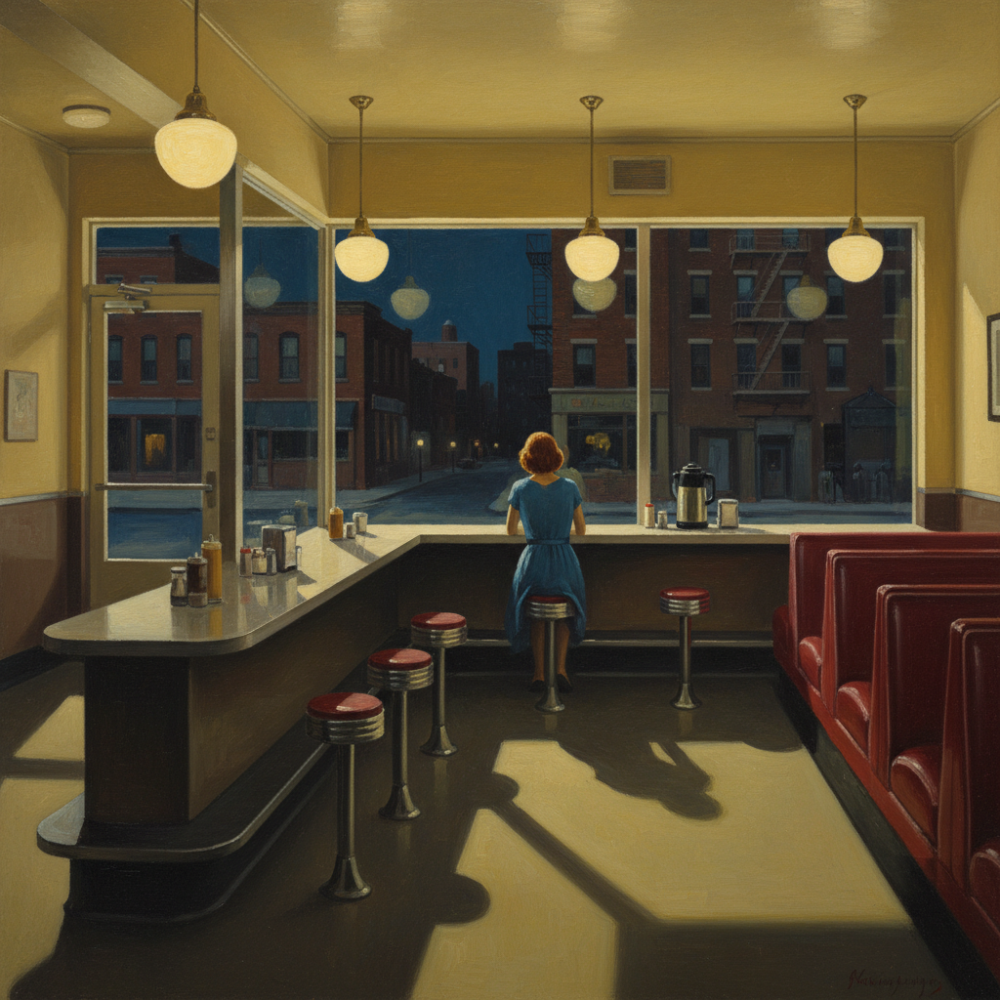

# Edward Hopper 霍珀

> "If I could say it in words there would be no reason to paint." — Edward Hopper

## 概述

爱德华·霍珀（Edward Hopper，1882–1967）是美国现实主义画家，以描绘美国城市和乡村中的孤独、沉默和疏离感闻名。他的画面如同电影的静帧——深夜的餐厅、空旷的加油站、阳光照射的空房间，每一幅都暗示着一个未讲完的故事。

霍珀画的不是美国的风景，而是美国的孤独——那种在人群中、在阳光下、在最平凡的日常中无处不在的存在性孤独。

## 核心特征

| 特征 | 描述 |
|------|------|
| 孤独感 | 人物之间的疏离和沉默 |
| 戏剧光线 | 强烈的、舞台般的光影对比 |
| 美国场景 | 加油站、汽车旅馆、餐厅、办公室 |
| 叙事暗示 | 暗示故事但不讲述——开放的叙事 |
| 几何构图 | 建筑的几何线条框住人物 |
| 时间凝固 | 静止的、悬停的时间感 |

## 视觉特征

- **光线**：强烈的、戏剧性的——从窗户射入或人工照明
- **色彩**：清晰的、饱和的——蓝、绿、黄、红
- **构图**：几何化的建筑框架——窗户、门、墙
- **人物**：孤立的、沉默的、不交流的
- **空间**：空旷的、安静的——城市的空虚
- **时间**：黄昏、深夜、清晨——过渡时刻

## 代表作品

| 作品 | 年代 | 意义 |
|------|------|------|
| *Nighthawks* | 1942 | 美国孤独的图标 |
| *Morning Sun* | 1952 | 阳光中的孤独 |
| *Gas* | 1940 | 美国公路的寂寞 |
| *Office at Night* | 1940 | 城市工作的疏离 |
| *Automat* | 1927 | 深夜咖啡馆的女人 |

## 真实作品（公共领域）

| 作品 | 来源 |
|------|------|
| *Nighthawks* | [Art Institute Chicago](https://www.artic.edu/artworks/111628) |
| *Gas* | [MoMA](https://www.moma.org/collection/works/80000) |
| *Morning Sun* | [Columbus Museum of Art](https://www.columbusmuseum.org/) |

> ⚠️ 本条目优先使用真实作品。

## AI生成概念图

## 与其他风格的关系

- **American Realism** → 美国现实主义的巅峰
- **Film Noir** → 深刻影响了黑色电影的视觉
- **Ashcan School** → 从垃圾箱画派出发但更内省
- **Cinematic Art** → 电影构图的直接灵感来源
